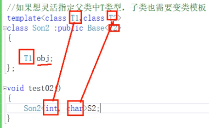
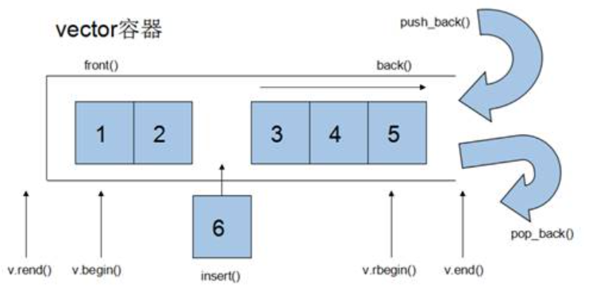
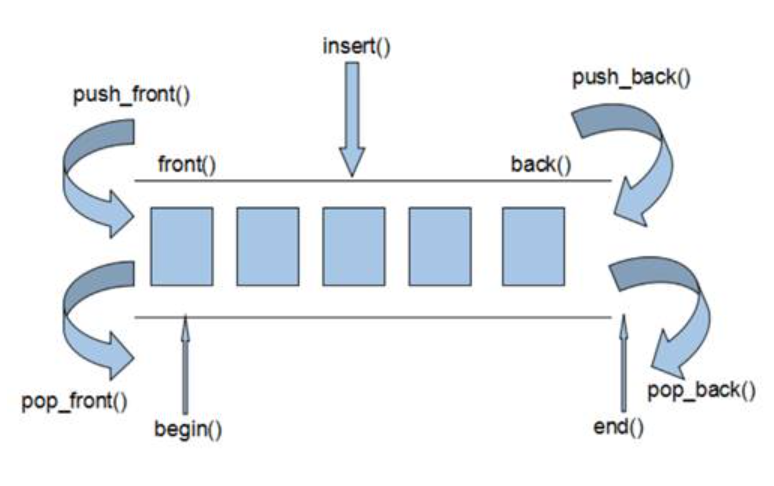
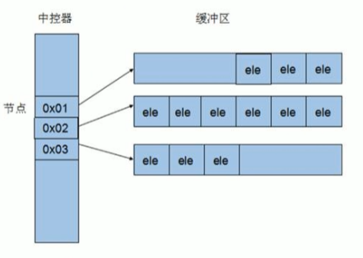

### 如何在vscode配置cpp环境
将 GCC 与 MinGW 结合使用
在本教程中，您将配置 Visual Studio Code 以使用mingw-w64中的 GCC C++ 编译器 (g++) 和 GDB 调试器来创建在 Windows 上运行的程序。配置 VS Code 后，您将编译、运行和调试 Hello World 程序。

本教程不会教您有关 GCC、GDB、minGW-w64 或 C++ 语言的知识。对于这些主题，网络上有许多好的资源。

如果您有任何问题，请随时在VS Code 文档存储库中提交本教程的问题。

先决条件
要成功完成本教程，您必须执行以下步骤：

安装Visual Studio 代码。

安装VS Code 的 C/C++ 扩展。您可以通过在扩展视图 ( Ctrl+Shift+X )中搜索“C++”来安装 C/C++ 扩展。

C/C++ 扩展

安装 MinGW-w64 工具链
通过MSYS2获取最新版本的 MinGW-w64 ，它提供了 GCC、MinGW-w64 和其他有用的 C++ 工具和库的最新本机版本。这将为您提供必要的工具来编译代码、调试代码并将其配置为与IntelliSense一起使用。

您可以从 MSYS2 页面下载最新的安装程序或使用此安装程序的直接链接。

运行安装程序并按照安装向导的步骤进行操作。请注意，MSYS2 需要 64 位 Windows 8.1 或更高版本。

在向导中，选择所需的安装文件夹。记录此目录以供以后使用。大多数情况下，推荐的目录是可以接受的。当您开始设置开始菜单快捷方式步骤时，这同样适用。完成后，确保选中“立即运行 MSYS2”框并选择“完成”。这将为您打开一个 MSYS2 终端窗口。

在此终端中，通过运行以下命令安装 MinGW-w64 工具链：

pacman -S --needed base-devel mingw-w64-ucrt-x86_64-toolchain
toolchain按Enter接受组中默认的包数。

MYSS2 安装程序

Y当提示是否继续安装时输入。

使用以下步骤将 MinGW-w64 文件夹的路径添加bin到 Windows环境变量中：PATH

在 Windows 搜索栏中，键入“设置”以打开“Windows 设置”。
搜索编辑您帐户的环境变量。
在用户变量中，选择Path变量，然后选择编辑。
选择新建并将您在安装过程中记录的 MinGW-w64 目标文件夹添加到列表中。如果您使用上面的默认设置，那么这将是路径：C:\msys64\ucrt64\bin。
选择“确定”保存更新的路径。您需要重新打开所有控制台窗口才能使新的 PATH 位置可用。
检查您的 MinGW 安装
要检查您的 MinGW-w64 工具是否已正确安装且可用，请打开一个新的命令提示符并键入：

gcc --version
g++ --version
gdb --version
您应该看到输出，说明您安装了哪些版本的 GCC、g++ 和 GDB。如果不是这种情况：

确保您的 PATH 变量条目与安装工具链的 MinGW-w64 二进制位置匹配。如果该 PATH 条目中不存在编译器，请确保遵循前面的说明。
如果gcc有正确的输出，但没有gdb，那么您需要安装 MinGW-w64 工具集中缺少的软件包。
如果在编译时您收到“miDebuggerPath 的值无效”。消息，原因之一可能是您丢失了mingw-w64-gdb包裹。
创建一个 Hello World 应用程序
首先，让我们建立一个项目。

启动 Windows 命令提示符（在 Windows 搜索栏中输入Windows 命令提示符）。
运行以下命令。这些将创建一个名为的空文件夹，projects您可以在其中放置所有 VS Code 项目。在那里，接下来的命令将创建并导航到名为 的子文件夹helloworld。从那里，您将helloworld直接在 VS Code 中打开。
mkdir projects
cd projects
mkdir helloworld
cd helloworld
code .
代码 。” 命令在当前工作文件夹中打开 VS Code，该文件夹将成为您的“工作区”。选择是，我信任作者，接受“工作空间信任”对话框，因为这是您创建的文件夹。

当您完成本教程时，您将看到在.vscode工作区的文件夹中创建的三个文件：

tasks.json（构建说明）
launch.json（调试器设置）
c_cpp_properties.json（编译器路径和 IntelliSense 设置）
添加Hello World源代码文件
在文件资源管理器标题栏中，选择新建文件按钮并将文件命名为helloworld.cpp。

新建文件标题栏按钮

添加hello world源码
现在粘贴此源代码：

    #include <iostream>
    #include <vector>
    #include <string>
    using namespace std;

    int main()
    {
        vector<string> msg {"Hello", "C++", "World", "from", "VS Code", "and the C++ extension!"};

        for (const string& word : msg)
        {
            cout << word << " ";
        }
        cout << endl;
    }
现在按Ctrl+S保存文件。请注意您刚刚添加的文件如何显示在VS Code 侧栏中的文件资源管理器视图 ( Ctrl+Shift+E ) 中：

文件管理器

您还可以通过选择“文件” > “自动保存”来启用“自动保存”以自动保存文件更改。您可以在 VS Code用户界面文档中找到有关其他视图的更多信息。

注意：当您保存或打开 C++ 文件时，您可能会看到来自 C/C++ 扩展的有关 Insiders 版本可用性的通知，该版本可让您测试新功能和修复。X您可以通过选择（清除通知）来忽略此通知。

探索智能感知
IntelliSense是一款通过添加代码完成、参数信息、快速信息和成员列表等代码编辑功能来帮助您更快、更高效地编码的工具。

要查看实际的 IntelliSense，请将鼠标悬停在vector或 上string以查看其类型信息。如果您输入 msg.第 10 行，您可以看到建议调用的成员函数的完整列表，全部由 IntelliSense 生成：

语句完成智能感知

您可以按Tab键插入选定的成员。如果您随后添加左括号，IntelliSense 将显示有关需要哪些参数的信息。

如果尚未配置 IntelliSense，请打开命令面板 ( Ctrl+Shift+P ) 并输入Select IntelliSense Configuration。从编译器的下拉列表中，选择Use gcc.exe进行配置。更多信息可以在IntelliSense 配置文档中找到。

运行helloworld.cpp
请记住，C++ 扩展使用您计算机上安装的 C++ 编译器来构建程序。helloworld.cpp在尝试在 VS Code 中运行和调试之前，请确保已完成“安装 MinGW-w64 工具链”步骤。

打开helloworld.cpp，使其成为活动文件。

按编辑器右上角的播放按钮。

helloworld.cpp 和播放按钮的屏幕截图

从系统上检测到的编译器列表中选择C/C++: g++.exe 构建和调试活动文件。

C++ 调试配置下拉列表

仅在第一次运行时才会要求您选择编译器helloworld.cpp。该编译器将被设置为tasks.json文件中的“默认”编译器。

构建成功后，程序的输出将出现在集成终端中。

程序输出截图

恭喜！您刚刚在 VS Code 中运行了您的第一个 C++ 程序！

了解tasks.json
第一次运行程序时，C++ 扩展会创建一个tasks.json文件，您可以在项目的.vscode文件夹中找到该文件。tasks.json存储您的构建配置。

您的新tasks.json文件应类似于以下 JSON：

    {
      "tasks": [
        {
          "type": "cppbuild",
          "label": "C/C++: g++.exe build active file",
          "command": "C:\\msys64\\ucrt64\\bin\\g++.exe",
          "args": [
            "-fdiagnostics-color=always",
            "-g",
            "${file}",
            "-o",
            "${fileDirname}\\${fileBasenameNoExtension}.exe"
          ],
          "options": {
            "cwd": "${fileDirname}"
          },
          "problemMatcher": ["$gcc"],
          "group": {
            "kind": "build",
            "isDefault": true
          },
          "detail": "Task generated by Debugger."
        }
      ],
      "version": "2.0.0"
    }
注意：您可以在变量参考中了解有关tasks.json变量的更多信息。

该command设置指定要运行的程序；在这种情况下，即g++。

该args数组指定传递给 g++ 的命令行参数。这些参数按照编译器期望的特定顺序列在该文件中。

此任务告诉 g++ 获取活动文件 ( ${file})，对其进行编译，并-o在当前目录 ( ${fileDirname}) 中创建一个输出文件 ( switch)，其名称与活动文件相同，但.exe扩展名 ( ${fileBasenameNoExtension}.exe)。对于我们来说，这会导致helloworld.exe.

该label值是您将在任务列表中看到的值；你可以随意命名它。

该detail值是您将作为任务列表中的任务描述的值。强烈建议重命名该值以将其与类似任务区分开来。

该problemMatcher值选择用于在编译器输出中查找错误和警告的输出解析器。对于 GCC，如果使用问题匹配器，您将获得最佳结果$gcc。

从现在开始，播放按钮将读取tasks.json以了解如何构建和运行您的程序。您可以在 中定义多个构建任务tasks.json，并且播放按钮将使用标记为默认的任务。如果您需要更改默认编译器，可以运行“任务：命令面板中的配置默认构建任务” 。或者，您可以修改tasks.json文件并通过替换此段来删除默认值：

    "group": {
        "kind": "build",
        "isDefault": true
    },
有了这个：

    "group": "build",
修改tasks.json
您可以tasks.json使用类似参数而"${workspaceFolder}/*.cpp"不是 来修改您的文件以构建多个 C++ 文件"${file}"。这将构建.cpp当前文件夹中的所有文件。"${fileDirname}\\${fileBasenameNoExtension}.exe"您还可以通过替换为硬编码文件名（例如）来修改输出文件名"${workspaceFolder}\\myProgram.exe"。

调试helloworld.cpp
要调试您的代码，

返回，helloworld.cpp使其成为活动文件。
通过单击编辑器边距或在当前行上使用 F9 设置断点。helloworld.cpp 中断点的屏幕截图
从播放按钮旁边的下拉列表中，选择Debug C/C++ File。播放按钮下拉菜单的屏幕截图
从系统上检测到的编译器列表中选择C/C++: g++ 构建和调试活动文件helloworld.cpp（只有在第一次运行或调试时才会要求您选择编译器）。C++ 调试配置下拉列表
播放按钮有两种模式：运行 C/C++ 文件和调试 C/C++ 文件。它将默认为上次使用的模式。如果您在播放按钮中看到调试图标，则只需选择播放按钮即可进行调试，而无需使用下拉菜单。

探索调试器
在开始逐步执​​行代码之前，让我们花点时间注意一下用户界面中的一些变化：

集成终端出现在源代码编辑器的底部。在“调试控制台”选项卡中，您会看到指示调试器已启动并正在运行的输出。

编辑器会突出显示您在启动调试器之前设置断点的行：

初始断点

左侧的“运行和调试”视图显示调试信息。您将在本教程后面看到一个示例。

在代码编辑器的顶部，会出现一个调试控制面板。您可以通过抓住左侧的点在屏幕上移动它。

调试控件

单步执行代码
现在您已准备好开始单步执行代码。

在调试控制面板中选择“单步执行”图标。

跨过按钮

这将使程序执行前进到 for 循环的第一行，并跳过创建和初始化变量时调用的vector和类中的所有内部函数调用。请注意左侧“变量”窗口中的变化。stringmsg

调试窗口

在这种情况下，错误是预料之中的，因为虽然循环的变量名现在对调试器可见，但该语句尚未执行，因此此时没有任何内容可读取。然而，的内容msg是可见的，因为该语句已经完成。

再次按“单步执行”可前进到该程序中的下一条语句（跳过为初始化循环而执行的所有内部代码）。现在，变量窗口显示有关循环变量的信息。

再次按Step over执行该cout语句。（请注意，在循环退出之前，C++ 扩展不会将任何输出打印到调试控制台。）

如果您愿意，可以一直按“Step over”，直到向量中的所有单词都已打印到控制台。但如果您好奇，请尝试按“单步执行”按钮单步执行 C++ 标准库中的源代码！

要返回到您自己的代码，一种方法是按住Step over。另一种方法是在代码中设置断点，方法是切换到helloworld.cpp代码编辑器中的选项卡，将插入点放在cout循环内语句的某处，然后按F9。左侧装订线中出现一个红点，表示已在此行设置断点。

main 中的断点

然后按F5从标准库头中的当前行开始执行。执行将中断cout。如果您愿意，可以再次按F9来关闭断点。

循环完成后，您可以在集成终端中看到输出，以及 GDB 输出的一些其他诊断信息。

在终端中调试输出

设置手表
有时您可能希望在程序执行时跟踪变量的值。您可以通过对变量设置监视来做到这一点。

将插入点放置在循环内。在“监视”窗口中，选择加号，然后在文本框中键入word，这是循环变量的名称。现在，当您单步执行循环时，请查看“监视”窗口。

观察窗

通过在循环之前添加以下语句来添加另一个监视：int i = 0;。然后，在循环内添加以下语句：++i;。i现在，像上一步中所做的那样添加一个监视。

要在执行暂停在断点上时快速查看任何变量的值，可以将鼠标指针悬停在该变量上。

鼠标悬停

使用 launch.json 自定义调试
当您使用播放按钮或F5进行调试时，C++ 扩展会动态创建动态调试配置。

在某些情况下，您需要自定义调试配置，例如指定在运行时传递给程序的参数。您可以在文件中定义自定义调试配置launch.json。

要创建launch.json，请从播放按钮下拉菜单中选择添加调试配置。

添加调试配置播放按钮菜单

然后，您将看到各种预定义调试配置的下拉列表。选择C/C++: g++.exe 构建和调试活动文件。

C++ 调试配置下拉列表

VS Code 在文件夹中创建一个launch.json文件.vscode，如下所示：

    {
      "configurations": [
        {
          "name": "C/C++: g++.exe build and debug active file",
          "type": "cppdbg",
          "request": "launch",
          "program": "${fileDirname}\\${fileBasenameNoExtension}.exe",
          "args": [],
          "stopAtEntry": false,
          "cwd": "${fileDirname}",
          "environment": [],
          "externalConsole": false,
          "MIMode": "gdb",
          "miDebuggerPath": "C:\\msys64\\ucrt64\\bin\\gdb.exe",
          "setupCommands": [
            {
              "description": "Enable pretty-printing for gdb",
              "text": "-enable-pretty-printing",
              "ignoreFailures": true
            },
            {
              "description": "Set Disassembly Flavor to Intel",
              "text": "-gdb-set disassembly-flavor intel",
              "ignoreFailures": true
            }
          ],
          "preLaunchTask": "C/C++: g++.exe build active file"
        }
      ],
      "version": "2.0.0"
    }
在上面的 JSON 中，program指定要调试的程序。此处设置为活动文件夹 ( ${fileDirname}) 和活动文件名，扩展名为.exe( ${fileBasenameNoExtension}.exe)，如果helloworld.cpp是活动文件，则为helloworld.exe。该args属性是在运行时传递给程序的参数数组。

默认情况下，C++ 扩展不会向源代码添加任何断点，并且该stopAtEntry值设置为false.

将值更改stopAtEntry为以使调试器在开始调试时true停止在该方法上。main

从现在开始，在启动程序进行调试时，播放按钮和F5将从您的文件中读取。launch.json

添加附加 C/C++ 设置
如果您想要对 C/C++ 扩展进行更多控制，可以创建一个c_cpp_properties.json文件，该文件允许您更改编译器路径、包含路径、C++ 标准（默认为 C++17）等设置。

您可以通过从命令面板 ( Ctrl+Shift+P )运行命令 C/C++ ：编辑配置 (UI) 来查看 C/C++ 配置 UI 。

命令面板

这将打开C/C++ 配置页面。当您在此处进行更改时，VS Code 会将它们写入c_cpp_properties.json该.vscode文件夹中名为的文件中。

在这里，我们将配置名称更改为GCC，将编译器路径下拉列表设置为 g++ 编译器，并将IntelliSense 模式设置为匹配编译器 ( gcc-x64 )。

命令面板

Visual Studio Code 将这些设置放置在.vscode\c_cpp_properties.json. 如果直接打开该文件，它应该如下所示：

    {
      "configurations": [
        {
          "name": "GCC",
          "includePath": ["${workspaceFolder}/**"],
          "defines": ["_DEBUG", "UNICODE", "_UNICODE"],
          "windowsSdkVersion": "10.0.22000.0",
          "compilerPath": "C:/msys64/mingw64/bin/g++.exe",
          "cStandard": "c17",
          "cppStandard": "c++17",
          "intelliSenseMode": "windows-gcc-x64"
        }
      ],
      "version": 4
    }
如果您的程序包含不在工作区或标准库路径中的头文件，则只需添加到“包含路径数组”设置。

编译路径
该扩展使用该compilerPath设置来推断 C++ 标准库头文件的路径。当扩展程序知道在哪里可以找到这些文件时，它可以提供智能完成和转到定义导航等功能。

C/C++ 扩展尝试compilerPath根据它在系统上找到的内容填充默认编译器位置。该扩展会查找几个常见的编译器位置。

搜索compilerPath顺序是：

首先检查 Microsoft Visual C++ 编译器
然后在 Windows Subsystem for Linux (WSL) 上查找 g++
然后是 MinGW-w64 的 g++。
如果安装了 Visual Studio 或 WSL，则可能需要进行更改compilerPath以匹配项目的首选编译器。例如，如果您使用 i686 体系结构、Win32 线程和 sjlj 异常处理安装选项安装了 MinGW-w64 版本 8.1.0，则路径将如下所示：C:\Program Files (x86)\mingw-w64\i686-8.1.0-win32-sjlj-rt_v6-rev0\mingw64\bin\g++.exe。

故障排除
MSYS2已安装，但仍然找不到g++和gdb
您必须按照MSYS2 网站上的步骤使用 MSYS CLI 安装完整的 MinGW-w64 工具链 ( pacman -S --needed base-devel mingw-w64-ucrt-x86_64-toolchain) 以及所有必需的先决条件。工具链包括g++和gdb。

作为 Windows 用户，运行 pacman 命令会出现错误
Windows 计算机上的 UCRT 仅包含在 Windows 10 或更高版本中。如果您使用的是其他版本的 Windows，请运行以下不使用 UCRT 的命令：

pacman -S --needed base-devel mingw-w64-x86_64-toolchain
将 MinGW-w64 目标文件夹添加到环境变量列表中时，默认路径将为：C:\msys64\mingw64\bin。

32位MinGW
如果您需要 32 位版本的 MinGW 工具集，请参阅MSYS2 wiki 上的下载部分。它包含 32 位和 64 位安装选项的链接。

下一步
浏览VS Code 用户指南。
查看C++ 扩展概述。
创建一个新工作区，将.vscodeJSON 文件复制到其中，调整新工作区路径、程序名称等必要的设置，然后开始编码！


system("pause");
在 C++ 中，`system("pause");` 是一个用来暂停程序执行的命令。
## 宏常量
    #define 
    #define 常量名 常量值
## 字符串
C++中，字符数组用来存储字符串时，默认是以'\0'字符结束的。也就是说n个容量的字符数组只能存n-1个元素，如果强制定义了最后一个，则会导致无法读取到'\0'（字符串的终止字符），会继续向后读取，导致出现乱码。
## 运算符
两个小数不能做取模运算
前置递增先对变量进行++，再计算表达式，后置递增相反
## 三目运算符号
    表达式1 ? 表达式2 : 表达式3
如果表达式1的值为真，执行表达式2，并返回表达式2的结果;
如果表达式1的值为假，执行表达式3，并返回表达式3的结果.
在C++中三目运算符返回的是变量，可以继续赋值
## switch语句
执行多条件分支语句
``` cpp
switch(表达式)
{
    case 结果1 : 执行语句; break;
    case 结果2 : 执行语句; break;
    case 结果3 : 执行语句; break;
    ...
    default : 执行语句; break;
}
```
注意1: switch语句中表达式类型只能是整型或者字符型
注意2: case里如果没有break，那么程序会一直向下执行
总结:  与if语句比，对于多条件判断时，switch的结构清晰，执行效率高，缺点是switch不可以判断区间
注意3：每个case里面break语句上面有一行以上代码要用大括号括起来形成代码块，否侧无法编译

## 系统生成随机数
rand() % (n)  生成小于n的随机数
eg: rand() % (100) ——> 0-99

    #include <ctime>
    //time系统时间头文件包含
    srand((unsigned int)time (NULL)):
//添加随机数种子 作用利用当前系统时间生成随机数，防止每次随机数都一样
## 数组
直接输出数组名会输出数组第一个元素所在的地址
## 二维数组
二维数组定义的时候可以只定义列不定义行
>在 C++ 中，只指定二维数组的列数而不指定行数是允许的，因为这样编译器能知道每行的大小，从而计算元素位置。但如果只指定行数而不指定列数，编译器就无法确定每行的大小，因此无法定位元素。简而言之，列数对于内存中元素的布局是必需的，而行数则不是。

>将一个二维数组看成若于一维数组每,一行就是一个一维数组.而二维数组的列就代表每个一维数组中可以存在多少个元素，只有确定每个一维数组存放多少个元素才能正确定义二维数组,如果省略列的定义,那么操作系统不知道每个一维数组要分配多少个有可能是平均分配,有可能全都给第一个一维数组分配,这就造成了歧义。

二维数组可以输出每一行所占用空间及其内存位置
二维数组内存是连续的
## 函数
>值传递的时候，函数的形参发生改变，并不会影响实参
### 函数声明
告诉编译器函数名称及如何调用函数。函数的实际主体可以单独定义
（适用于函数主体在调用函数的语句后面的情况）
函数的声明可以多次，但是函数的定义只能有一次
## 指针
数据类型 * 变量名
&寻址符
\ *解引用符
在32位操作系统下，指针是占4个字节空间大小，不管是什么数据类型
在64位操作系统下，指针是占8个字节空间大小，不管是什么数据类型
**空指针**:指针变量指向内存中编号为0的空间(不可以访问)
0-255为系统占用内存,不允许用户访问
**野指针**:指针变量指向非法的内存空间
在程序中，尽量避免出现野指针
空指针和野指针都不是我们申请的空间，因此不要访问。

**常量指针**：**Pointer to Constant**
const修饰指针
const 数据类型 * 指针变量 = 变量名
数据类型 const * 指针变量 = 变量名
（const在 * 左边 ——> 常量指针）
该指针指向一个只读的对象，不能通过该指针来改变该对象的值，但可以改变该指针所指的内存空间
强调指针对其所指对象的不可变性

**指针常量**：**Constant Pointer**
const修饰常量
数据类型 * const 指针变量 = 变量名
（const在 * 右边 ——> 指针常量）
该指针所指的内存区域是固定的，必须在定义的时候初始化
强调指针的不可变性

## 地址传递
利用指针作函数参数，可以修改实参的值
eg：

  ``` cpp
      void swap(int * p1, int * p2){
        int temp = * p1;
        * p1 = * p2;
        * p2 = temp;
      }

      int main(){
        int a = 10;
        int b = 20;
        swap(&a, &b);//地址传递会改变实参
      }
```
如果不想修改实参，就用值传递，如果想修改实参，就用地址传递

## C++中引用传递与指针传递的区别
**指针：变量，独立，可变，可空，替身，无类型检查；
引用：别名，依赖，不变，非空，本体，有类型检查；**

完整版：
1. **概念**
指针从本质上讲是一个变量，变量的值是另一个变量的地址，指针在逻辑上是独立的，它可以被改变的，包括指针变量的值（所指向的地址）和指针变量的值对应的内存中的数据（所指向地址中所存放的数据）。
引用从本质上讲是一个别名，是另一个变量的同义词，它在逻辑上不是独立的，它的存在具有依附性，所以引用必须在一开始就被初始化（先有这个变量，这个实物，这个实物才能有别名），而且其引用的对象在其整个生命周期中不能被改变，即自始至终只能依附于同一个变量（初始化的时候代表的是谁的别名，就一直是谁的别名，不能变）。

2. **C++中的指针参数传递和引用参数传递**
指针参数传递本质上是值传递，它所传递的是一个地址值。值传递过程中，被调函数的形式参数作为被调函数的局部变量处理，会在栈中开辟内存空间以存放由主调函数传递进来的实参值，从而形成了实参的一个副本（替身）。值传递的特点是，被调函数对形式参数的任何操作都是作为局部变量进行的，不会影响主调函数的实参变量的值（形参指针变了，实参指针不会变）。
引用参数传递过程中，被调函数的形式参数也作为局部变量在栈中开辟了内存空间，但是这时存放的是由主调函数放进来的实参变量的地址。被调函数对形参（本体）的任何操作都被处理成间接寻址，即通过栈中存放的地址访问主调函数中的实参变量（根据别名找到主调函数中的本体）。因此，被调函数对形参的任何操作都会影响主调函数中的实参变量。
引用传递和指针传递是不同的，虽然他们都是在被调函数栈空间上的一个局部变量，但是任何对于引用参数的处理都会通过一个间接寻址的方式操作到主调函数中的相关变量。而对于指针传递的参数，如果改变被调函数中的指针地址，它将应用不到主调函数的相关变量。如果想通过指针参数传递来改变主调函数中的相关变量（地址），那就得使用指向指针的指针或者指针引用。
从编译的角度来讲，程序在编译时分别将指针和引用添加到符号表上，符号表中记录的是变量名及变量所对应地址。指针变量在符号表上对应的地址值为指针变量的地址值，而引用在符号表上对应的地址值为引用对象的地址值（与实参名字不同，地址相同）。符号表生成之后就不会再改，因此指针可以改变其指向的对象（指针变量中的值可以改），而引用对象则不能修改。

3. **总结**
**相同点**：　　
都是地址的概念
**不同点**：
指针是一个实体（替身）；引用只是一个别名（本体的另一个名字）
引用只能在定义时被初始化一次，之后不可改变，即“从一而终”；指针可以修改，即“见异思迁”；
引用不能为空（有本体，才有别名）；指针可以为空
sizeof 引用，得到的是所指向变量的大小；sizeof 指针，得到的是指针的大小；
指针 ++，是指指针的地址自增；引用++是指所指变量自增；
引用是类型安全的，引用过程会进行类型检查；指针不会进行安全检查；
## 结构体

struct 结构体名 {结构体成员列表};
**总结1**: 定义结构体时的关键字是struct，不可省略
**总结2**: 创建结构体变量时，关键字struct可以省略

通过结构体指针 访问结构体中的属性，需要利用 ->

>system("pause");//请按任意键继续
system("cls");//清屏

## 内存分区模型
四个区域：
代码区：存放函数体的二进制代码，由操作系统进行管理
全局区：存放全局变量和静态变量以及常量
栈区：由编译器自动分配释放，存放函数的参数值，局部变量等
堆区：由程序员分配和释放，若程序员不释放，程序结束时由操作系统回收
内存四区意义:
不同区域存放的数据，赋予不同的生命周期，给我们更大的灵活编程
### 程序运行前
在程序编译后，生成了exe可执行程序，未执行该程序前分为两个区域

代码区：
存放 CPU 执行的机器指令
代码区是**共享**的，共享的目的是对于频繁被执行的程序，只需要在内存中有一份代码即可
代码区是**只读**的，使其只读的原因是防止程序意外地修改了它的指令

全局区：
全局变量（global）静态变量（static）存放在此.
全局区还包含了常量区, 字符串常量（用“”括起来的都叫字符串常量）和其他常量（const修饰的全局变量->全局常量）也存放在此.（const修饰的局部变量->局部变量不在全局区）
该区域的数据在程序结束后由**操作系统**释放.

总结：
C++中在程序运行前分为全局区和代码区
代码区特点是共享和只读
全局区中存放全局变量、静态变量、常量
常量区中存放 const修饰的全局常量  和 字符串常量

### 程序运行后

栈区：
由编译器自动分配释放, 存放函数的参数值,局部变量等
**注意事项**：不要返回局部变量的地址，栈区开辟的数据由编译器自动释放

堆区：
由由程序员管理开辟和释放,若程序员不释放,程序结束时由操作系统回收
在C++中主要利用new在堆区开辟内存

### new操作符
C++中利用**new**操作符在堆区开辟数据
堆区开辟的数据，由程序员手动开辟，手动释放
语法：` new 数据类型 `
利用**new**创建的数据，会返回该数据对应的类型的**指针**
eg:
```
int* a = new int(10);
int* arr = new int[10];
```
释放利用操作符 **delete**
用**delete**释放堆区数据
释放的空间不可访问
释放数组delete后面加[]
eg:
```
delete a;
delete[] arr;
```

## 引用

### 基本使用
作用：给变量起别名
语法：`数据类型 &别名 = 原名`
eg；
```
int a = 10;
int &b = a;
```

### 修饰 
形参“修饰”实参，这通常意味着形参以某种方式影响或改变了实参的行为、属性或状态

### 注意事项
引用必须初始化
引用在初始化后，不可改变
```
int &c = a; //一旦初始化后，就不可以更改
c = b; //这是赋值操作，不是更改引用
```

### 引用做函数参数
int mySwap03(int &a, int &b){}
作用：函数传参时，可以利用引用的技术让形参修饰实参
优点：可以简化指针修改实参
总结：通过引用参数产生的效果同按地址传递是一样的。引用的语法更清楚简单

### 引用做函数返回值
作用：引用是可以作为函数的返回值存在的 
返回类型后面加&
eg：int& test01(){
  int a = 10;
  return a;
}
注意：不要返回局部变量引用
用法：函数调用作为左值

### 引用的本质
本质：引用的本质在c++内部实现是一个指针常量.

    指针常量是指针指向不可改，也说明为什么引用不可更改
	  int& ref = a;(自动转换为 int* const ref = &a; )

### 常量引用
作用：常量引用主要用来修饰形参，防止误操作
在函数形参列表中，可以加const修饰形参，防止形参改变实参

int& ref = 10;  
**引用本身需要一个合法的内存空间**，因此这行错误
加入const就可以了，编译器优化代码
```    
    int temp = 10; 
    const int& ref = temp;
            ||
	const int& ref = 10;
```

## 函数提高

### 函数默认参数
在C++中，函数的形参列表中的形参是可以有默认值的。
语法：` 返回值类型  函数名 （参数= 默认值）{}`
传入参数优先级比默认参数高
**注意事项**
1. 如果某个位置参数有默认值，那么从这个位置往后，从左向右，都必须要有默认值
2. 如果函数声明有默认值，函数实现的时候就不能有默认参数
```
int func2(int a = 10, int b = 10);//函数声明
int func2(int a, int b) {//函数实现
	return a + b;
}
```

### 3.2 函数占位参数
C++中函数的形参列表里可以有占位参数，用来做占位，调用函数时必须填补该位置
语法： `返回值类型 函数名 (数据类型){}`

### 3.3 函数重载

#### 3.3.1 函数重载概述

**作用：**函数名可以相同，提高复用性

**函数重载满足条件：**

* 同一个作用域下
* 函数名称相同
* 函数参数**类型不同**  或者 **个数不同** 或者 **顺序不同**

**注意:**  函数的返回值不可以作为函数重载的条件

#### 3.3.2 函数重载注意事项
引用作为重载条件以及函数重载碰到函数默认参数
```cpp
void func(int &a)
{
	cout << "func (int &a) 调用 " << endl;
}

void func(const int &a)
{
	cout << "func (const int &a) 调用 " << endl;
}

void func2(int a, int b = 10)
{
	cout << "func2(int a, int b = 10) 调用" << endl;
}

void func2(int a)
{
	cout << "func2(int a) 调用" << endl;
}

int main() {
	
	int a = 10;
	func(a); //调用无const 相当于int &a = a;合法
	func(10);//调用有const 相当于const int &a = 10 合法 (编译器优化)

  //func2(10); //碰到默认参数产生歧义，需要避免
	system("pause");

	return 0;
}
```

## 类和对象

### 封装

#### 封装意义

一，在设计类的时候，属性和行为写在一起，表现事物

语法： `class 类名{   访问权限： 属性  / 行为  };`

二， 类在设计时，可以把属性和行为放在不同的权限下，加以控制

三种权限
公共权限  public     
类内可以访问  类外可以访问
保护权限  protected  
类内可以访问 子类可以访问 类外不可以访问
私有权限  private    
类内可以访问  类外不可以访问

#### struct和class区别

在C++中 struct和class唯一的**区别**就在于 **默认的访问权限不同**

* struct 默认权限为公共
* class   默认权限为私有

#### 成员属性设置为私有

**优点1：**将所有成员属性设置为私有，可以自己控制读写权限

**优点2：**对于写权限，我们可以检测数据的有效性

类的成员变量类型可以是另一个类

类可以写分开写成头文件(.h) 和源文件(.cpp)

在.h中写类声明及其成员变量成员函数声明
```cpp
#pragma once//防止头文件重复包含
#include <iostream>
using namespace std;
```

在.cpp中写函数体
```cpp
#include "circle.h"
void Circle::setR(int r){
  m_R = r;
}
```

之后在主程序中添加头文件即可

### 对象的初始化和清理

#### 构造函数和析构函数

对象的初始化和清理工作是编译器强制要我们做的事情，因此如果**我们不提供构造和析构，编译器会提供**

**编译器提供的构造函数和析构函数是空实现。**

* 构造函数：主要作用在于创建对象时为对象的成员属性赋值，构造函数由编译器自动调用，无须手动调用。
  (类似战吼)
* 析构函数：主要作用在于对象**销毁前**系统自动调用，执行一些清理工作。
  (类似亡语)

**构造函数语法：**`类名(){}`
1. 构造函数，没有返回值也不写void
2. 函数名称与类名相同
3. 构造函数可以有参数，因此可以发生重载
4. 程序在调用对象时候会自动调用构造，无须手动调用,而且只会调用一次

**析构函数语法：** `~类名(){}`
1. 析构函数，没有返回值也不写void
2. 函数名称与类名相同,在名称前加上符号~
3. 析构函数**不可以**有参数，因此**不可以**发生重载
4. 程序在对象销毁前会自动调用析构，无须手动调用,而且只会调用一次

#### 构造函数的分类及调用

无参（默认）构造函数
  Person() {
    cout << "无参构造函数!" << endl;
  }

有参构造函数
  Person(int a) {
    age = a;
    cout << "有参构造函数!" << endl;
  }

拷贝构造函数
  Person(**const Person& p**) {
    age = p.age;
    cout << "拷贝构造函数!" << endl;
  }

2.1  括号法，常用
Person p1(10);
//注意1：调用无参构造函数不能加括号，如果加了编译器认为这是一个函数声明
//Person p2();

2.2 显式法
Person p2 = Person(10); 
Person p3 = Person(p2);
//Person(10)单独写就是**匿名对象**  当前行结束之后，马上析构

2.3 隐式转换法
Person p4 = 10; // Person p4 = Person(10); 
Person p5 = p4; // Person p5 = Person(p4); 

//注意2：**不能**利用 拷贝构造函数 初始化匿名对象 编译器认为是对象声明
编译器会认为 Person(p3)===Person p3
//Person p5(p4);

#### 拷贝构造函数调用时机

```cpp
  //1. 使用一个已经创建完毕的对象来初始化一个新对象
  void test01() {

    Person man(100); //p对象已经创建完毕
    Person newman(man); //调用拷贝构造函数
    Person newman2 = man; //拷贝构造

    //Person newman3;
    //newman3 = man; //不是调用拷贝构造函数，赋值操作
    //这一行并不是创建一个新的对象，而是对newman3（因为它已经被声明了）进行赋值操作。
  }

  //2. 值传递的方式给函数参数传值
  //相当于Person p1 = p; 调用拷贝构造函数
  void doWork(Person p1) {}
  void test02() {
    Person p; //无参构造函数
    doWork(p);
  }

  //3. 以值方式返回局部对象
  Person doWork2()
  {
    Person p1;
    cout << (int *)&p1 << endl;
    return p1;
  }

  void test03()
  {
    Person p = doWork2();
    cout << (int *)&p << endl;
  }
```

#### 构造函数调用规则

默认情况下，c++编译器至少给一个类添加3个函数

1．默认构造函数(无参，函数体为空)

2．默认析构函数(无参，函数体为空)

3．默认拷贝构造函数，对属性进行值拷贝

构造函数调用规则如下：

* 如果用户定义有参构造函数，c++不在提供默认无参构造，但是会提供默认拷贝构造

* 如果用户定义拷贝构造函数，c++不会再提供其他构造函数

#### 深拷贝与浅拷贝

浅拷贝：简单的赋值拷贝操作
深拷贝：在堆区重新申请空间，进行拷贝操作

	//拷贝构造函数  
	Person(const Person& p) {
		cout << "拷贝构造函数!" << endl;
		//如果不利用深拷贝在堆区创建新内存，会导致浅拷贝带来的重复释放堆区问题
		m_age = p.m_age;
		m_height = new int(*p.m_height);
		
	}

> 总结：如果属性有在堆区开辟的，一定要自己提供拷贝构造函数，防止浅拷贝带来的问题
> 记得在析构函数中释放new出的内存

#### 初始化列表

**语法：**
`构造函数()：属性1(值1),属性2（值2）... {}`
eg：
```
  Person(int a, int b, int c) :m_A(a), m_B(b), m_C(c) {}
```

#### 类对象作为类成员

C++类中的成员可以是另一个类的对象，我们称该成员为 对象成员

B类中有对象A作为成员，A为对象成员

构造的顺序是 ：先调用对象成员的构造，再调用本类构造
析构顺序与构造相反
```
	//Phone m_Phone = pName;
	Person(string name, string pName) :m_Name(name), m_Phone(pName)
	{
		cout << "Person构造" << endl;
	}
```

#### 静态成员

静态成员就是在成员变量和成员函数之前加上关键字static，称其为静态成员

静态成员分为：

静态成员变量：
   *  所有对象共享同一份数据
   *  在编译阶段分配内存
   *  类内声明，类外初始化
静态成员函数：
   *  所有对象共享同一个函数
   *  静态成员函数**只能**访问静态成员变量
      y：因为直接调用静态成员函数，但这时无法区分对应的是哪个对象的属性

类外初始化的一种方法
int Per=son::m_B = 10;

静态成员变量两种访问方式
1. 通过对象 eg：p1.m_A
2. 通过类名 eg：Person::m_A

静态成员变量两种访问方式
1. 通过对象 eg：p1.func();
2. 通过类名 eg：Person::func();

### C++对象模型和this指针

#### 成员变量和成员函数分开存储

在C++中，类内的成员变量和成员函数分开存储
只有**非静态成员变量**才属于类的对象上

空对象占用一个字节

#### this指针概念

**this指针指向被调用的成员函数所属的对象**

this指针的用途：

*  当形参和成员变量同名时，可用this指针来区分
*  在类的非静态成员函数中返回对象本身，可使用return *this
（返回对象时要返回它的引用）

#### 空指针访问成员函数

C++中空指针也是可以调用成员函数的，但是也要注意有没有用到this指针
如果用到this指针，需要加以判断保证代码的健壮性

#### const修饰成员函数

常函数：
成员函数后加const后我们称为这个函数为**常函数**
常函数内不可以修改成员属性
成员属性声明时加关键字mutable后，在常函数中依然可以修改
语法：void ShowPerson() const {}

常对象：
声明对象前加const称该对象为常对象
常对象只能调用常函数

**this指针的本质是一个指针常量（只指向该成员），指针的指向不可修改**
在成员函数后面加const，本质是修饰this指针，让这个指针指向的值也不可以修改

const修饰成员函数，表示指针指向的内存空间的数据不能修改，除了**mutable**修饰的变量

常对象不能修改普通成员变量的值,但是可以访问
但是常对象可以修改mutable修饰成员变量

常对象**只能**调用常函数，因为普通成员函数可以修改属性。

### 友元

友元的目的就是让一个函数或者类 访问另一个类中私有成员

#### 全局函数做友元

声明方法：在类中声明该函数，在函数前面加上friend关键字
```cpp
class Building
{
    friend void goodGay(Building * building);

private:
    string m_BedRoom;
}
```

#### 类做友元

声明方法：在类中声明该类，在函数前面加上friend关键字
eg；
friend class goodGay;

friend class 类名；

在类外写成员函数的方法
> 返回类型 类名::函数名(){}

声明类的方法
> class 类名;

#### 成员函数做友元

声明方法：在类中声明该成员函数，在函数前面加上friend关键字
eg：
friend void goodGay::visit();

### 运算符重载

#### 加号运算符重载
eg：
```cpp
	Person operator+(const Person& p) {
		Person temp;
		temp.m_A = this->m_A + p.m_A;
		temp.m_B = this->m_B + p.m_B;
		return temp;
	}//成员函数

  Person operator+(const Person& p1, const Person& p2) {
    Person temp(0, 0);
    temp.m_A = p1.m_A + p2.m_A;
    temp.m_B = p1.m_B + p2.m_B;
    return temp;
  }//全局函数

  Person operator+(const Person& p2, int val) {
    Person temp;
    temp.m_A = p2.m_A + val;
    temp.m_B = p2.m_B + val;
    return temp;
  }
```

> 总结1：对于内置的数据类型的表达式的的运算符是不可能改变的

> 总结2：不要滥用运算符重载

#### 左移运算符重载 <<

成员函数 实现不了  p << cout 不是我们想要的效果

```cpp
//全局函数实现左移重载
//**ostream对象只能有一个**
ostream& operator<<(ostream& out, Person& p) {
	out << "a:" << p.m_A << " b:" << p.m_B;
	return out;
}
```

cout << p1 << "hello world" << endl; 
//链式编程

> 总结：重载左移运算符配合友元可以实现输出自定义数据类型

#### 递增运算符重载

```cpp
	//前置++
	MyInteger& operator++() {
		//先++
		m_Num++;
		//再返回
		return *this;
	}

	//后置++
	MyInteger operator++(int) {
		//先返回
		MyInteger temp = *this; //记录当前本身的值，然后让本身的值加1，但是返回的是以前的值，达到先返回后++；
		m_Num++;
		return temp;
	}
  ```

> 总结： 前置递增返回引用，后置递增返回值

#### 赋值运算符重载

c++编译器至少给一个类添加4个函数

1. 默认构造函数(无参，函数体为空)
2. 默认析构函数(无参，函数体为空)
3. 默认拷贝构造函数，对属性进行值拷贝
4. 赋值运算符 operator=, 对属性进行值拷贝

如果类中有属性指向堆区，做赋值操作时也会出现深浅拷贝问题(编译器自身提供的是浅拷贝)

```cpp
	//重载赋值运算符 
	Person& operator=(Person &p)
	{
		if (m_Age != NULL)
		{
			delete m_Age;
			m_Age = NULL;
		}
		//编译器提供的代码是浅拷贝
		//m_Age = p.m_Age;

		//提供深拷贝 解决浅拷贝的问题
		m_Age = new int(*p.m_Age);

		//返回自身
		return *this;
	}
  ```

#### 关系运算符重载


```cpp
	bool operator==(Person & p)
	{
		if (this->m_Name == p.m_Name && this->m_Age == p.m_Age)
		{
			return true;
		}
		else
		{
			return false;
		}
	}

	bool operator!=(Person & p)
	{
		if (this->m_Name == p.m_Name && this->m_Age == p.m_Age)
		{
			return false;
		}
		else
		{
			return true;
		}
	}
```

#### 函数调用运算符重载

* 函数调用运算符 ()  也可以重载
* 由于重载后使用的方式非常像函数的调用，因此称为**仿函数**
* 仿函数没有固定写法，非常灵活
```cpp
  class MyAdd
{
public:
	int operator()(int v1, int v2)
	{
		return v1 + v2;
	}
};
  Myadd myadd;
  int ret = myadd(100, 100);
	cout << "MyAdd()(100,100) = " << MyAdd()(100, 100) << endl;//匿名对象调用  
```

### 继承

#### 继承的基本语法

**继承是面向对象三大特性之一**
继承的好处：==可以减少重复的代码==

语法: 
class 子类名 : 继承方式 父类名{};
子类又叫派生类
父类又叫基类

一类是从基类继承过来的，一类是自己增加的成员。

从基类继承过过来的表现其共性，而新增的成员体现了其个性。

#### 继承方式

**继承方式一共有三种：**

* 公共继承
* 保护继承
* 私有继承

1. 无论哪种继承子类都不可访问父类中的private
2. 公共继承后，原父类public在子类中仍为public，原父类protected在子类中仍为protected
3. 保护继承后，原父类public和protected在子类中都为protected
4. 私有继承后，原父类public和protected在子类中都为private

#### 继承中的对象模型

父类中所有非静态成员属性都会被子类继承下去
父类中私有成员属性是被编译器给隐藏了，因此是访问不到，但是确实被继承下去了

#### 继承中构造和析构顺序

子类继承父类后，当创建子类对象，也会调用父类的构造函数

继承中 先调用父类构造函数，再调用子类构造函数，析构顺序与构造相反

#### 继承同名成员处理方式

* 访问子类同名成员   直接访问即可
* 访问父类同名成员   需要加作用域

eg:
	cout << "Son下的m_A = " << s.m_A << endl;
	cout << "Base下的m_A = " << s.Base::m_A << endl;

  s.func();
	s.Base::func();
	s.Base::func(10);

1. 子类对象可以直接访问到子类中同名成员
2. 子类对象加作用域可以访问到父类同名成员
3. 当子类与父类拥有同名的成员函数，子类会隐藏父类中同名成员函数，加作用域可以访问到父类中同名函数

#### 继承同名静态成员处理方式

* 访问子类同名成员   直接访问即可
* 访问父类同名成员   需要加作用域

eg：
```cpp
  //同名成员属性
  void test01()
  {
    //通过对象访问
    cout << "通过对象访问： " << endl;
    Son s;
    cout << "Son  下 m_A = " << s.m_A << endl;
    cout << "Base 下 m_A = " << s.Base::m_A << endl;

    //通过类名访问
    cout << "通过类名访问： " << endl;
    cout << "Son  下 m_A = " << Son::m_A << endl;
    cout << "Base 下 m_A = " << Son::Base::m_A << endl;
  }

  //同名成员函数
  void test02()
  {
    //通过对象访问
    cout << "通过对象访问： " << endl;
    Son s;
    s.func();
    s.Base::func();

    cout << "通过类名访问： " << endl;
    Son::func();
    Son::Base::func();
    //出现同名，子类会隐藏掉父类中所有同名成员函数，需要加作作用域访问
    Son::Base::func(100);
  }
```

> 总结：同名静态成员处理方式和非静态处理方式一样，只不过有两种访问的方式（通过对象 和 通过类名）

#### 多继承语法

C++允许**一个类继承多个类**

语法：
```cpp
class 子类 ：继承方式 父类1 ， 继承方式 父类2...{

};
```

多继承可能会引发父类中有同名成员出现，需要加作用域区分

**C++实际开发中不建议用多继承**

    //多继承容易产生成员同名的情况
    //通过使用类名作用域可以区分调用哪一个基类的成员
    void test01()
    {
      Son s;
      cout << "sizeof Son = " << sizeof(s) << endl;
      cout << s.Base1::m_A << endl;
      cout << s.Base2::m_A << endl;
    }

#### 菱形继承

**菱形继承概念：**

两个派生类继承同一个基类​
又有某个类同时继承者两个派生类
这种继承被称为菱形继承，或者钻石继承

    class Animal
    {
    public:
      int m_Age;
    };

    //继承前加virtual关键字后，变为虚继承
    //此时公共的父类Animal称为虚基类
    class Sheep : virtual public Animal {};
    class Tuo   : virtual public Animal {};
    class SheepTuo : public Sheep, public Tuo {};

    void test01()
    {
      SheepTuo st;
      st.Sheep::m_Age = 100;
      st.Tuo::m_Age = 200;

      cout << "st.Sheep::m_Age = " << st.Sheep::m_Age << endl;
      cout << "st.Tuo::m_Age = " <<  st.Tuo::m_Age << endl;
      cout << "st.m_Age = " << st.m_Age << endl;
    }

总结：

* 菱形继承带来的主要问题是子类继承两份相同的数据，导致资源浪费以及毫无意义
* 利用虚继承可以解决菱形继承问题
* 虚继承之后父类和子类被指向子类中的同一个成员

### 多态

#### 多态的基本概念

多态分为两类

* 静态多态: 函数重载 和 运算符重载属于静态多态，复用函数名
* 动态多态: 派生类和虚函数实现运行时多态

静态多态和动态多态区别：

* 静态多态的函数地址早绑定  -  编译阶段确定函数地址
* 动态多态的函数地址晚绑定  -  运行阶段确定函数地址

//多态满足条件： 
//1、有继承关系
//2、子类重写父类中的虚函数

//多态使用：
//父类指针或引用指向子类对象

重写：函数返回值类型函数名 参数列表 完全相同

当子类重写父类的虚函数
子类中的虚函数表内部会替换成子类的虚函数地址

当父类的指针或者引用指向子类对象时候，发生多态

#### 纯虚函数和抽象类

纯虚函数语法：`virtual 返回值类型 函数名 （参数列表）= 0 ;`

当类中有了纯虚函数，这个类也称为==抽象类==

**抽象类特点**：

 * 无法实例化对象
 * 子类必须重写抽象类中的纯虚函数，否则也属于抽象类

#### 虚析构和纯虚析构

多态使用时，如果子类中有属性开辟到堆区，那么父类指针在释放时无法调用到子类的析构代码

解决方式：将父类中的析构函数改为**虚析构**或者**纯虚析构**

虚析构和纯虚析构共性：

* 可以解决父类指针释放子类对象
* 都需要有具体的函数实现

虚析构和纯虚析构区别：

* 如果是纯虚析构，该类属于抽象类，无法实例化对象

虚析构语法：
`virtual ~类名(){}`
纯虚析构语法：
` virtual ~类名() = 0;`
`类名::~类名(){}`

父类中的纯虚析构需要声明，也需要实现

## 文件操作

C++中对文件操作需要包含头文件
#include<fstream>

文件类型分为两种：

1. **文本文件**: 文件以文本的**ASCII码**形式存储在计算机中
2. **二进制文件**: 文件以文本的**二进制**形式存储在计算机中，用户一般不能直接读懂它们

操作文件的三大类:

1. ofstream：写操作
2. ifstream： 读操作
3. fstream ： 读写操作
   
### 文本文件

#### 写文件

写文件步骤如下：
1. 包含头文件
     \#include <fstream\>
2. 创建流对象
   ofstream ofs;
3. 打开文件
   ofs.open("文件路径",打开方式);
4. 写数据
   ofs << "写入的数据";
5. 关闭文件
   ofs.close();

文件打开方式：

| 打开方式    | 解释                       |
| ----------- | -------------------------- |
| ios::in     | 为读文件而打开文件         |
| ios::out    | 为写文件而打开文件         |
| ios::ate    | 初始位置：文件尾           |
| ios::app    | 追加方式写文件             |
| ios::trunc  | 如果文件存在先删除，再创建 |
| ios::binary | 二进制方式                 |

**注意：** 文件打开方式可以配合使用，利用|操作符

**例如：**用二进制方式写文件 `ios::binary |  ios:: out`

#### 读文件

读文件步骤如下：
1. 包含头文件   
     \#include <fstream\>
2. 创建流对象  
   ifstream ifs;
3. 打开文件并判断文件是否打开成功
   ifs.open("文件路径",打开方式);
   eg：
    ifs.open("test.txt", ios::in);

    if (!ifs.is_open())
  {
    cout << "文件打开失败" << endl;
    return;
  }
4. 读数据
   四种方式读取
  //第一种方式
	//char buf[1024] = { 0 };
	//while (ifs >> buf)
	//{
	//	cout << buf << endl;
	//}

	//第二种
	//char buf[1024] = { 0 };
	//while (ifs.getline(buf,sizeof(buf)))
	//按行读取
  //{
	//	cout << buf << endl;
	//}

	//第三种
	//string buf;
	//while (getline(ifs, buf))
  //{
	//	cout << buf << endl;
	//}
  
  //第四种
	char c;
	while ((c = ifs.get()) != EOF)
  //EOF end of file
	{
		cout << c;
	}

	ifs.close();
5. 关闭文件
   ifs.close();

### 二进制文件

以二进制的方式对文件进行读写操作
打开方式要指定为 ==ios::binary==

#### 写文件

二进制方式写文件主要利用流对象调用成员函数write
函数原型 ：`ostream& write(const char * buffer,int len);`
参数解释：字符指针buffer指向内存中一段存储空间。len是读写的字节数

写文件步骤如下：
1. 包含头文件
     \#include <fstream\>
2. 创建流对象
   ofstream ofs;
3. 打开文件
   ofs.open("文件路径",打开方式);
   要包含ios::binary
   eg:
  ofs.open("person.txt", ios::out | ios::binary);
4. 写数据
  ofs.write((const char *)&p, sizeof(p));
5. 关闭文件
   ofs.close();

PS:也可以在创建对象的时候设定打开方式
eg：ofstream ofs("person.txt", ios::out | ios::binary);

#### 读文件

二进制方式读文件主要利用流对象调用成员函数read
函数原型：`istream& read(char *buffer,int len);`
参数解释：字符指针buffer指向内存中一段存储空间。len是读写的字节数

读文件步骤如下：
1. 包含头文件
     \#include <fstream\>
2. 创建流对象
   ofstream ofs;
3. 打开文件并判断文件是否打开成功
   ofs.open("文件路径",打开方式);
   要包含ios::binary
   eg:
    ofs.open("person.txt", ios::in | ios::binary);
  	
    if (!ifs.is_open())
	{
		cout << "文件打开失败" << endl;
	}
4. 读文件
  ofs.write((char *)&p, sizeof(p));
5. 关闭文件
   ofs.close();

tips:
   1. 类可以写分开写成头文件(.h) 和源文件(.cpp)

在.h中写类声明及其成员变量成员函数声明
```cpp
#pragma once//防止头文件重复包含
#include <iostream>
using namespace std;

class Circle
{
public:
  void setR();
};
```

在.cpp中写函数体
```cpp
#include "circle.h"
void Circle::setR(int r){
  m_R = r;
}
```

之后在主程序中添加头文件即可
   2. exit(0);功能：退出程序
   3. 子类中继承父类虚函数要添加父类头文件.h
   4. 子类中继承父类虚函数 virtual可以不用去
   5. .h文件中写函数实现要把前面的virtual去掉
   6. 直接return "内容"; 
      实际上返回的是一个指向字符串常量的指针，确切地说，是 const char* 类型
   7. 实例化子类实例：
      1. 创建一个父类类型的空指针 Worker * worker = NULL；
      2. 将该指针指向new出来的子类对象  worker = new Employee(1, "张三", 1);
      3. 倘若不把指针不声明为null 如果new失败则这个指针会变成野指针 访问野指针会导致程序有崩溃风险
      4. 记得delete对象(1.调用析构函数2.释放内存)
        关于析构函数：
        如果父类的析构函数被声明为虚函数（virtual），那么当你使用delete删除指向子类对象的父类指针时，会首先调用子类的析构函数，然后调用父类的析构函数。这确保了对象的逐层析构，释放了子类可能分配的所有资源，避免了内存泄露。
        
        如果父类的析构函数没有被声明为虚函数，那么当你使用delete删除指向子类对象的父类指针时，只会调用父类的析构函数。这意味着子类的析构函数不会被调用，可能会导致如果子类分配了资源（如动态内存、文件句柄等）则不会被适当释放，从而造成资源泄露或其他未定义行为。

        因此，为了安全地通过父类指针删除子类对象，应该总是将父类的析构函数声明为虚。
   8. 当一个类的析构函数被声明为虚（virtual）时，在通过父类指针delete一个子类对象的情况下，实际上会发生以下步骤： 
      1. 子类的析构函数首先被调用
      2. 随后自动调用父类的析构函数
      如果你调用一个虚成员函数，只有子类中重写的那个版本会被调用一次，父类中的版本不会被调用，除非子类的函数显式地请求调用父类版本（使用Base::virtualFunc()这样的语法）
   9.  重写基类中的虚函数时使用override关键字
      1. 使用override明确表示当前函数旨在重写基类中的虚函数，提高代码的可读性
      2. override关键字让编译器知道你的意图是重写一个基类中的虚函数。如果标记了override的函数实际上并没有重写任何基类中的虚函数（可能是因为基类函数的签名发生了变化，或者是拼写错误），编译器将报错。
      3. 如果基类函数的参数列表发生变化，而派生类中的相应函数没有更新，那么派生类函数将不再是重写，而是成为一个新的重载函数。使用override可以避免这种情况
      4. 标记为override的函数清晰地表明了它们是重写的函数，这增加了代码的自文档化能力。
   10. 类内调用成员函数不需要加this也可以，但最好加
       1.  明确成员访问，增加可读性
       2.  解决命名冲突
       3.  链式调用，使用this指针还允许进行链式调用。通过在成员函数中返回*this，可以连续调用同一个对象上的多个成员函数
       4.  自引用的表达
   11. >>操作符的工作原理如下：
       1.  **自动类型转换**：根据接收数据的变量类型，>>操作符尝试从文件中读取并转换相应格式的数据。例如，如果目标变量是int类型，>>会读取字符直到遇到非数字字符（或文件结束），然后将这些字符转换为int类型的值。
       2.  **空白字符的跳过**：默认情况下，在使用>>读取数据时，会自动跳过空白字符（如空格、制表符、换行符等），直到遇到下一个非空白字符为止。
       3.  **错误和文件结束的检测**：如果在读取过程中遇到文件结束或数据格式与目标类型不匹配，ifstream对象的状态会相应改变。可以通过成员函数如eof()、fail()等检查这些状态。
   12. 养成加注释的习惯（不然回头看容易看不懂）
   13. 指针在64位下是8字节，指针在32位下是4字节
   14. new一个int返回int*（指向int的指针）
       new一个int* 返回 int**（指向int指针的指针）
       数组同理
   15. delete指针之后，被删除的指针变成悬垂指针，指向的内存被释放。为了避免使用悬垂指针，最好在 delete 后将指针设置为 nullptr。
   16. 将指针A赋值给指针B后，将指针A设定为nullptr，不会影响B所指向的内容
   17. 需要在释放父类数组内存之前，遍历数组并对每个非空元素使用delete操作符。这确保了每个动态分配的对象都被适当地销毁，并释放了它们各自占用的内存。
       1.  遍历数组，释放每个动态分配的对象
       2.  最后，释放指针数组本身

## 模板

### 函数模板

* C++另一种编程思想称为 ==泛型编程== ，主要利用的技术就是模板

* C++提供两种模板机制:**函数模板**和**类模板** 

#### 函数模板语法

函数模板作用：

建立一个通用函数，其函数返回值类型和形参类型可以不具体制定，用一个**虚拟的类型**来代表。
**语法：** 
```C++
template<typename T>
函数声明或定义
```
**解释：**
template  ---  声明创建模板
typename  --- 表面其后面的符号是一种数据类型，可以用class代替
T    ---   通用的数据类型，名称可以替换，通常为大写字母

//利用模板提供通用的交换函数
```cpp
template<typename T>
void mySwap(T& a, T& b)
{
	T temp = a;
	a = b;
	b = temp;
}

void test01()
{	
  //利用模板实现交换
	//1、自动类型推导
	mySwap(a, b);
	//2、显示指定类型
	mySwap<int>(a, b);
}
```

总结：
* 函数模板利用关键字 template
* 使用函数模板有两种方式：自动类型推导、显示指定类型
* 模板的目的是为了提高复用性，将**类型参数化**

#### 函数模板注意事项

* 自动类型推导，必须推导出一致的数据类型T,才可以使用
eg:
```cpp
template<class T>
void mySwap(T& a, T& b)
{
	T temp = a;
	a = b;
	b = temp;
}

void test01()
{
	int a = 10;
	int b = 20;
	char c = 'c';

	mySwap(a, b); // 正确，可以推导出一致的T
	//mySwap(a, c); // 错误，推导不出一致的T类型
}
```

* 模板必须要确定出T的数据类型，才可以使用
eg:
```cpp
template<class T>
void func()
{
	cout << "func 调用" << endl;
}

void test02()
{
	//func(); //错误，模板不能独立使用，必须确定出T的类型
	func<int>(); //利用显示指定类型的方式，给T一个类型，才可以使用该模板
}
```

tip: 模板不能直接使用，就像ppt模板必须往里添加内容，确定的T类型就是其内容。

#### 普通函数与函数模板的区别

**普通函数与函数模板区别：**
* 普通函数调用时可以发生自动类型转换（隐式类型转换）
* 函数模板调用时，如果利用自动类型推导，不会发生隐式类型转换
* 如果利用显示指定类型的方式，可以发生隐式类型转换
```cpp
//函数模板
template<class T>
T myAdd02(T a, T b)  
{
	return a + b;
}

//使用函数模板时，如果用自动类型推导，不会发生自动类型转换,即隐式类型转换
void test01()
{
	int a = 10;
	int b = 20;
	char c = 'c';
	
	cout << myAdd01(a, c) << endl; //正确，将char类型的'c'隐式转换为int类型  'c' 对应 ASCII码 99

	//myAdd02(a, c); // 报错，使用自动类型推导时，不会发生隐式类型转换

	myAdd02<int>(a, c); //正确，如果用显示指定类型，可以发生隐式类型转换
}
```

总结：建议使用显示指定类型的方式，调用函数模板，因为可以自己确定通用类型T

#### 普通函数与函数模板的调用规则

调用规则如下：
```cpp
void myPrint(int a, int b)
{
	cout << "调用的普通函数" << endl;
}

template<typename T>
void myPrint(T a, T b) 
{ 
	cout << "调用的模板" << endl;
}

template<typename T>
void myPrint(T a, T b, T c) 
{ 
	cout << "调用重载的模板" << endl; 
}
```

1. 如果函数模板和普通函数都可以实现，优先调用普通函数
```cpp
	int a = 10;
	int b = 20;
	myPrint(a, b); //调用普通函数
  // 注意 如果告诉编译器  普通函数是有的，但只是声明没有实现，或者不在当前文件内实现，就会**报错**找不到
```
2. 可以通过空模板参数列表来强制调用函数模板
```cpp
	int a = 10;
	int b = 20;
  myPrint<>(a, b); //调用函数模板
```
3. 函数模板也可以发生重载
```cpp
	int a = 10;
	int b = 20;
	int c = 30;
	myPrint(a, b, c); //调用重载的函数模板
```
4. 如果函数模板可以产生更好的匹配,优先调用函数模板
```cpp
	char c1 = 'a';
	char c2 = 'b';
	myPrint(c1, c2); //调用函数模板
```

总结：既然提供了函数模板，最好就不要提供普通函数，否则容易出现**二义性**

#### 模板的局限性

**局限性：**
* 模板的通用性并不是万能的，有些特定数据类型，需要用具体化方式做特殊实现

因此C++为了解决这种问题，提供模板的重载，可以为这些**特定的类型**提供**具体化的模板**

```cpp
class Person
{
public:
	Person(string name, int age)
	{
		this->m_Name = name;
		this->m_Age = age;
	}
	string m_Name;
	int m_Age;
};

//普通函数模板
template<class T>
bool myCompare(T& a, T& b)
{
	if (a == b)
	{
		return true;
	}
	else
	{
		return false;
	}
}

//具体化，显示具体化的原型和定意思以template<>开头，并通过名称来指出类型
//具体化优先于常规模板
template<> bool myCompare(Person &p1, Person &p2)
{
	if ( p1.m_Name  == p2.m_Name && p1.m_Age == p2.m_Age)
	{
		return true;
	}
	else
	{
		return false;
	}
}

void test01()
{
	int a = 10;
	int b = 20;
	//内置数据类型可以直接使用通用的函数模板
	bool ret = myCompare(a, b);
	if (ret)
	{
		cout << "a == b " << endl;
	}
	else
	{
		cout << "a != b " << endl;
	}
}

void test02()
{
	Person p1("Tom", 10);
	Person p2("Tom", 10);
	//自定义数据类型，不会调用普通的函数模板
	//可以创建具体化的Person数据类型的模板，用于特殊处理这个类型
	bool ret = myCompare(p1, p2);
	if (ret)
	{
		cout << "p1 == p2 " << endl;
	}
	else
	{
		cout << "p1 != p2 " << endl;
	}
}
```

```cpp
//具体化优先于常规模板
//假设你有一个模板函数，用于打印不同类型的数据。然后，你为int类型提供了一个特化版本，因为你想对int类型的数据打印进行特殊处理，那就会优先调用该具体化模板。
// 通用模板
template<typename T>
void printData(const T& data) {
    std::cout << "General template: " << data << std::endl;
}

// 特化版本，专门处理 int 类型
template<>
void printData<int>(const int& data) {
    std::cout << "Specialized for int: " << data << " (int specialization)" << std::endl;
}

int main() {
    printData(5);          // 调用特化版本
    printData("Hello");    // 调用通用模板
    return 0;
}
```
输出：
Specialized for int: 5 (int specialization)
General template: Hello

总结：
* 利用具体化的模板，可以解决自定义类型的通用化
* 学习模板并不是为了写模板，而是在STL能够运用系统提供的模板

### 类模板

#### 类模板语法

类模板作用：

* 建立一个通用类，类中的成员 数据类型可以不具体制定，用一个**虚拟的类型**来代表。

**语法：** 

```c++
template<typename T>
类
```

**示例：**

```C++
//类模板
template<class NameType, class AgeType> 
class Person
{
public:
	Person(NameType name, AgeType age)
	{
		this->mName = name;
		this->mAge = age;
	}
	void showPerson()
	{
		cout << "name: " << this->mName << " age: " << this->mAge << endl;
	}
public:
	NameType mName;
	AgeType mAge;
};
```

调用：
Person<string, int>P1("孙悟空", 999);
尖括号内是模板参数列表的“参数”，圆括号内是函数的形参

总结：类模板和函数模板语法相似，在声明模板template后面加类，此类称为类模板


#### 类模板与函数模板区别

类模板与函数模板区别主要有两点：
1. 类模板没有自动类型推导的使用方式
   必须使用显示指定类型的方式(在<>中设定参数类型)
	// Person p("孙悟空", 1000); // 错误 类模板使用时候，不可以用自动类型推导
	Person <string ,int>p("孙悟空", 1000); //必须使用显示指定类型的方式，使用类模板
2. 类模板在模板参数列表中可以有默认参数
   eg：template<class NameType, class AgeType = int> 
   	   Person <string> p("猪八戒", 999); //类模板中的模板参数列表 可以指定默认参数

#### 类模板中成员函数创建时机

类模板中成员函数和普通类中成员函数创建时机是有区别的：
* 普通类中的成员函数一开始就可以创建
* 类模板中的成员函数在调用时才创建

```cpp
template<class T>
class MyClass
{
public:
	T obj;

	//类模板中的成员函数，并不是一开始就创建的，而是在模板调用时再生成

	void fun1() { obj.showPerson1(); }
	void fun2() { obj.showPerson2(); }

};

void test01()
{
	MyClass<Person1> m;
	
	m.fun1();

	//m.fun2();//编译会出错，说明函数调用才会去创建成员函数
}
```

#### 类模板对象做函数参数

* 类模板实例化出的对象，向函数传参一共有三种传入方式：

1. 指定传入的类型   --- 直接显示对象的数据类型
```cpp
   void printPerson1(Person<string, int> &p) 
{
	p.showPerson();
}
```

2. 参数模板化           --- 将对象中的参数变为模板进行传递
```cpp
template <class T1, class T2>
void printPerson2(Person<T1, T2>&p)
{
	p.showPerson();
}
```

3. 整个类模板化       --- 将这个对象类型 模板化进行传递
```cpp
template<class T>
void printPerson3(T & p)
{
  p.showPerson();
}
```

tip: 在 printPerson2 函数模板中：T1和T2是模板参数，它们在函数被调用时确定。
     T1和T2的类型由传递给printPerson2函数的Person对象的类型参数决定。
     当你创建一个Person对象并传递给printPerson2函数时，编译器会根据传入的Person对象的实际类型参数自动推导出printPerson2中的T1和T2的类型。
     printPerson3同理，根据传递来的 Person 对象**自动类型推导**出模板中T的类型

查看变量类型名称的函数
typeid(变量).name()

使用比较广泛是第一种：指定传入的类型

#### 类模板与继承

* 当子类继承的父类是一个类模板时，子类在声明的时候，要指定出父类中T的类型
  eg: class Son :public Base<int> //必须指定一个类型
* 如果不指定，编译器无法给子类分配内存
  
* 如果想灵活指定出父类中T的类型，子类也需变为类模板
看图：


#### 类模板成员函数类外实现

```cpp
template<class T1, class T2>
class Person {
public:
	//成员函数类内声明
	Person(T1 name, T2 age);
	void showPerson();

public:
	T1 m_Name;
	T2 m_Age;
};

template<class T1, class T2>
Person<T1, T2>::Person(T1 name, T2 age) {
	this->m_Name = name;
	this->m_Age = age;
}

template<class T1, class T2>
void Person<T1, T2>::showPerson() {
	cout << "姓名: " << this->m_Name << " 年龄:" << this->m_Age << endl;
}
```
在类外实现类模板成员函数时，要有模板参数列表且**不能改变**。
别忘了作用域:: 和模板参数列表 <T1, T2>

#### 类模板分文件编写

类模板中成员函数创建时机是在调用阶段，导致分文件编写时链接不到

解决：

* 解决方式1：直接包含.cpp源文件
* 解决方式2：**将声明和实现写到同一个文件中**，并更改后缀名为.hpp，hpp是约定的名称，并不是强制

#### 1.3.8 类模板与友元

一旦一个函数被声明为某个类的友元（friend），那么这个函数就不是那个类的成员函数。

1. 全局函数配合友元   类内实现

template<class T1, class T2>
class Person
{

  friend void printPerson(Person<T1, T2> & p)
  {
    cout << "姓名： " << p.m_Name << " 年龄：" << p.m_Age << endl;
  }

};

2.  全局函数配合友元  类外实现
    1.  前向声明类
    2.  声明友元函数模板
    3.  在类内声明友元函数模板
    4.  定义友元函数模板
   eg：
```cpp
#include <iostream>

// 前向声明
class MyClass;

// 声明友元函数模板
template <typename T>
void showValue(const MyClass& obj);

class MyClass {
public:
    MyClass(int value) : value_(value) {}

    // 声明友元函数模板
    template <typename T>
    friend void showValue(const MyClass& obj);

private:
    int value_;
};

// 定义友元函数模板
template <typename T>
void showValue(const MyClass& obj) {
    std::cout << obj.value_ << std::endl;
}

int main() {
    MyClass obj(42);
    showValue<int>(obj);
    return 0;
}
```

tips：
  1. 如果在分配新内存之前不释放原有的内存，会导致内存泄漏——即原有内存不再被使用，但没有被正确回收，从而浪费资源。长期内存泄漏可能导致程序运行缓慢或崩溃。
  2. 引用做函数返回值可以使函数调用作为左值

## STL初识

### STL基本概念

* STL(Standard Template Library,**标准模板库**)
* STL 从广义上分为: **容器(container) 算法(algorithm) 迭代器(iterator)**
* **容器**和**算法**之间通过**迭代器**进行无缝连接。
* STL 几乎所有的代码都采用了模板类或者模板函数

### 2.3 STL六大组件

STL大体分为六大组件，分别是:**容器、算法、迭代器、仿函数、适配器（配接器）、空间配置器**

1. 容器：各种数据结构，如vector、list、deque、set、map等,用来存放数据。
2. 算法：各种常用的算法，如sort、find、copy、for_each等
3. 迭代器：扮演了容器与算法之间的胶合剂。
4. 仿函数：行为类似函数，可作为算法的某种策略。
5. 适配器：一种用来修饰容器或者仿函数或迭代器接口的东西。
6. 空间配置器：负责空间的配置与管理。

### STL中容器、算法、迭代器

**容器**
将运用**最广泛的一些数据结构**实现出来
常用的数据结构：数组, 链表,树, 栈, 队列, 集合, 映射表 等
这些容器分为**序列式容器**和**关联式容器**两种:
​	**序列式容器**:强调值的排序，序列式容器中的每个元素均有固定的位置。
 **关联式容器**:二叉树结构，各元素之间没有严格的物理上的顺序关系。

**算法**
有限的步骤，解决逻辑或数学上的问题，这一门学科我们叫做算法(Algorithms)
算法分为:**质变算法**和**非质变算法**。
质变算法：是指运算过程中会更改区间内的元素的内容。例如拷贝，替换，删除等等
非质变算法：是指运算过程中不会更改区间内的元素内容，例如查找、计数、遍历、寻找极值等等

**迭代器：**容器和算法之间粘合剂，**算法需要迭代器才能访问容器中的元素**
提供一种方法，使之能够依序寻访某个容器所含的各个元素，而又无需暴露该容器的内部表示方式。
**每个容器都有自己专属的迭代器**
迭代器使用非常类似于指针，初学阶段我们可以先理解迭代器为**指针**

迭代器种类：

| 种类           | 功能                                                     | 支持运算                                |
| -------------- | -------------------------------------------------------- | --------------------------------------- |
| 输入迭代器     | 对数据的只读访问                                         | 只读，支持++、==、！=                   |
| 输出迭代器     | 对数据的只写访问                                         | 只写，支持++                            |
| 前向迭代器     | 读写操作，并能向前推进迭代器                             | 读写，支持++、==、！=                   |
| 双向迭代器     | 读写操作，并能向前和向后操作                             | 读写，支持++、--，                      |
| 随机访问迭代器 | 读写操作，可以以跳跃的方式访问任意数据，功能最强的迭代器 | 读写，支持++、--、[n]、-n、<、<=、>、>= |

常用的容器中迭代器种类为双向迭代器，和随机访问迭代器

### 容器算法迭代器初识

#### 2.5.1 vector存放内置数据类型

容器：     `vector`
算法：     `for_each`
迭代器： `vector<int>::iterator`

eg:
```C++
#include <vector>//包含vector头文件
#include <algorithm>//包含算法头文件

void MyPrint(int val)
{
	cout << val << endl;
}

void test01() {

	//创建vector容器对象，并且通过模板参数指定容器中存放的数据的类型
	vector<int> v;
	//向容器中放数据
	v.push_back(10);
	v.push_back(20);
	v.push_back(30);
	v.push_back(40);

	//每一个容器都有自己的迭代器，迭代器是用来遍历容器中的元素
	//v.begin()返回迭代器，这个迭代器指向容器中第一个数据
	//v.end()返回迭代器，这个迭代器指向容器元素的最后一个元素的**下一个位置**
	//vector<int>::iterator 拿到vector<int>这种容器的迭代器类型

	vector<int>::iterator pBegin = v.begin();
	vector<int>::iterator pEnd = v.end();

	//第一种遍历方式：
	while (pBegin != pEnd) {
		cout << *pBegin << endl;
		pBegin++;
	}

	
	//第二种遍历方式：
	for (vector<int>::iterator it = v.begin(); it != v.end(); it++) {
		cout << *it << endl;
	}
	cout << endl;

	//第三种遍历方式：
	//使用STL提供标准遍历算法  头文件 algorithm
	for_each(v.begin(), v.end(), MyPrint);
}
```

#### Vector存放自定义数据类型
```cpp
for (vector<Person>::iterator it = v.begin(); it != v.end(); it++) {
  cout << "Name:" << (*it).mName << " Age:" << (*it).mAge << endl;
}//存放对象

for (vector<Person*>::iterator it = v.begin(); it != v.end(); it++) {
  Person * p = (*it);
  cout << "Name:" << p->mName << " Age:" << (*it)->mAge << endl;
}//存放对象指针
```

主要看<>里的数据类型

#### 2.5.3 Vector容器嵌套容器

```C++
#include <vector>

//容器嵌套容器
void test01() {

	vector< vector<int> >  v;

	vector<int> v1;
	vector<int> v2;
	vector<int> v3;
	vector<int> v4;

	for (int i = 0; i < 4; i++) {
		v1.push_back(i + 1);
		v2.push_back(i + 2);
		v3.push_back(i + 3);
		v4.push_back(i + 4);
	}

	//将容器元素插入到vector v中
	v.push_back(v1);
	v.push_back(v2);
	v.push_back(v3);
	v.push_back(v4);


	for (vector<vector<int>>::iterator it = v.begin(); it != v.end(); it++) {

		//it————vector<int>
    for (vector<int>::iterator vit = (*it).begin(); vit != (*it).end(); vit++) {
      //vit————int
			cout << *vit << " ";
		}
		cout << endl;
	}
  //重点还是理清尖括号里的数据类型
}
```

## STL- 常用容器

### string容器

#### string基本概念

**本质** string是C++风格的字符串，而string本质上是一个类
**string和char * 区别：**
* char * 是一个指针
* string是一个类，类内部封装了char\*，管理这个字符串，是一个char*型的容器。

**特点：**
string 类内部封装了很多成员方法
例如：查找find，拷贝copy，删除delete 替换replace，插入insert
string管理char*所分配的内存，不用担心复制越界和取值越界等，由类内部进行负责

#### string构造函数

构造函数原型：
* `string();`          			//创建一个空的字符串 例如: string str;
* `string(const char* s);`	    //使用字符串s初始化
* `string(const string& str);`  //使用一个string对象初始化另一个string对象
* `string(int n, char c);`      //使用n个字符c初始化
eg:
```cpp
  string s1; //创建空字符串，调用无参构造函数
  cout << "str1 = " << s1 << endl;

  const char* str = "hello world";
  string s2(str); //把c_string转换成了string

  cout << "str2 = " << s2 << endl;

  string s3(s2); //调用拷贝构造函数
  cout << "str3 = " << s3 << endl;

  string s4(10, 'a');
  cout << "str3 = " << s3 << endl;
```

#### string赋值操作

```C++
void test01()
{
	string str1;
	str1 = "hello world";
	cout << "str1 = " << str1 << endl;
  //string& operator=(const char* s);
  //char*类型字符串 赋值给当前的字符串

	string str2;
	str2 = str1;
	cout << "str2 = " << str2 << endl;
  //string& operator=(const string &s);
  //把字符串s赋给当前的字符串

	string str3;
	str3 = 'a';
	cout << "str3 = " << str3 << endl;
  //string& operator=(char c);
  //字符赋值给当前的字符串

	string str4;
	str4.assign("hello c++");
	cout << "str4 = " << str4 << endl;
  //string& assign(const char *s);
  //把字符串s赋给当前的字符串

	string str5;
	str5.assign("hello c++",5);
	cout << "str5 = " << str5 << endl;
  //string& assign(const char *s, int n);
  //把字符串s的前n个字符赋给当前的字符串

	string str6;
	str6.assign(str5);
	cout << "str6 = " << str6 << endl;
  //string& assign(const string &s);
  //把字符串s赋给当前字符串

	string str7;
	str7.assign(5, 'x');
	cout << "str7 = " << str7 << endl;
  //string& assign(int n, char c);
  //用n个字符c赋给当前字符串
}
```

#### string字符串拼接
实现在字符串末尾拼接字符串
```C++
void test01()
{
	string str1 = "我";

	str1 += "爱玩游戏";
	cout << "str1 = " << str1 << endl;
  //string& operator+=(const char* str);
  //重载+=操作符 末尾拼接字符串

	str1 += ':';
	cout << "str1 = " << str1 << endl;
  //string& operator+=(const char c);
  //重载+=操作符 末尾拼接单个字符

	string str2 = "LOL DNF";
	str1 += str2;
  cout << "str1 = " << str1 << endl;
  //string& operator+=(const string& str);
  //重载+=操作符 末尾拼接string对象

	string str3 = "I";
	str3.append(" love ");
  //string& append(const char *s);
  //把字符串s连接到当前字符串结尾

  str3.append("game abcde", 4);
  //string& append(const char *s, int n);
  //把字符串s的前n个字符连接到当前字符串结尾

	str3.append(str2);
  //string& append(const string &s);
  //同operator+=(const string& str)

	str3.append(str2, 4, 3); // 从下标4位置开始 ，截取3个字符，拼接到字符串末尾
	cout << "str3 = " << str3 << endl;
  //string& append(const string &s, int pos, int n);
  //字符串s中从pos开始的n个字符连接到字符串结尾
}
```

#### string查找和替换


```C++
void test01()
{
	//查找 查找指定字符串是否存在
	string str1 = "abcdefgde";

	int pos = str1.find("de");
	if (pos == -1)
	{
		cout << "未找到" << endl;
	}
	else
	{
		cout << "pos = " << pos << endl;
	}
  //int find(const string& str, int pos = 0) const;
  //查找str第一次出现位置,从左边开始查找
  //也可以给默认参数赋值，从pos开始查找
  //这里也可以直接传入一个string对象 eg:
  //string toFind = "de";
  //int pos = str1.find(toFind);

	pos = str1.rfind("de");//和find()的区别，find()从左往右rfind()从右往左
	cout << "pos = " << pos << endl;
  //int rfind(const string& str, int pos = npos) const;
  //查找str最后一次位置,从右边开始查找

}

// int find(const string& str, int pos = 0) const; 查找str第一次出现的位置，从pos开始。
// int find(const char* s, int pos = 0) const; 查找C风格字符串s第一次出现的位置，从pos开始。
// int find(const char* s, int pos, int n) const; 从pos开始，查找C风格字符串s的前n个字符第一次出现的位置。
// int find(char c, int pos = 0) const; 查找字符c第一次出现的位置，从pos开始。
//也可以给默认参数赋值，从pos开始查找

// int rfind(const std::string& str, int pos = npos) const; 查找str最后一次出现的位置，从pos开始反向查找。
//npos是std::string类中定义的一个特殊的常量值，表示一个无效的位置或者说是找不到的位置。
// int rfind(const char* s, int pos = npos) const; 查找C风格字符串s最后一次出现的位置，从pos开始反向查找。
// int rfind(const char* s, int pos, int n) const; 从pos开始，查找s的前n个字符最后一次出现的位置。
// int rfind(char c, int pos = npos) const; 查找字符c最后一次出现的位置，从pos开始反向查找。

void test02()
{
	//替换 在指定的位置替换字符串
	string str1 = "abcdefg";
	str1.replace(1, 3, "1111");
  //是全部替换->a1111efg

	cout << "str1 = " << str1 << endl;
}

//string& replace(int pos, int n, const string& str);
//替换从pos开始n个字符为字符串str
//string& replace(int pos, int n,const char* s);
//替换从pos开始的n个字符为字符串s

```
总结：

* find查找是从左往后，rfind从右往左
* find找到字符串后返回查找的第一个字符位置，找不到返回-1
* replace在替换时，要指定从哪个位置起，多少个字符，替换成什么样的字符串

#### string字符串比较

比较方式：字符串比较是按字符的ASCII码进行对比
= 返回   0
> 返回   1 
< 返回  -1

* `int compare(const string &s) const; `  //与字符串s比较
* `int compare(const char *s) const;`      //与字符串s比较

```C++
void test01()
{

	string s1 = "hello";
	string s2 = "aello";

	int ret = s1.compare(s2);

	if (ret == 0) {
		cout << "s1 等于 s2" << endl;
	}
	else if (ret > 0)
	{
		cout << "s1 大于 s2" << endl;
	}
	else
	{
		cout << "s1 小于 s2" << endl;
	}

}
```

总结：字符串对比主要是用于比较两个字符串是否相等，判断谁大谁小的意义并不是很大

#### string字符存取

string中单个字符存取方式有两种

* `char& operator[](int n); `     //通过[]方式取字符
* `char& at(int n);   `           //通过at方法获取字符
  
```C++
void test01()
{
	string str = "hello world";

	for (int i = 0; i < str.size(); i++)
	{
		cout << str[i] << " ";
	}
	cout << endl;

	for (int i = 0; i < str.size(); i++)
	{
		cout << str.at(i) << " ";
	}
	cout << endl;
	//字符修改
	str[0] = 'x';
	str.at(1) = 'x';
	cout << str << endl;
}

```
string.size();

#### string插入和删除

**函数原型：**

* `string& insert(int pos, const char* s);  `                //插入字符串
* `string& insert(int pos, const string& str); `        //插入字符串
* `string& insert(int pos, int n, char c);`                //在指定位置插入n个字符c
* `string& erase(int pos, int n = npos);`                    //删除从Pos开始的n个字符 

```C++
//字符串插入和删除
void test01()
{
	string str = "hello";
	str.insert(1, "111");
  //h111ello
	cout << str << endl;

	str.erase(1, 3);  //从1号位置开始3个字符
	cout << str << endl;
}
```

#### 3.1.9 string子串

**函数原型：**
* `string substr(int pos = 0, int n = npos) const;`   //返回由pos开始的n个字符组成的字符串

```C++
//子串
void test01()
{
	string str = "abcdefg";
	string subStr = str.substr(1, 3);
	cout << "subStr = " << subStr << endl;

	string email = "hello@sina.com";
	int pos = email.find("@");
	string username = email.substr(0, pos);
	cout << "username: " << username << endl;
}
```

### vector容器

#### vector基本概念

**功能：**
* vector数据结构和**数组非常相似**，也称为**单端数组**

**vector与普通数组区别：**
* 不同之处在于数组是静态空间，而vector可以**动态扩展**

**动态扩展：**
* 并不是在原空间之后续接新空间，而是找更大的内存空间，然后将原数据拷贝新空间，释放原空间

  
* vector容器的迭代器是支持随机访问的迭代器

#### vector构造函数

**功能描述：**
* 创建vector容器

**函数原型：**
* `vector<T> v; `               		     //采用模板实现类实现，默认构造函数
* `vector(v.begin(), v.end());   `       //将v[begin(), end())区间中的元素拷贝给本身。
* `vector(n, elem);`                     //构造函数将n个elem拷贝给本身。
* `vector(const vector &vec);`           //拷贝构造函数。

eg:
```C++
#include <vector>

void printVector(vector<int>& v) {

	for (vector<int>::iterator it = v.begin(); it != v.end(); it++) {
		cout << *it << " ";
	}
	cout << endl;
}

void test01()
{
	vector<int> v1; //无参构造

	for (int i = 0; i < 10; i++)
	{
		v1.push_back(i);
	}
	printVector(v1);

	vector<int> v2(v1.begin(), v1.end());
	printVector(v2);

	vector<int> v3(10, 100);
	printVector(v3);
	
	vector<int> v4(v3);
	printVector(v4);
}
```

#### vector赋值操作

**函数原型：**
* `vector& operator=(const vector &vec);`//重载等号操作符
* `assign(beg, end);`                    //将[beg, end)区间中的数据拷贝赋值给本身。
* `assign(n, elem);`                     //将n个elem拷贝赋值给本身。

```C++
#include <vector>

void printVector(vector<int>& v) {

	for (vector<int>::iterator it = v.begin(); it != v.end(); it++) {
		cout << *it << " ";
	}
	cout << endl;
}

//赋值操作
void test01()
{
	vector<int> v1; //无参构造
	for (int i = 0; i < 10; i++)
	{
		v1.push_back(i);
	}
	printVector(v1);
  //1 2 3 4 5 6 7 8 9

	vector<int>v2;
	v2 = v1;
	printVector(v2);
  //1 2 3 4 5 6 7 8 9

	vector<int>v3;
	v3.assign(v1.begin(), v1.end());
	printVector(v3);
  //1 2 3 4 5 6 7 8 9

	vector<int>v4;
	v4.assign(10, 100);
	printVector(v4);
  //100 100 100 100 100 100 100 100 100 100
}
```

#### vector容量和大小

**函数原型：**

* `empty(); `
* //判断容器是否为空

* `capacity();`
* //容器的容量

* `size();`
*//返回容器中元素的个数

capacity(); >= size();

* `resize(int num);`
* //重新指定容器的长度为num，若容器变长，则以默认值 0 填充新位置。
* //如果容器变短，则末尾超出容器长度的元素被删除。

* `resize(int num, elem);`
* //重新指定容器的长度为num，若容器变长，则以elem值填充新位置。
* //如果容器变短，则末尾超出容器长度的元素被删除

```C++
#include <vector>
void printVector(vector<int>& v) {

	for (vector<int>::iterator it = v.begin(); it != v.end(); it++) {
		cout << *it << " ";
	}
	cout << endl;
}

void test01()
{
	vector<int> v1;
	for (int i = 0; i < 10; i++)
	{
		v1.push_back(i);
	}
	printVector(v1);
	if (v1.empty())
	{
		cout << "v1为空" << endl;
	}
	else
	{
		cout << "v1不为空" << endl;
		cout << "v1的容量 = " << v1.capacity() << endl;
		cout << "v1的大小 = " << v1.size() << endl;
	}

	//resize 重新指定大小 ，若指定的更大，默认用0填充新位置，可以利用重载版本替换默认填充
	v1.resize(15,10);
	printVector(v1);
  //1 2 3 4 5 6 7 8 9 10 10 10 10 10 10

	//resize 重新指定大小 ，若指定的更小，超出部分元素被删除
	v1.resize(5);
	printVector(v1);
  //1 2 3 4 5
}
```

#### vector插入和删除

**函数原型：**

* `push_back(ele);`
* //尾部插入元素ele
* `pop_back();`
* //删除最后一个元素
* `insert(const_iterator pos, ele);`
* //迭代器指向位置pos插入元素ele
* `insert(const_iterator pos, int count,ele);`
* //迭代器指向位置pos插入count个元素ele
* `erase(const_iterator pos);`                     
* //删除迭代器指向的元素
* `erase(const_iterator start, const_iterator end);`
* //删除迭代器从start到end之间的元素
* `clear();`                                                        
* //删除容器中所有元素

**以上函数参数大多数位迭代器**

```C++
#include <vector>
void printVector(vector<int>& v) {
	for (vector<int>::iterator it = v.begin(); it != v.end(); it++) {
		cout << *it << " ";
	}
	cout << endl;
}

//插入和删除
void test01()
{
	vector<int> v1;
	//尾插
	v1.push_back(10);
	v1.push_back(20);
	v1.push_back(30);
	v1.push_back(40);
	v1.push_back(50);
	printVector(v1);
  //10 20 30 40 50

	//尾删
	v1.pop_back();
	printVector(v1);
  //10 20 30 40

	//插入 第一个参数是迭代器
	v1.insert(v1.begin(), 100);
	printVector(v1);
  //100 10 20 30 40

	v1.insert(v1.begin(), 2, 1000);
	printVector(v1);
  //1000 1000 100 10 20 30 40

	//删除 参数是迭代器
	v1.erase(v1.begin());
	printVector(v1);
  //1000 100 10 20 30 40

	//清空 参数是迭代器
	v1.erase(v1.begin(), v1.end());
	v1.clear();
	printVector(v1);
}
```

#### vector数据存取

**函数原型：**
* `at(int idx); `     //返回索引idx所指的**数据**
* `operator[]; `       //返回索引idx所指的**数据**
* `front(); `            //返回容器中第一个**数据元素**
* `back();`              //返回容器中最后一个**数据元素**

```C++
#include <vector>
void test01()
{
	vector<int>v1;
	for (int i = 0; i < 10; i++)
	{
		v1.push_back(i);
	}

	for (int i = 0; i < v1.size(); i++)
	{
		cout << v1[i] << " ";
	}
	cout << endl;

	for (int i = 0; i < v1.size(); i++)
	{
		cout << v1.at(i) << " ";
	}
	cout << endl;

	cout << "v1的第一个元素为： " << v1.front() << endl;
	cout << "v1的最后一个元素为： " << v1.back() << endl;
}
```

#### vector互换容器

**函数原型：**
* `swap(vec);`  // 将vec与本身的元素互换

```C++
#include <vector>

void printVector(vector<int>& v) {

	for (vector<int>::iterator it = v.begin(); it != v.end(); it++) {
		cout << *it << " ";
	}
	cout << endl;
}

void test01()
{
	vector<int>v1;
	for (int i = 0; i < 10; i++)
	{
		v1.push_back(i);
	}
	printVector(v1);

	vector<int>v2;
	for (int i = 10; i > 0; i--)
	{
		v2.push_back(i);
	}
	printVector(v2);

	//互换容器
	cout << "互换后" << endl;
	v1.swap(v2);
	printVector(v1);
	printVector(v2);
}

void test02()
{
	vector<int> v;
	for (int i = 0; i < 100000; i++) {
		v.push_back(i);
	}

	cout << "v的容量为：" << v.capacity() << endl;
	cout << "v的大小为：" << v.size() << endl;

	v.resize(3);

	cout << "v的容量为：" << v.capacity() << endl;
	cout << "v的大小为：" << v.size() << endl;

	//收缩内存
	vector<int>(v).swap(v); //匿名对象
  //vector<int>(v)拷贝函数构造匿名对象
  //.swap(v)与原对象v互换拷贝对象在该行执行后被编译器回收，从而快速回收内存

	cout << "v的容量为：" << v.capacity() << endl;
	cout << "v的大小为：" << v.size() << endl;
}
```

#### vector预留空间

**函数原型：**
* `reserve(int len);`//容器预留len个元素长度，预留位置不初始化，元素不可访问。

```C++
#include <vector>

void test01()
{
	vector<int> v;

	//预留空间
	v.reserve(100000);

	int num = 0;
	int* p = NULL;
	for (int i = 0; i < 100000; i++) {
		v.push_back(i);
		if (p != &v[0]) {
			p = &v[0];
			num++;
		}
	}

	cout << "num:" << num << endl;
}
```
如果数据量较大，可以一开始利用reserve预留空间
与resize相比。reserve不会改变大小，只改变容量

### deque容器

#### deque容器基本概念

**功能：**

* 双端数组，可以对头端进行插入删除操作
* 
**deque与vector区别：**

* vector对于头部的插入删除效率低，数据量越大，效率越低
* deque相对而言，对头部的插入删除速度回比vector快
* vector访问元素时的速度会比deque快,这和两者内部实现有关
  

deque内部工作原理:

deque内部有个**中控器**，维护每段缓冲区中的内容，缓冲区中存放真实数据
中控器维护的是每个缓冲区的地址，使得使用deque时像一片连续的内存空间

实际是一段段不连续的空间，地址储存在中控器中

* deque容器的迭代器也是支持随机访问的

#### deque构造函数

**函数原型：**

* `deque<T> deqT`;                   //默认构造形式
* `deque<T> deqT(beg, end);`         //构造函数将[beg, end)区间中的元素拷贝给本身。
* `deque<T> deqT(n, elem);`          //构造函数将n个elem拷贝给本身。
* `deque<T> deqT(const deque &deq);` //拷贝构造函数


```C++
#include <deque>

void printDeque(const deque<int>& d) 
{
	for (deque<int>::const_iterator it = d.begin(); it != d.end(); it++) {
		cout << *it << " ";
	//const_iterator是只读迭代器，当传入只读对象时，应当采用const_iterator
	}
	cout << endl;
}
//deque构造
void test01() {

	deque<int> d1; //无参构造函数
	
	for (int i = 0; i < 10; i++)
	{
		d1.push_back(i);
	}

	printDeque(d1);
	//0 1 2 3 4 5 6 7 8 9

	deque<int> d2(d1.begin(),d1.end());
	printDeque(d2);
	//0 1 2 3 4 5 6 7 8 9

	deque<int>d3(10,100);
	printDeque(d3);
	//100 100 100 100 100 100 100 100 100 100

	deque<int>d4(d3);
	printDeque(d4);
	//100 100 100 100 100 100 100 100 100 100
}
```

tip：构造函数中的迭代器可以是任何符合要求的迭代器，只要它们指向的是相同类型的元素，意味着可以使用std::vector、std::list、数组或其他容器的迭代器来初始化std::deque

#### deque赋值操作

**函数原型：**

* `deque& operator=(const deque &deq); `         //重载等号操作符
* `assign(beg, end);`                            //将[beg, end)区间中的数据拷贝赋值给本身。
* `assign(n, elem);`                             //将n个elem拷贝赋值给本身。

```C++
#include <deque>

void printDeque(const deque<int>& d) 
{
	for (deque<int>::const_iterator it = d.begin(); it != d.end(); it++) {
		cout << *it << " ";
	}
	cout << endl;
}
//赋值操作
void test01()
{
	deque<int> d1;
	for (int i = 0; i < 10; i++)
	{
		d1.push_back(i);
	}
	printDeque(d1);

	deque<int>d2;
	d2 = d1;
	printDeque(d2);

	deque<int>d3;
	d3.assign(d1.begin(), d1.end());
	printDeque(d3);

	deque<int>d4;
	d4.assign(10, 100);
	printDeque(d4);

}

```

#### deque大小操作

**函数原型：**

* `deque.empty();`                       
//判断容器是否为空
* `deque.size();`                         
//返回容器中元素的个数
* `deque.resize(num);`
//重新指定容器的长度为num,若容器变长，则以默认值填充新位置。
//如果容器变短，则末尾超出容器长度的元素被删除。
* `deque.resize(num, elem);`
//重新指定容器的长度为num,若容器变长，则以elem值填充新位置。
//如果容器变短，则末尾超出容器长度的元素被删除。  ​

```C++
#include <deque>

void printDeque(const deque<int>& d) 
{
	for (deque<int>::const_iterator it = d.begin(); it != d.end(); it++) {
		cout << *it << " ";

	}
	cout << endl;
}

//大小操作
void test01()
{
	deque<int> d1;
	for (int i = 0; i < 10; i++)
	{
		d1.push_back(i);
	}
	printDeque(d1);

	//判断容器是否为空
	if (d1.empty()) {
		cout << "d1为空!" << endl;
	}
	else {
		cout << "d1不为空!" << endl;
		//统计大小
		cout << "d1的大小为：" << d1.size() << endl;
	}

	//重新指定大小
	d1.resize(15, 1);
	printDeque(d1);

	d1.resize(5);
	printDeque(d1);
}

```

总结：

* deque没有容量capacity的概念
* 判断是否为空   --- empty
* 返回元素个数   --- size
* 重新指定个数   --- resize

#### deque 插入和删除

**函数原型：**

两端插入操作：
- `push_back(elem);`         //在容器尾部添加一个数据
- `push_front(elem);`        //在容器头部插入一个数据
- `pop_back();`              //删除容器最后一个数据
- `pop_front();`             //删除容器第一个数据

指定位置操作：
* `insert(pos const_iterator,elem);`      //在pos位置插入一个elem元素的拷贝，返回新数据的位置。
* `insert(pos const_iterator,n,elem);`    //在pos位置插入n个elem数据，无返回值。
* `insert(pos const_iterator,beg,end);`   //在pos位置插入[beg,end)区间的数据，无返回值。
* `clear();`               //清空容器的所有数据
* `erase(beg,end);`        //删除[beg,end)区间的数据，返回下一个数据的位置。
* `erase(pos);`            //删除pos位置的数据，返回下一个数据的位置。
```C++
#include <deque>

void printDeque(const deque<int>& d) 
{
	for (deque<int>::const_iterator it = d.begin(); it != d.end(); it++) {
		cout << *it << " ";

	}
	cout << endl;
}
//两端操作
void test01()
{
	deque<int> d;
	//尾插
	d.push_back(10);
	d.push_back(20);
	//头插
	d.push_front(100);
	d.push_front(200);

	printDeque(d);

	//尾删
	d.pop_back();
	//头删
	d.pop_front();
	printDeque(d);
}

//插入
void test02()
{
	deque<int> d;
	d.push_back(10);
	d.push_back(20);
	d.push_front(100);
	d.push_front(200);
	printDeque(d);
	//200 100 20 10
	
	d.insert(d.begin(), 1000);
	printDeque(d);
	//1000 200 100 20 10
	d.insert(d.begin(), 2,10000);
	printDeque(d);
	//10000 10000 1000 200 100 20 10
	deque<int>d2;
	d2.push_back(1);
	d2.push_back(2);
	d2.push_back(3);

	d.insert(d.begin(), d2.begin(), d2.end());
	printDeque(d);
	//1 2 3 10000 10000 1000 200 100 20 10

}

//删除
void test03()
{
	deque<int> d;
	d.push_back(10);
	d.push_back(20);
	d.push_front(100);
	d.push_front(200);
	printDeque(d);
	//200 100 10 20

	deque<int>::iterator it = d.begin();
	//auto it = d.begin();
	it++;
	d.erase(it);
	printDeque(d);
	//200 10 20

	d.erase(d.begin(), d.end());
	d.clear();
	printDeque(d);
}

```

总结：

* 插入和删除提供的位置是迭代器！

tip
* begin()：返回一个迭代器，指向容器的第一个元素，用于开始正向遍历。
* end()：返回一个迭代器，指向容器最后一个元素之后的位置，用于结束正向遍历。
* rbegin()：返回一个反向迭代器，指向容器的最后一个元素，用于开始反向遍历。
* rend()：返回一个反向迭代器，指向容器第一个元素之前的位置，用于结束反向遍历。
* r是reverse
* 容器中除了string作为特殊容器，其余表示位置皆用迭代器而不是成员下标
  eg：第一个是begin()，第二个是(begin() + 1)、
  erase参数中的第二个迭代器不删除，同理insert插入一段数时也不包含第二个参数

#### deque 数据存取

**函数原型：**

- `at(int idx); `     //返回索引idx所指的数据
- `operator[]; `      //返回索引idx所指的数据
- `front(); `            //返回容器中第一个数据元素
- `back();`              //返回容器中最后一个数据元素

```C++
#include <deque>

void printDeque(const deque<int>& d) 
{
	for (deque<int>::const_iterator it = d.begin(); it != d.end(); it++) {
		cout << *it << " ";

	}
	cout << endl;
}

//数据存取
void test01()
{

	deque<int> d;
	d.push_back(10);
	d.push_back(20);
	d.push_front(100);
	d.push_front(200);

	for (int i = 0; i < d.size(); i++) {
		cout << d[i] << " ";
	}
	cout << endl;


	for (int i = 0; i < d.size(); i++) {
		cout << d.at(i) << " ";
	}
	cout << endl;

	cout << "front:" << d.front() << endl;

	cout << "back:" << d.back() << endl;

}

```

at() [] front() back()
返回的都是元素不是迭代器

#### 3.3.7  deque 排序

* `sort(iterator beg, iterator end)`  //对[beg,end)区间内元素进行排序

```C++
#include <deque>
#include <algorithm>

void printDeque(const deque<int>& d) 
{
	for (deque<int>::const_iterator it = d.begin(); it != d.end(); it++) {
		cout << *it << " ";

	}
	cout << endl;
}

void test01()
{

	deque<int> d;
	d.push_back(10);
	d.push_back(20);
	d.push_front(100);
	d.push_front(200);

	printDeque(d);
	sort(d.begin(), d.end());
	printDeque(d);

}

```
对于对于支持随机访问的迭代器的容器，都可以利用sort算法直接对其进行排序
（默认从小到大）
记得包含 <algorithm>

tip 注意sort里（迭代器，迭代器）

### stack容器

#### stack 基本概念

**概念：**stack是一种**先进后出**(First In Last Out,FILO)的数据结构，它只有一个出口
栈中只有顶端的元素才可以被外界使用，因此栈不允许有遍历行为
栈中进入数据称为  --- **入栈**  `push`
栈中弹出数据称为  --- **出栈**  `pop`
 
#### stack 常用接口

功能描述：栈容器常用的对外接口

构造函数：
* `stack<T> stk;`                                 //stack采用模板类实现， stack对象的默认构造形式
* `stack(const stack &stk);`            //拷贝构造函数

赋值操作：
* `stack& operator=(const stack &stk);`           //重载等号操作符

数据存取：
* `push(elem);`      //向栈顶添加元素
* `pop();`                //从栈顶移除第一个元素
* `top(); `                //返回栈顶元素

大小操作：
* `empty();`            //判断堆栈是否为空
* `size(); `              //返回栈的大小

```C++
#include <stack>
//栈容器常用接口
void test01()
{
	//创建栈容器 栈容器必须符合先进后出
	stack<int> s;

	//向栈中添加元素，叫做 压栈 入栈
	s.push(10);
	s.push(20);
	s.push(30);

	while (!s.empty()) {
		//输出栈顶元素
		cout << "栈顶元素为： " << s.top() << endl;
		//弹出栈顶元素
		s.pop();
	}
	cout << "栈的大小为：" << s.size() << endl;
}
```

### queue 容器

#### queue 基本概念

**概念：**Queue是一种**先进先出**(First In First Out,FIFO)的数据结构，它有两个出口

队列容器允许从一端新增元素，从另一端移除元素
队列中只有队头和队尾才可以被外界使用，因此队列不允许有遍历行为
队列中进数据称为 --- **入队**    `push`
队列中出数据称为 --- **出队**    `pop`

#### queue 常用接口

功能描述：栈容器常用的对外接口

构造函数：
- `queue<T> que;`                                 //queue采用模板类实现，queue对象的默认构造形式
- `queue(const queue &que);`            //拷贝构造函数

赋值操作：
- `queue& operator=(const queue &que);`           //重载等号操作符

数据存取：
- `push(elem);`                             //往队尾添加元素
- `pop();`                                      //从队头移除第一个元素
- `back();`                                    //返回最后一个元素
- `front(); `                                  //返回第一个元素

大小操作：
- `empty();`            //判断堆栈是否为空
- `size(); `              //返回栈的大小


**示例：**

```C++
#include <queue>
#include <string>
class Person
{
public:
	Person(string name, int age)
	{
		this->m_Name = name;
		this->m_Age = age;
	}

	string m_Name;
	int m_Age;
};

void test01() {

	//创建队列
	queue<Person> q;

	//准备数据
	Person p1("唐僧", 30);
	Person p2("孙悟空", 1000);
	Person p3("猪八戒", 900);
	Person p4("沙僧", 800);

	//向队列中添加元素  入队操作
	q.push(p1);
	q.push(p2);
	q.push(p3);
	q.push(p4);

	//队列不提供迭代器，更不支持随机访问	
	while (!q.empty()) {
		//输出队头元素
		cout << "队头元素-- 姓名： " << q.front().m_Name 
              << " 年龄： "<< q.front().m_Age << endl;
        
		cout << "队尾元素-- 姓名： " << q.back().m_Name  
              << " 年龄： " << q.back().m_Age << endl;
        
		cout << endl;
		//弹出队头元素
		q.pop();
	}

	cout << "队列大小为：" << q.size() << endl;
}
```

tips：栈和队列都不提供迭代器

### list容器

#### list基本概念

**功能：**将数据进行链式存储

**链表**（list）是一种物理存储单元上非连续的存储结构，数据元素的逻辑顺序是通过链表中的指针链接实现的

链表的组成：链表由一系列**结点**组成
结点的组成：一个是存储数据元素的**数据域**，另一个是存储下一个结点地址的**指针域**

STL中的链表是一个**双向**循环链表

由于链表的存储方式并不是连续的内存空间，因此链表list中的迭代器只支持前移和后移，属于**双向迭代器**

list的优点：
* 采用动态存储分配，不会造成内存浪费和溢出
* 链表执行插入和删除操作十分方便，修改指针即可，不需要移动大量元素

list的缺点：
* 链表灵活，但是空间(指针域) 和 时间（遍历）额外耗费较大

List有一个重要的性质，插入操作和删除操作都不会造成原有list迭代器的失效，这在vector是不成立的。

总结：STL中**List和vector是两个最常被使用的容器**，各有优缺点

#### list构造函数

**函数原型：**
* `list<T> lst;`                             //list采用采用模板类实现,对象的默认构造形式：
* `list(beg,end);`                           //构造函数将[beg, end)区间中的元素拷贝给本身。
* `list(n,elem);`                            //构造函数将n个elem拷贝给本身。
* `list(const list &lst);`            		 //拷贝构造函数。

```C++
#include <list>

void printList(const list<int>& L) {

	for (list<int>::const_iterator it = L.begin(); it != L.end(); it++) {
		cout << *it << " ";
	}
	cout << endl;
}

void test01()
{
	list<int>L1;
	L1.push_back(10);
	L1.push_back(20);
	L1.push_back(30);
	L1.push_back(40);

	printList(L1);
	//10 20 30 40

	list<int>L2(L1.begin(),L1.end());
	printList(L2);
	//10 20 30 40

	list<int>L3(L2);
	printList(L3);
	//10 20 30 40


	list<int>L4(10, 1000);
	printList(L4);
	//1000 1000 1000 1000 1000 1000 1000 1000 1000 1000
}
```

#### list 赋值和交换

**函数原型：**

* `assign(beg, end);`            //将[beg, end)区间中的数据拷贝赋值给本身。
* `assign(n, elem);`              //将n个elem拷贝赋值给本身。
* `list& operator=(const list &lst);`         //重载等号操作符
* `swap(lst);`                         //将lst与本身的元素互换。

```C++
#include <list>

void printList(const list<int>& L) {

	for (list<int>::const_iterator it = L.begin(); it != L.end(); it++) {
		cout << *it << " ";
	}
	cout << endl;
}

//赋值和交换
void test01()
{
	list<int>L1;
	L1.push_back(10);
	L1.push_back(20);
	L1.push_back(30);
	L1.push_back(40);
	printList(L1);

	//赋值
	list<int>L2;
	L2 = L1;
	printList(L2);

	list<int>L3;
	L3.assign(L2.begin(), L2.end());
	printList(L3);

	list<int>L4;
	L4.assign(10, 100);
	printList(L4);

}

//交换
void test02()
{

	list<int>L1;
	L1.push_back(10);
	L1.push_back(20);
	L1.push_back(30);
	L1.push_back(40);

	list<int>L2;
	L2.assign(10, 100);

	cout << "交换前： " << endl;
	printList(L1);
	printList(L2);

	cout << endl;

	L1.swap(L2);

	cout << "交换后： " << endl;
	printList(L1);
	printList(L2);

}
```

#### list 大小操作

* `size(); `                             //返回容器中元素的个数
* `empty(); `                           //判断容器是否为空
* `resize(num);`                   
//重新指定容器的长度为num，若容器变长，则以默认值填充新位置。
//如果容器变短，则末尾超出容器长度的元素被删除。
* `resize(num, elem); `      
//重新指定容器的长度为num，若容器变长，则以elem值填充新位置。
//如果容器变短，则末尾超出容器长度的元素被删除。


```C++
#include <list>

void printList(const list<int>& L) {

	for (list<int>::const_iterator it = L.begin(); it != L.end(); it++) {
		cout << *it << " ";
	}
	cout << endl;
}

//大小操作
void test01()
{
	list<int>L1;
	L1.push_back(10);
	L1.push_back(20);
	L1.push_back(30);
	L1.push_back(40);

	if (L1.empty())
	{
		cout << "L1为空" << endl;
	}
	else
	{
		cout << "L1不为空" << endl;
		cout << "L1的大小为： " << L1.size() << endl;
	}

	//重新指定大小
	L1.resize(10);
	printList(L1);

	L1.resize(2);
	printList(L1);
}
```


#### list 插入和删除

* push_back(elem);//在容器尾部加入一个元素
* pop_back();//删除容器中最后一个元素
* push_front(elem);//在容器开头插入一个元素
* pop_front();//从容器开头移除第一个元素
* insert(pos,elem);//在pos位置插elem元素的拷贝，返回新数据的位置。
* insert(pos,n,elem);//在pos位置插入n个elem数据，无返回值。
* insert(pos,beg,end);//在pos位置插入[beg,end)区间的数据，无返回值。
* clear();//移除容器的所有数据
* erase(beg,end);//删除[beg,end)区间的数据，返回下一个数据的位置。
* erase(pos);//删除pos位置的数据，返回下一个数据的位置。
* remove(elem);//删除容器中所有与elem值匹配的元素。

```C++
#include <list>

void printList(const list<int>& L) {

	for (list<int>::const_iterator it = L.begin(); it != L.end(); it++) {
		cout << *it << " ";
	}
	cout << endl;
}

//插入和删除
void test01()
{
	list<int> L;
	//尾插
	L.push_back(10);
	L.push_back(20);
	L.push_back(30);
	//头插
	L.push_front(100);
	L.push_front(200);
	L.push_front(300);

	printList(L);

	//尾删
	L.pop_back();
	printList(L);

	//头删
	L.pop_front();
	printList(L);

	//插入
	list<int>::iterator it = L.begin();
	L.insert(++it, 1000);
	printList(L);

	//删除
	it = L.begin();
	L.erase(++it);
	printList(L);

	//移除
	L.push_back(10000);
	L.push_back(10000);
	L.push_back(10000);
	printList(L);
	L.remove(10000);
	printList(L);
    
    //清空
	L.clear();
	printList(L);
}
```


#### list 数据存取

* `front();`        //返回第一个元素。
* `back();`         //返回最后一个元素。

```C++
#include <list>

//数据存取
void test01()
{
	list<int>L1;
	L1.push_back(10);
	L1.push_back(20);
	L1.push_back(30);
	L1.push_back(40);

	
	//cout << L1.at(0) << endl;//错误 不支持at访问数据
	//cout << L1[0] << endl; //错误  不支持[]方式访问数据
	cout << "第一个元素为： " << L1.front() << endl;
	cout << "最后一个元素为： " << L1.back() << endl;

	//list容器的迭代器是双向迭代器，不支持随机访问
	list<int>::iterator it = L1.begin();
	it++;//++， --是可以通过的（支持双向）
	//it = it + 1;//错误，不可以跳跃访问，即使是+1
}
```


#### list 反转和排序

**函数原型：**
* `reverse();`   //反转链表
* `sort();`        //链表排序

```C++
void printList(const list<int>& L) {

	for (list<int>::const_iterator it = L.begin(); it != L.end(); it++) {
		cout << *it << " ";
	}
	cout << endl;
}

bool myCompare(int val1 , int val2)
{
	return val1 > val2;
}

//反转和排序
void test01()
{
	list<int> L;
	L.push_back(90);
	L.push_back(30);
	L.push_back(20);
	L.push_back(70);
	printList(L);

	//反转容器的元素
	L.reverse();
	printList(L);

	//不支持随机访问迭代器的容器，所以不能用标准sort(pos， pos)
	//不支持随机访问迭代器的容器，内部会提供对应一些算法
	L.sort(); //默认的排序规则 从小到大
	printList(L);

	L.sort(myCompare); //指定规则，从大到小
	printList(L);
}
```
tips: 
* 对于自定义数据类型，必须要指定排序规则，否则编译器不知道如何进行排序
* 高级排序只是在排序规则上再进行一次逻辑规则制定，并不复杂

### set/ multiset 容器

#### set基本概念

**简介：**
* 所有元素都会在插入时自动被排序

**本质：**
* set/multiset属于**关联式容器**，底层结构是用**二叉树**实现。

**set和multiset区别**：
* set不允许容器中有重复的元素
* multiset允许容器中有重复的元素


#### set构造和赋值

构造：
* `set<T> st;`                        	//默认构造函数：
* `set(const set &st);`       			//拷贝构造函数

赋值：
* `set& operator=(const set &st);`    	//重载等号操作符

```C++
#include <set>

void printSet(set<int> & s)
{
	for (set<int>::iterator it = s.begin(); it != s.end(); it++)
	{
		cout << *it << " ";
	}
	cout << endl;
}

//构造和赋值
void test01()
{
	set<int> s1;

	s1.insert(10);
	s1.insert(30);
	s1.insert(20);
	s1.insert(40);
	printSet(s1);
	//set容器插入数据时用insert
	//set容器特点：所有元素插入时候自动被排序
	//set容器不允许插入重复值

	//拷贝构造
	set<int>s2(s1);
	printSet(s2);

	//赋值
	set<int>s3;
	s3 = s2;
	printSet(s3);
}
```


#### set大小和交换

**功能描述：**
* 统计set容器大小以及交换set容器
* 不能用resize这种函数，因为默认填充为0，而set中不允许有重复的元素

**函数原型：**
* `size();`          //返回容器中元素的数目
* `empty();`        //判断容器是否为空
* `swap(st);`      //交换两个集合容器

```C++
#include <set>

void printSet(set<int> & s)
{
	for (set<int>::iterator it = s.begin(); it != s.end(); it++)
	{
		cout << *it << " ";
	}
	cout << endl;
}

//大小
void test01()
{

	set<int> s1;
	
	s1.insert(10);
	s1.insert(30);
	s1.insert(20);
	s1.insert(40);

	if (s1.empty())
	{
		cout << "s1为空" << endl;
	}
	else
	{
		cout << "s1不为空" << endl;
		cout << "s1的大小为： " << s1.size() << endl;
	}

}

//交换
void test02()
{
	set<int> s1;

	s1.insert(10);
	s1.insert(30);
	s1.insert(20);
	s1.insert(40);

	set<int> s2;

	s2.insert(100);
	s2.insert(300);
	s2.insert(200);
	s2.insert(400);

	cout << "交换前" << endl;
	printSet(s1);
	printSet(s2);
	cout << endl;

	cout << "交换后" << endl;
	s1.swap(s2);
	printSet(s1);
	printSet(s2);
}
```


#### set插入和删除

**功能描述：**
* set容器进行插入数据和删除数据

**函数原型：**
* `insert(elem);`           //在容器中插入元素。
* `clear();`                    //清除所有元素
* `erase(pos);`              //删除pos迭代器所指的元素，返回下一个元素的迭代器。
* `erase(beg, end);`    //删除区间[beg,end)的所有元素 ，返回下一个元素的迭代器。
* `erase(elem);`            //删除容器中值为elem的元素。

```C++
#include <set>

void printSet(set<int> & s)
{
	for (set<int>::iterator it = s.begin(); it != s.end(); it++)
	{
		cout << *it << " ";
	}
	cout << endl;
}

//插入和删除
void test01()
{
	set<int> s1;
	//插入
	s1.insert(10);
	s1.insert(30);
	s1.insert(20);
	s1.insert(40);
	printSet(s1);

	//删除
	s1.erase(s1.begin());
	printSet(s1);

	s1.erase(30);
	printSet(s1);

	//清空
	//s1.erase(s1.begin(), s1.end());
	s1.clear();
	printSet(s1);
}

int main() {

	test01();

	system("pause");

	return 0;
}
```


#### set查找和统计

**函数原型：**

* `find(key);`                  //查找key是否存在,若存在，返回该键的元素的迭代器；**若不存在，返回set.end();**
* `count(key);`                //统计key的元素个数

```C++
#include <set>
//查找和统计
void test01()
{
	set<int> s1;
	//插入
	s1.insert(10);
	s1.insert(30);
	s1.insert(20);
	s1.insert(40);
	
	//查找
	set<int>::iterator pos = s1.find(30);

	if (pos != s1.end())
	{
		cout << "找到了元素 ： " << *pos << endl;
	}
	else
	{
		cout << "未找到元素" << endl;
	}

	//统计
	int num = s1.count(30);
	//对于set而言 统计结果要么是0要么是1
	cout << "num = " << num << endl;
}
```


#### set和multiset区别

**区别：**
* set不可以插入重复数据，而multiset可以
* set插入数据的同时会返回插入结果，表示插入是否成功
* set的insert方法返回一个 pair，其第一个元素是一个迭代器，指向已经插入的元素或者是尝试插入的元素（如果它已经存在于集合中）。第二个元素是一个布尔值，表示插入操作是否成功
* multiset不会检测数据，因此可以插入重复数据
* multiset方法返回一个迭代器

```C++
#include <set>
//set和multiset区别
void test01()
{
	set<int> s;
	pair<set<int>::iterator, bool>  ret = s.insert(10);
	if (ret.second) {
		cout << "第一次插入成功!" << endl;
	}
	else {
		cout << "第一次插入失败!" << endl;
	}

	ret = s.insert(10);
	if (ret.second) {
		cout << "第二次插入成功!" << endl;
	}
	else {
		cout << "第二次插入失败!" << endl;
	}
    
	//multiset
	multiset<int> ms;
	ms.insert(10);
	ms.insert(10);

	for (multiset<int>::iterator it = ms.begin(); it != ms.end(); it++) {
		cout << *it << " ";
	}
	cout << endl;
}
```

总结：

* 如果不允许插入重复数据可以利用set
* 如果需要插入重复数据利用multiset


#### pair对组创建

**功能描述：**
* 成对出现的数据，利用对组可以返回两个数据

**两种创建方式：**
* `pair<type, type> p ( value1, value2 );`
* `pair<type, type> p = make_pair( value1, value2 );`

```C++
#include <string>

//对组创建
void test01()
{
	pair<string, int> p(string("Tom"), 20);
	cout << "姓名： " <<  p.first << " 年龄： " << p.second << endl;

	pair<string, int> p2 = make_pair("Jerry", 10);
	cout << "姓名： " << p2.first << " 年龄： " << p2.second << endl;
}
```


#### set容器排序

主要技术点：
* 利用仿函数，可以改变排序规则

**示例一**   set存放内置数据类型

```C++
#include <set>

class MyCompare 
{
public:
	bool operator()(int v1, int v2) {
		return v1 > v2;
	}
};

void test01() 
{    
	set<int> s1;
	s1.insert(10);
	s1.insert(40);
	s1.insert(20);
	s1.insert(30);
	s1.insert(50);

	//默认从小到大
	for (set<int>::iterator it = s1.begin(); it != s1.end(); it++) {
		cout << *it << " ";
	}
	cout << endl;

	//指定排序规则
	set<int,MyCompare> s2;
	s2.insert(10);
	s2.insert(40);
	s2.insert(20);
	s2.insert(30);
	s2.insert(50);

	for (set<int, MyCompare>::iterator it = s2.begin(); it != s2.end(); it++) {
		cout << *it << " ";
	}
	cout << endl;
}
```

总结：利用仿函数可以指定set容器的排序规则


**示例二** set存放自定义数据类型

```C++
#include <set>
#include <string>

class Person
{
public:
	Person(string name, int age)
	{
		this->m_Name = name;
		this->m_Age = age;
	}

	string m_Name;
	int m_Age;

};
class comparePerson
{
public:
	bool operator()(const Person& p1, const Person &p2)
	{
		//按照年龄进行排序  降序
		return p1.m_Age > p2.m_Age;
	}
};

void test01()
{
	set<Person, comparePerson> s;//自定义数据类型都会指定排序规则

	Person p1("刘备", 23);
	Person p2("关羽", 27);
	Person p3("张飞", 25);
	Person p4("赵云", 21);

	s.insert(p1);
	s.insert(p2);
	s.insert(p3);
	s.insert(p4);

	for (set<Person, comparePerson>::iterator it = s.begin(); it != s.end(); it++)
	{
		cout << "姓名： " << it->m_Name << " 年龄： " << it->m_Age << endl;
	}
}
```

总结：
对于自定义数据类型，set必须指定排序规则才可以插入数据

### map/multimap容器

#### map基本概念

**简介：**
* map中所有元素都是pair
* pair中第一个元素为key（键值），起到索引作用，第二个元素为value（实值）
* 所有元素都会根据元素的键值自动排序

**本质：**
* map/multimap属于**关联式容器**，底层结构是用二叉树实现。

**优点：**
* 可以根据key值快速找到value值

map和multimap**区别**：
- map不允许容器中有重复key值元素
- multimap允许容器中有重复key值元素


#### map构造和赋值

**函数原型：**
**构造：**
* `map<T1, T2> mp;`                 //map默认构造函数: 
* `map(const map &mp);`             //拷贝构造函数

**赋值：**
* `map& operator=(const map &mp);`    //重载等号操作符

```C++
#include <map>

void printMap(map<int,int>&m)
{
	for (map<int, int>::iterator it = m.begin(); it != m.end(); it++)
	{
		cout << "key = " << it->first << " value = " << it->second << endl;
	}
	cout << endl;
}

void test01()
{
	map<int,int>m; //默认构造
	m.insert(pair<int, int>(1, 10));
	m.insert(pair<int, int>(2, 20));
	m.insert(pair<int, int>(3, 30));
	printMap(m);

	map<int, int>m2(m); //拷贝构造
	printMap(m2);

	map<int, int>m3;
	m3 = m2; //赋值
	printMap(m3);
}
```
总结：map中所有元素都是成对出现，插入数据时候要使用对组


#### map大小和交换

**功能描述：**
* 统计map容器大小以及交换map容器

函数原型：
- `size();`          //返回容器中元素的数目
- `empty();`         //判断容器是否为空
- `swap(st);`        //交换两个集合容器

```C++
#include <map>

void printMap(map<int,int>&m)
{
	for (map<int, int>::iterator it = m.begin(); it != m.end(); it++)
	{
		cout << "key = " << it->first << " value = " << it->second << endl;
	}
	cout << endl;
}

void test01()
{
	map<int, int>m;
	m.insert(pair<int, int>(1, 10));
	m.insert(pair<int, int>(2, 20));
	m.insert(pair<int, int>(3, 30));

	if (m.empty())
	{
		cout << "m为空" << endl;
	}
	else
	{
		cout << "m不为空" << endl;
		cout << "m的大小为： " << m.size() << endl;
	}
}


//交换
void test02()
{
	map<int, int>m;
	m.insert(pair<int, int>(1, 10));
	m.insert(pair<int, int>(2, 20));
	m.insert(pair<int, int>(3, 30));

	map<int, int>m2;
	m2.insert(pair<int, int>(4, 100));
	m2.insert(pair<int, int>(5, 200));
	m2.insert(pair<int, int>(6, 300));

	cout << "交换前" << endl;
	printMap(m);
	printMap(m2);

	cout << "交换后" << endl;
	m.swap(m2);
	printMap(m);
	printMap(m2);
}
```

总结：
- 统计大小   --- size
- 判断是否为空   --- empty
- 交换容器   --- swap


#### map插入和删除

**功能描述：**
- map容器进行插入数据和删除数据

**函数原型：**
- `insert(elem);`       //在容器中插入元素。
- `clear();`            //清除所有元素
- `erase(pos);`         //删除pos迭代器所指的元素，返回下一个元素的迭代器。
- `erase(beg, end);`    //删除区间[beg,end)的所有元素 ，返回下一个元素的迭代器。
- `erase(key);`        	//删除容器中值为key的元素。

```C++
#include <map>

void printMap(map<int,int>&m)
{
	for (map<int, int>::iterator it = m.begin(); it != m.end(); it++)
	{
		cout << "key = " << it->first << " value = " << it->second << endl;
	}
	cout << endl;
}

void test01()
{
	//插入
	map<int, int> m;
	//第一种插入方式
	m.insert(pair<int, int>(1, 10));
	//第二种插入方式
	m.insert(make_pair(2, 20));
	//第三种插入方式
	m.insert(map<int, int>::value_type(3, 30));
	//第四种插入方式
	m[4] = 40; 
	//[]不建议插入，用途可以利用key访问到value。
	//如果key不存在则会创建一个value为0的key元素
	printMap(m);

	//删除
	m.erase(m.begin());
	printMap(m);

	m.erase(3);
	printMap(m);

	//清空
	m.erase(m.begin(),m.end());
	m.clear();
	printMap(m);
}
```

#### map查找和统计

**功能描述：**
- 对map容器进行查找数据以及统计数据

**函数原型：**
- `find(key);`                  //查找key是否存在,若存在，返回该键的元素的迭代器；若不存在，返回set.end();
- `count(key);`                //统计key的元素个数

```C++
#include <map>

//查找和统计
void test01()
{
	map<int, int>m; 
	m.insert(pair<int, int>(1, 10));
	m.insert(pair<int, int>(2, 20));
	m.insert(pair<int, int>(3, 30));
	m.insert(pair<int, int>(3, 40));
	//如果尝试插入一个新的键值对，而这个键已经存在于 map 中，那么新插入操作将不会改变 map 中该键对应的值。也就是说，map 中的元素不会被新值覆盖。

	//查找
	map<int, int>::iterator pos = m.find(3);

	if (pos != m.end())
	{
		cout << "找到了元素 key = " << (*pos).first << " value = " << (*pos).second << endl;
	}
	else
	{
		cout << "未找到元素" << endl;
	}

	//统计
	//map不允许插入重复key元素，count统计而言结果要么是0要么是1
	//multimap的count可能大于1
	int num = m.count(3);
	cout << "num = " << num << endl;
}
```

总结：

- 查找   ---  find    （返回的是迭代器）
- 统计   ---  count  （对于map，结果为0或者1）


#### map容器排序

**主要技术点:**
- 利用仿函数，可以改变排序规则

**示例：**

```C++
#include <map>

class MyCompare {
public:
	bool operator()(int v1, int v2) {
		return v1 > v2;
	}
};

void test01() 
{
	//默认从小到大排序
	//利用仿函数实现从大到小排序
	map<int, int, MyCompare> m;

	m.insert(make_pair(1, 10));
	m.insert(make_pair(2, 20));
	m.insert(make_pair(3, 30));
	m.insert(make_pair(4, 40));
	m.insert(make_pair(5, 50));

	for (map<int, int, MyCompare>::iterator it = m.begin(); it != m.end(); it++) {
		cout << "key:" << it->first << " value:" << it->second << endl;
	}
}
```

总结：
* 利用仿函数可以指定map容器的排序规则
* 对于自定义数据类型，map必须要指定排序规则,同set容器


## STL- 函数对象

### 函数对象

#### 函数对象概念

**概念：**
* 重载**函数调用操作符**的类，其对象常称为**函数对象**
* **函数对象**使用重载的()时，行为类似函数调用，也叫**仿函数**

**本质：**
函数对象(仿函数)是一个**类**，不是一个函数

#### 函数对象使用

**特点：**

* 函数对象在使用时，可以像普通函数那样调用, 可以有参数，可以有返回值
* 函数对象超出普通函数的概念，函数对象可以有自己的状态
* 函数对象可以作为参数传递

```C++
#include <string>

//1、函数对象在使用时，可以像普通函数那样调用, 可以有参数，可以有返回值
class MyAdd
{
public :
	int operator()(int v1,int v2)
	{
		return v1 + v2;
	}
};

void test01()
{
	MyAdd myAdd;
	cout << myAdd(10, 10) << endl;
}

//2、函数对象可以有自己的状态
class MyPrint
{
public:
	MyPrint()
	{
		count = 0;
	}
	void operator()(string test)
	{
		cout << test << endl;
		count++; //统计使用次数
	}

	int count; //内部自己的状态
};
void test02()
{
	MyPrint myPrint;
	myPrint("hello world");
	myPrint("hello world");
	myPrint("hello world");
	cout << "myPrint调用次数为： " << myPrint.count << endl;
}

//3、函数对象可以作为参数传递
void doPrint(MyPrint &mp , string test)
{
	mp(test);
}

void test03()
{
	MyPrint myPrint;
	doPrint(myPrint, "Hello C++");
}

int main() {

	//test01();
	//test02();
	test03();

	system("pause");

	return 0;
}
```


### 谓词

#### 谓词概念

**概念：**
* 返回bool类型的仿函数称为**谓词**
* 如果operator()接受一个参数，那么叫做一元谓词
* 如果operator()接受两个参数，那么叫做二元谓词

#### 一元谓词

```C++
#include <vector>
#include <algorithm>

//1.一元谓词
class GreaterFive{
	bool operator()(int val) {
		return val > 5;
	}
};

void test01() {

	vector<int> v;
	for (int i = 0; i < 10; i++)
	{
		v.push_back(i);
	}

	vector<int>::iterator it = find_if(v.begin(), v.end(), GreaterFive());
	//GreaterFive()为匿名函数对象
	if (it == v.end()) {
		cout << "没找到!" << endl;
	}
	else {
		cout << "找到:" << *it << endl;
	}

}
```


#### 4.2.3 二元谓词

```C++
#include <vector>
#include <algorithm>
//二元谓词
class MyCompare
{
public:
	bool operator()(int num1, int num2)
	{
		return num1 > num2;
	}
};

void test01()
{
	vector<int> v;
	v.push_back(10);
	v.push_back(40);
	v.push_back(20);
	v.push_back(30);
	v.push_back(50);

	//默认从小到大
	sort(v.begin(), v.end());
	for (vector<int>::iterator it = v.begin(); it != v.end(); it++)
	{
		cout << *it << " ";
	}
	cout << endl;
	cout << "----------------------------" << endl;

	//使用函数对象改变算法策略，排序从大到小
	sort(v.begin(), v.end(), MyCompare());
	for (vector<int>::iterator it = v.begin(); it != v.end(); it++)
	{
		cout << *it << " ";
	}
	cout << endl;
}
```


### 内建函数对象

#### 内建函数对象意义

**概念：**
* STL内建了一些函数对象

**分类:**
* 算术仿函数
* 关系仿函数
* 逻辑仿函数

**用法：**
* 这些仿函数所产生的对象，用法和一般函数完全相同
* 使用内建函数对象，需要引入头文件 `#include<functional>`

#### 算术仿函数

**功能描述：**
* 实现四则运算
* 其中negate是一元运算，其他都是二元运算

**仿函数原型：**
* `template<class T> T plus<T>`                //加法仿函数
* `template<class T> T minus<T>`              //减法仿函数
* `template<class T> T multiplies<T>`    //乘法仿函数
* `template<class T> T divides<T>`         //除法仿函数
* `template<class T> T modulus<T>`         //取模仿函数
* `template<class T> T negate<T>`           //取反仿函数

```C++
#include <functional>
//negate
void test01()
{
	negate<int> n;
	cout << n(50) << endl;
}

//plus
void test02()
{
	plus<int> p;
	cout << p(10, 20) << endl;
}

int main() {

	test01();
	test02();

	system("pause");

	return 0;
}
```

#### 关系仿函数

**仿函数原型：**

* `template<class T> bool equal_to<T>`                    //等于
* `template<class T> bool not_equal_to<T>`            //不等于
* `template<class T> bool greater<T>`                      //大于
* `template<class T> bool greater_equal<T>`          //大于等于
* `template<class T> bool less<T>`                           //小于
* `template<class T> bool less_equal<T>`               //小于等于


```C++
#include <functional>
#include <vector>
#include <algorithm>

class MyCompare
{
public:
	bool operator()(int v1,int v2)
	{
		return v1 > v2;
	}
};
void test01()
{
	vector<int> v;

	v.push_back(10);
	v.push_back(30);
	v.push_back(50);
	v.push_back(40);
	v.push_back(20);

	for (vector<int>::iterator it = v.begin(); it != v.end(); it++) {
		cout << *it << " ";
	}
	cout << endl;

	//自己实现仿函数
	//sort(v.begin(), v.end(), MyCompare());
	//STL内建仿函数  大于仿函数
	sort(v.begin(), v.end(), greater<int>());

	for (vector<int>::iterator it = v.begin(); it != v.end(); it++) {
		cout << *it << " ";
	}
	cout << endl;
}
```


#### 逻辑仿函数

**函数原型：**
* `template<class T> bool logical_and<T>`              //逻辑与
* `template<class T> bool logical_or<T>`                //逻辑或
* `template<class T> bool logical_not<T>`              //逻辑非

```C++
#include <vector>
#include <functional>
#include <algorithm>
void test01()
{
	vector<bool> v;
	v.push_back(true);
	v.push_back(false);
	v.push_back(true);
	v.push_back(false);

	for (vector<bool>::iterator it = v.begin();it!= v.end();it++)
	{
		cout << *it << " ";
	}
	cout << endl;

	//逻辑非  将v容器搬运到v2中，并执行逻辑非运算
	vector<bool> v2;
	v2.resize(v.size());
	transform(v.begin(), v.end(),  v2.begin(), logical_not<bool>());
	for (vector<bool>::iterator it = v2.begin(); it != v2.end(); it++)
	{
		cout << *it << " ";
	}
	cout << endl;
}
```


## STL- 常用算法

**概述**:
* 算法主要是由头文件`<algorithm>` `<functional>` `<numeric>`组成。
* `<algorithm>`是所有STL头文件中最大的一个，范围涉及到比较、 交换、查找、遍历操作、复制、修改等等
* `<numeric>`体积很小，只包括几个在序列上面进行简单数学运算的模板函数
* `<functional>`定义了一些模板类,用以声明函数对象。

### 常用遍历算法

**算法简介：**
* `for_each`     //遍历容器
* `transform`   //搬运容器到另一个容器中

#### for_each

**函数原型：**
* `for_each(iterator beg, iterator end, _func);  `
  // 遍历算法 遍历容器元素
  // beg 开始迭代器
  // end 结束迭代器
  // _func 函数或者函数对象


**示例：**

```C++
#include <algorithm>
#include <vector>

//普通函数
void print01(int val) 
{
	cout << val << " ";
}
//函数对象
class print02 
{
 public:
	void operator()(int val) 
	{
		cout << val << " ";
	}
};

//for_each算法基本用法
void test01() {

	vector<int> v;
	for (int i = 0; i < 10; i++) 
	{
		v.push_back(i);
	}

	//遍历算法
	for_each(v.begin(), v.end(), print01);
	cout << endl;

	for_each(v.begin(), v.end(), print02());
	cout << endl;
}
```


#### transform

**函数原型：**
* `transform(iterator beg1, iterator end1, iterator beg2, _func);`
//beg1 源容器开始迭代器
//end1 源容器结束迭代器
//beg2 目标容器开始迭代器
//_func 函数或者函数对象


**示例：**

```C++
#include<vector>
#include<algorithm>

//常用遍历算法  搬运 transform

class TransForm
{
public:
	int operator()(int val)
	{
		return val;
	}

};

class MyPrint
{
public:
	void operator()(int val)
	{
		cout << val << " ";
	}
};

void test01()
{
	vector<int>v;
	for (int i = 0; i < 10; i++)
	{
		v.push_back(i);
	}

	vector<int>vTarget; //目标容器

	vTarget.resize(v.size()); // 目标容器需要提前开辟空间

	transform(v.begin(), v.end(), vTarget.begin(), TransForm());

	for_each(vTarget.begin(), vTarget.end(), MyPrint());
}

int main() {

	test01();

	system("pause");

	return 0;
}
```


### 常用查找算法

**算法简介：**
- `find`                     //查找元素
- `find_if`               //按条件查找元素
- `adjacent_find`    //查找相邻重复元素
- `binary_search`    //二分查找法
- `count`                   //统计元素个数
- `count_if`             //按条件统计元素个数

#### find

**函数原型：**
- `find(iterator beg, iterator end, value);  `
  // 按值查找元素，找到返回指定位置迭代器，找不到返回结束迭代器位置
  // beg 开始迭代器
  // end 结束迭代器
  // value 查找的元素

```C++
#include <algorithm>
#include <vector>
#include <string>
void test01() {

	vector<int> v;
	for (int i = 0; i < 10; i++) {
		v.push_back(i + 1);
	}
	//查找容器中是否有 5 这个元素
	vector<int>::iterator it = find(v.begin(), v.end(), 5);
	if (it == v.end()) 
	{
		cout << "没有找到!" << endl;
	}
	else 
	{
		cout << "找到:" << *it << endl;
	}
}

class Person {
public:
	Person(string name, int age) 
	{
		this->m_Name = name;
		this->m_Age = age;
	}
	//重载== 底层find知道如何对比person数据类型
	bool operator==(const Person& p) 
	{
		if (this->m_Name == p.m_Name && this->m_Age == p.m_Age) 
		{
			return true;
		}
		return false;
	}

public:
	string m_Name;
	int m_Age;
};

void test02() {

	vector<Person> v;

	//创建数据
	Person p1("aaa", 10);
	Person p2("bbb", 20);
	Person p3("ccc", 30);
	Person p4("ddd", 40);

	v.push_back(p1);
	v.push_back(p2);
	v.push_back(p3);
	v.push_back(p4);

	vector<Person>::iterator it = find(v.begin(), v.end(), p2);
	if (it == v.end()) 
	{
		cout << "没有找到!" << endl;
	}
	else 
	{
		cout << "找到姓名:" << it->m_Name << " 年龄: " << it->m_Age << endl;
	}
}
```


#### find_if

**函数原型：**

- `find_if(iterator beg, iterator end, _Pred);  `
  // 按值查找元素，找到返回指定位置迭代器，找不到返回结束迭代器位置
  // beg 开始迭代器
  // end 结束迭代器
  // _Pred 函数或者谓词（返回bool类型的仿函数）

```C++
#include <algorithm>
#include <vector>
#include <string>

//内置数据类型
class GreaterFive
{
public:
	bool operator()(int val)
	{
		return val > 5;
	}
};

void test01() {

	vector<int> v;
	for (int i = 0; i < 10; i++) {
		v.push_back(i + 1);
	}

	vector<int>::iterator it = find_if(v.begin(), v.end(), GreaterFive());
	if (it == v.end()) {
		cout << "没有找到!" << endl;
	}
	else {
		cout << "找到大于5的数字:" << *it << endl;
	}
}

//自定义数据类型
class Person {
public:
	Person(string name, int age)
	{
		this->m_Name = name;
		this->m_Age = age;
	}
public:
	string m_Name;
	int m_Age;
};

class Greater20
{
public:
	bool operator()(Person &p)
	{
		return p.m_Age > 20;
	}

};

void test02() {

	vector<Person> v;

	//创建数据
	Person p1("aaa", 10);
	Person p2("bbb", 20);
	Person p3("ccc", 30);
	Person p4("ddd", 40);

	v.push_back(p1);
	v.push_back(p2);
	v.push_back(p3);
	v.push_back(p4);

	vector<Person>::iterator it = find_if(v.begin(), v.end(), Greater20());
	if (it == v.end())
	{
		cout << "没有找到!" << endl;
	}
	else
	{
		cout << "找到姓名:" << it->m_Name << " 年龄: " << it->m_Age << endl;
	}
}
```


#### adjacent_find

**函数原型：**
- `adjacent_find(iterator beg, iterator end);  `
  // 查找相邻重复元素,返回**相邻元素**的第一个位置的迭代器
  // beg 开始迭代器
  // end 结束迭代器

```C++
#include <algorithm>
#include <vector>

void test01()
{
	vector<int> v;
	v.push_back(1);
	v.push_back(2);
	v.push_back(5);
	v.push_back(2);
	v.push_back(4);
	v.push_back(4);
	v.push_back(3);

	//查找相邻重复元素
	vector<int>::iterator it = adjacent_find(v.begin(), v.end());
	if (it == v.end()) {
		cout << "找不到!" << endl;
	}
	else {
		cout << "找到相邻重复元素为:" << *it << endl;//4
	}
}
```


#### binary_search

**函数原型：**
- `bool binary_search(iterator beg, iterator end, value);  `
  // 查找指定的元素，查到 返回true  否则false
  // 注意: 在**无序序列中不可用**
  // beg 开始迭代器
  // end 结束迭代器
  // value 查找的元素

```C++
#include <algorithm>
#include <vector>

void test01()
{
	vector<int>v;

	for (int i = 0; i < 10; i++)
	{
		v.push_back(i);
	}
	//二分查找
	bool ret = binary_search(v.begin(), v.end(),2);
	if (ret)
	{
		cout << "找到了" << endl;
	}
	else
	{
		cout << "未找到" << endl;
	}
}
```


#### count

**函数原型：**
- `count(iterator beg, iterator end, value);  `
  // 统计元素出现次数
  // beg 开始迭代器
  // end 结束迭代器
  // value 统计的元素

```C++
#include <algorithm>
#include <vector>

//内置数据类型
void test01()
{
	vector<int> v;
	v.push_back(1);
	v.push_back(2);
	v.push_back(4);
	v.push_back(5);
	v.push_back(3);
	v.push_back(4);
	v.push_back(4);

	int num = count(v.begin(), v.end(), 4);

	cout << "4的个数为： " << num << endl;
}

//自定义数据类型
class Person
{
public:
	Person(string name, int age)
	{
		this->m_Name = name;
		this->m_Age = age;
	}
	bool operator==(const Person & p)
	{
		if (this->m_Age == p.m_Age)
		{
			return true;
		}
		else
		{
			return false;
		}
	}
	string m_Name;
	int m_Age;
};

void test02()
{
	vector<Person> v;

	Person p1("刘备", 35);
	Person p2("关羽", 35);
	Person p3("张飞", 35);
	Person p4("赵云", 30);
	Person p5("曹操", 25);

	v.push_back(p1);
	v.push_back(p2);
	v.push_back(p3);
	v.push_back(p4);
	v.push_back(p5);
    
    Person p("诸葛亮",35);

	int num = count(v.begin(), v.end(), p);
	cout << "num = " << num << endl;
}
int main() {

	//test01();

	test02();

	system("pause");

	return 0;
}
```


#### count_if

**函数原型：**
- `count_if(iterator beg, iterator end, _Pred);  `
  // 按条件统计元素出现次数
  // beg 开始迭代器
  // end 结束迭代器
  // _Pred 谓词

  
```C++
#include <algorithm>
#include <vector>

class Greater4
{
public:
	bool operator()(int val)
	{
		return val >= 4;
	}
};

//内置数据类型
void test01()
{
	vector<int> v;
	v.push_back(1);
	v.push_back(2);
	v.push_back(4);
	v.push_back(5);
	v.push_back(3);
	v.push_back(4);
	v.push_back(4);

	int num = count_if(v.begin(), v.end(), Greater4());

	cout << "大于4的个数为： " << num << endl;
}

//自定义数据类型
class Person
{
public:
	Person(string name, int age)
	{
		this->m_Name = name;
		this->m_Age = age;
	}

	string m_Name;
	int m_Age;
};

class AgeLess35
{
public:
	bool operator()(const Person &p)
	{
		return p.m_Age < 35;
	}
};
void test02()
{
	vector<Person> v;

	Person p1("刘备", 35);
	Person p2("关羽", 35);
	Person p3("张飞", 35);
	Person p4("赵云", 30);
	Person p5("曹操", 25);

	v.push_back(p1);
	v.push_back(p2);
	v.push_back(p3);
	v.push_back(p4);
	v.push_back(p5);

	int num = count_if(v.begin(), v.end(), AgeLess35());
	cout << "小于35岁的个数：" << num << endl;
}
```

### 常用排序算法

**算法简介：**
- `sort`             //对容器内元素进行排序
- `random_shuffle`   //洗牌   指定范围内的元素随机调整次序
- `merge `           // 容器元素合并，并存储到另一容器中
- `reverse`       // 反转指定范围的元素

#### sort

**函数原型：**
- `sort(iterator beg, iterator end, _Pred);  `
  // 按值查找元素，找到返回指定位置迭代器，找不到返回结束迭代器位置
  //  beg    开始迭代器
  //  end    结束迭代器
  // _Pred  谓词

```c++
#include <algorithm>
#include <vector>

void myPrint(int val)
{
	cout << val << " ";
}

void test01() {
	vector<int> v;
	v.push_back(10);
	v.push_back(30);
	v.push_back(50);
	v.push_back(20);
	v.push_back(40);

	//sort默认从小到大排序
	sort(v.begin(), v.end());
	for_each(v.begin(), v.end(), myPrint);
	cout << endl;

	//从大到小排序
	sort(v.begin(), v.end(), greater<int>());
	for_each(v.begin(), v.end(), myPrint);
	cout << endl;
}
```


#### random_shuffle

**函数原型：**

- `random_shuffle(iterator beg, iterator end);  `
  // 指定范围内的元素随机调整次序
  // beg 开始迭代器
  // end 结束迭代器

```c++
#include <algorithm>
#include <vector>
#include <ctime>

class myPrint
{
public:
	void operator()(int val)
	{
		cout << val << " ";
	}
};

void test01()
{
	srand((unsigned int)time(NULL));
	vector<int> v;
	for(int i = 0 ; i < 10;i++)
	{
		v.push_back(i);
	}
	for_each(v.begin(), v.end(), myPrint());
	cout << endl;

	//打乱顺序
	random_shuffle(v.begin(), v.end());
	for_each(v.begin(), v.end(), myPrint());
	cout << endl;
}
```


#### merge

**函数原型：**
- `merge(iterator beg1, iterator end1, iterator beg2, iterator end2, iterator dest);  `
  // 容器元素合并，并存储到另一容器中
  // 注意: 两个容器必须是**有序的**
  // beg1   容器1开始迭代器
  // end1   容器1结束迭代器
  // beg2   容器2开始迭代器
  // end2   容器2结束迭代器
  // dest   目标容器开始迭代器

  ​

**示例：**

```c++
#include <algorithm>
#include <vector>

class myPrint
{
public:
	void operator()(int val)
	{
		cout << val << " ";
	}
};

void test01()
{
	vector<int> v1;
	vector<int> v2;
	for (int i = 0; i < 10 ; i++) 
    {
		v1.push_back(i);
		v2.push_back(i + 1);
	}

	vector<int> vtarget;
	//目标容器需要提前开辟空间
	vtarget.resize(v1.size() + v2.size());
	//合并  需要两个有序序列
	merge(v1.begin(), v1.end(), v2.begin(), v2.end(), vtarget.begin());
	for_each(vtarget.begin(), vtarget.end(), myPrint());
	cout << endl;
}
```

#### reverse

**函数原型：**

- `reverse(iterator beg, iterator end);  `
  // 反转指定范围的元素
  // beg 开始迭代器
  // end 结束迭代器

```c++
#include <algorithm>
#include <vector>

class myPrint
{
public:
	void operator()(int val)
	{
		cout << val << " ";
	}
};

void test01()
{
	vector<int> v;
	v.push_back(10);
	v.push_back(30);
	v.push_back(50);
	v.push_back(20);
	v.push_back(40);

	cout << "反转前： " << endl;
	for_each(v.begin(), v.end(), myPrint());
	cout << endl;

	cout << "反转后： " << endl;

	reverse(v.begin(), v.end());
	for_each(v.begin(), v.end(), myPrint());
	cout << endl;
}
```


### 常用拷贝和替换算法

**算法简介：**

- `copy`                    	// 容器内指定范围的元素拷贝到另一容器中
- `replace`                		// 将容器内指定范围的旧元素修改为新元素
- `replace_if `          		// 容器内指定范围满足条件的元素替换为新元素
- `swap`                     	// 互换两个容器的元素


#### copy

**函数原型：**
- `copy(iterator beg, iterator end, iterator dest);  `
  // 按值查找元素，找到返回指定位置迭代器，找不到返回结束迭代器位置
  // beg  开始迭代器
  // end  结束迭代器
  // dest 目标起始迭代器

```c++
#include <algorithm>
#include <vector>

class myPrint
{
public:
	void operator()(int val)
	{
		cout << val << " ";
	}
};

void test01()
{
	vector<int> v1;
	for (int i = 0; i < 10; i++) {
		v1.push_back(i + 1);
	}

	vector<int> v2;
	v2.resize(v1.size());//目标容器记得提前开辟空间

	copy(v1.begin(), v1.end(), v2.begin());

	for_each(v2.begin(), v2.end(), myPrint());
	cout << endl;
}
```


#### replace

**函数原型：**

- `replace(iterator beg, iterator end, oldvalue, newvalue);  `
  // 将区间内旧元素 替换成 新元素
  // beg 开始迭代器
  // end 结束迭代器
  // oldvalue 旧元素
  // newvalue 新元素

```c++
#include <algorithm>
#include <vector>

class myPrint
{
public:
	void operator()(int val)
	{
		cout << val << " ";
	}
};

void test01()
{
	vector<int> v;
	v.push_back(20);
	v.push_back(30);
	v.push_back(20);
	v.push_back(40);
	v.push_back(50);
	v.push_back(10);
	v.push_back(20);

	cout << "替换前：" << endl;
	for_each(v.begin(), v.end(), myPrint());
	cout << endl;

	//将容器中的20 替换成 2000
	cout << "替换后：" << endl;
	replace(v.begin(), v.end(), 20,2000);
	for_each(v.begin(), v.end(), myPrint());
	cout << endl;
}
```

#### replace_if

**函数原型：**
- `replace_if(iterator beg, iterator end, _pred, newvalue);  `
  // 按条件替换元素，满足条件的替换成指定元素
  // beg 开始迭代器
  // end 结束迭代器
  // _pred 谓词
  // newvalue 替换的新元素

```c++
#include <algorithm>
#include <vector>

class myPrint
{
public:
	void operator()(int val)
	{
		cout << val << " ";
	}
};

class ReplaceGreater30
{
public:
	bool operator()(int val)
	{
		return val >= 30;
	}

};

void test01()
{
	vector<int> v;
	v.push_back(20);
	v.push_back(30);
	v.push_back(20);
	v.push_back(40);
	v.push_back(50);
	v.push_back(10);
	v.push_back(20);

	cout << "替换前：" << endl;
	for_each(v.begin(), v.end(), myPrint());
	cout << endl;

	//将容器中大于等于的30 替换成 3000
	cout << "替换后：" << endl;
	replace_if(v.begin(), v.end(), ReplaceGreater30(), 3000);
	for_each(v.begin(), v.end(), myPrint());
	cout << endl;
}
```


#### swap

**函数原型：**
- `swap(container c1, container c2);  `
  // 互换两个容器的元素，必须同种类型
  // c1容器1
  // c2容器2

```c++
#include <algorithm>
#include <vector>

class myPrint
{
public:
	void operator()(int val)
	{
		cout << val << " ";
	}
};

void test01()
{
	vector<int> v1;
	vector<int> v2;
	for (int i = 0; i < 10; i++) {
		v1.push_back(i);
		v2.push_back(i+100);
	}

	cout << "交换前： " << endl;
	for_each(v1.begin(), v1.end(), myPrint());
	cout << endl;
	for_each(v2.begin(), v2.end(), myPrint());
	cout << endl;

	cout << "交换后： " << endl;
	swap(v1, v2);
	for_each(v1.begin(), v1.end(), myPrint());
	cout << endl;
	for_each(v2.begin(), v2.end(), myPrint());
	cout << endl;
}
```

### 常用算术生成算法

**注意：**
* 算术生成算法属于小型算法，使用时包含的头文件为 `#include <numeric>`

**算法简介：**
- `accumulate`      // 计算容器元素累计总和
- `fill`                 // 向容器中添加元素

#### ccumulate

**函数原型：**
- `accumulate(iterator beg, iterator end, value);  `
  // 计算容器元素累计总和
  // beg 开始迭代器
  // end 结束迭代器
  // value 起始值

```c++
#include <numeric>
#include <vector>
void test01()
{
	vector<int> v;
	for (int i = 0; i <= 100; i++) {
		v.push_back(i);
	}

	int total = accumulate(v.begin(), v.end(), 0);

	cout << "total = " << total << endl;
}
```


#### fill

**函数原型：**
- `fill(iterator beg, iterator end, value);  `
  // 向容器中填充元素
  // beg 开始迭代器
  // end 结束迭代器
  // value 填充的值

```c++
#include <numeric>
#include <vector>
#include <algorithm>

class myPrint
{
public:
	void operator()(int val)
	{
		cout << val << " ";
	}
};

void test01()
{

	vector<int> v;
	v.resize(10);
	//填充
	fill(v.begin(), v.end(), 100);

	for_each(v.begin(), v.end(), myPrint());
	cout << endl;
}
```

### 常用集合算法

**算法简介：**
- `set_intersection`          // 求两个容器的交集
- `set_union`                       // 求两个容器的并集
- `set_difference `              // 求两个容器的差集

#### set_intersection

**函数原型：**
- `set_intersection(iterator beg1, iterator end1, iterator beg2, iterator end2, iterator dest);  `
  // 求两个集合的交集
  // **注意:两个集合必须是有序序列**
  // beg1 容器1开始迭代器
  // end1 容器1结束迭代器
  // beg2 容器2开始迭代器
  // end2 容器2结束迭代器
  // dest 目标容器开始迭代器


**示例：**

```C++
#include <vector>
#include <algorithm>

class myPrint
{
public:
	void operator()(int val)
	{
		cout << val << " ";
	}
};

void test01()
{
	vector<int> v1;
	vector<int> v2;
	for (int i = 0; i < 10; i++)
    {
		v1.push_back(i);
		v2.push_back(i+5);
	}

	vector<int> vTarget;
	//取两个里面较小的值给目标容器开辟空间
	vTarget.resize(min(v1.size(), v2.size()));

	//返回目标容器的最后一个元素的迭代器地址
	vector<int>::iterator itEnd = 
        set_intersection(v1.begin(), v1.end(), v2.begin(), v2.end(), vTarget.begin());

	for_each(vTarget.begin(), itEnd, myPrint());
	//基于考虑A是B的子集的情况，size会大于等于交集实际元素个数，所以不能遍历到vTarget.end()
	cout << endl;
}
```

**总结：** 
* 求交集的两个集合必须的**有序序列**
* 目标容器开辟空间需要从**两个容器中取小值**
* set_intersection返回值既是交集中最后一个元素的位置

#### set_union

**函数原型：**
- `set_union(iterator beg1, iterator end1, iterator beg2, iterator end2, iterator dest);  `
  // 求两个集合的并集
  // **注意:两个集合必须是有序序列**
  // beg1 容器1开始迭代器
  // end1 容器1结束迭代器
  // beg2 容器2开始迭代器
  // end2 容器2结束迭代器
  // dest 目标容器开始迭代器

```C++
#include <vector>
#include <algorithm>

class myPrint
{
public:
	void operator()(int val)
	{
		cout << val << " ";
	}
};

void test01()
{
	vector<int> v1;
	vector<int> v2;
	for (int i = 0; i < 10; i++) {
		v1.push_back(i);
		v2.push_back(i+5);
	}

	vector<int> vTarget;
	//取两个容器的和给目标容器开辟空间
	vTarget.resize(v1.size() + v2.size());

	//返回目标容器的最后一个元素的迭代器地址
	vector<int>::iterator itEnd = 
        set_union(v1.begin(), v1.end(), v2.begin(), v2.end(), vTarget.begin());

	for_each(vTarget.begin(), itEnd, myPrint());
	cout << endl;
}
```

**总结：** 
- 求并集的两个集合必须的有序序列
- 目标容器开辟空间需要**两个容器相加**
- set_union返回值既是并集中最后一个元素的位置


#### set_difference

tip:A和B的差集指A-A∩B
	B和B的差集指B-A∩B

**函数原型：**
- `set_difference(iterator beg1, iterator end1, iterator beg2, iterator end2, iterator dest);  `
  // 求两个集合的差集
  // **注意:两个集合必须是有序序列**
  // beg1 容器1开始迭代器
  // end1 容器1结束迭代器
  // beg2 容器2开始迭代器
  // end2 容器2结束迭代器
  // dest 目标容器开始迭代器

```C++
#include <vector>
#include <algorithm>

class myPrint
{
public:
	void operator()(int val)
	{
		cout << val << " ";
	}
};

void test01()
{
	vector<int> v1;
	vector<int> v2;
	for (int i = 0; i < 10; i++) {
		v1.push_back(i);
		v2.push_back(i+5);
	}

	vector<int> vTarget;
	//取两个里面较大的值给目标容器开辟空间
	vTarget.resize( max(v1.size() , v2.size()));

	//返回目标容器的最后一个元素的迭代器地址
	cout << "v1与v2的差集为： " << endl;
	vector<int>::iterator itEnd = 
        set_difference(v1.begin(), v1.end(), v2.begin(), v2.end(), vTarget.begin());
	for_each(vTarget.begin(), itEnd, myPrint());
	cout << endl;


	cout << "v2与v1的差集为： " << endl;
	itEnd = set_difference(v2.begin(), v2.end(), v1.begin(), v1.end(), vTarget.begin());
	for_each(vTarget.begin(), itEnd, myPrint());
	cout << endl;
}
```

**总结：** 
- 求差集的两个集合必须的有序序列
- 目标容器开辟空间需要从**两个容器取较大值**
- set_difference返回值既是差集中最后一个元素的位置

# tips
1. void managerMenu(Identity * &manager)
   这是按引用传递，Identity *是数据类型

2. inline函数内联
   1. 函数调用：
		优点：
		模块化：函数调用可以将代码模块化，提高代码的可读性和可维护性。
		复用性：函数可以在多个地方调用，避免了代码重复，提高了代码的复用性。
		抽象：函数调用可以将复杂的操作抽象成一个函数，使代码更加清晰简洁。
		可维护性：修改函数的实现可以影响所有调用该函数的地方，提高了代码的可维护性。
		缺点：
		开销：函数调用涉及额外的函数栈、参数传递等开销，可能会影响程序的性能。
		代码膨胀：函数调用会引入额外的代码，可能会增加程序的大小。
	2. 内联函数：
		优点：
		减少开销：内联函数将函数调用转换为代码插入，避免了函数调用的开销，提高了程序的性能。
		代码优化：内联函数可以提供更多的优化机会，例如更好的指令流水线优化、局部变量的寄存器分配等。
		减少代码膨胀：内联函数可以减少代码膨胀，因为内联函数的代码会被直接插入到调用处，不会引入额外的代码。
		缺点：
		可读性：过多的内联函数可能会降低代码的可读性，因为代码会分散在各个地方，不易理解和维护。
		代码冗余：内联函数的代码会在每个调用点复制一份，可能会导致代码冗余和可维护性下降。
		编译时间增加：过多的内联函数会增加编译时间，因为编译器需要在每个调用点插入内联函数的代码。

3. 联合体
	联合体（union）是一种特殊的数据结构，它允许在同一块内存空间中存储不同类型的数据。与结构体（struct）不同的是，联合体中的各个成员共享同一块内存，因此联合体的大小等于其中最大成员的大小。
	联合体的定义方式类似于结构体，但其成员共享内存空间。当一个联合体变量被创建时，它的所有成员共享同一块内存空间，修改一个成员的值会影响其他成员的值。
	eg：
	``` cpp
	union MyUnion {
		int x;
		float y;
		char z;
	};
	```
4. 大端序 小端序
   1. 小端序: 最低有效字节存储在最低的地址
   2. 大端序: 最高有效字节存储在最低的地址
   3. 主机序可以是大端序也可以是小端序
   4. 网络序都是大端序

5. 在使用指针之前 先判断指针是否非空

6. 函数声明中设了一个参数的默认值，定义中不能再次设置该参数的默认值

7. define和typedef的区别
   1. 写法不同
      1. #define A B //用A来代替B
      2. typedef A B //用B来代替A
   2. define在编译前的预处理阶段 typedef在编译后用于定义类型别名的声明
   3. define只是文本替换，typedef是类型替换，有类型检查

8. extern关键词用来在多个文件之间共享变量和函数
9.  如果线程被设置为可分离状态（detached），当线程执行完成时，系统会自动回收它的资源。与之相对，如果线程被设置为不可分离状态（joinable），则必须显式地调用 join() 方法来等待线程完成并回收资源
10.  如果需要在函数外部访问函数内部分配的内存，可以通过指针参数化传递的方式将内存地址传递出去。这种方法通常用于动态内存分配，确保函数外部可以访问和管理该内存。
11.  在C++中，派生类的构造函数需要调用其基类的构造函数，以便正确初始化基类部分的成员。如果基类没有默认构造函数（即没有不带参数的构造函数），你必须在派生类的构造函数初始化列表中显式调用基类的构造函数。
12. 深度：二叉树中任意一个节点到根节点的距离
    高度：二叉树中任意一个节点到叶子节点的距离
	平衡二叉树：一个二叉树每个节点的左右两个子树的高度差的绝对值不超过1。