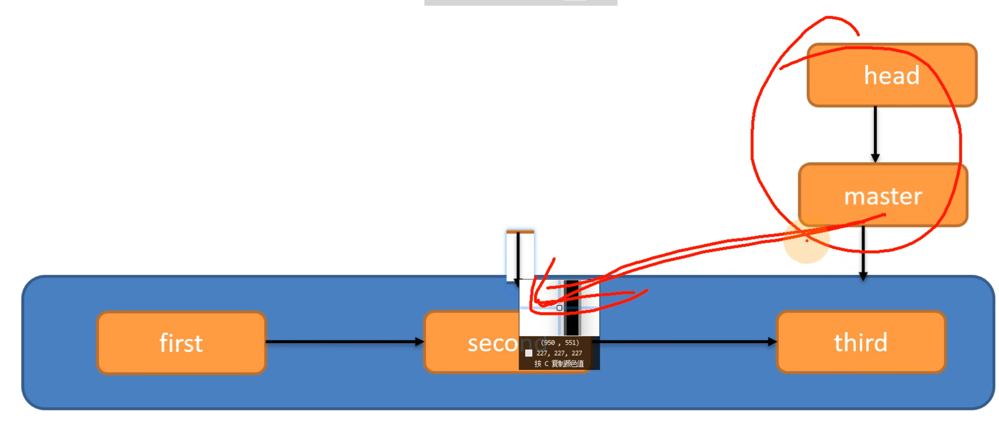

1. config -- global user.name <>
   config -- global user.email <>
   设置用户名和邮箱（去掉尖括号）
2. git init
   在当前目录下创建git库/初始化本地库
3. git status
   查看本地库状态
   1. 显示当前所在的 Git 分支，以及与该分支的远程分支（如果有）相比是否有提交的差异
   2. 未跟踪文件
4. git add
   用于将文件或目录添加到暂存区的命令。暂存区是一个中间区域，用来保存你计划提交到仓库中的更改。
   1. git add filename
   添加单个文件 
   2. git add directory_name/
   添加目录中的所有文件
   3. git add .
   将当前目录下的所有文件（包括新增、修改、删除）添加到暂存区。
   4. git add -u
   添加所有被修改或删除的文件，但不包括新增的文件
5. git rm --cached<file>
   --cached从 Git 的暂存区中删除 filename 文件，但保留工作目录中的文件。适用于希望停止跟踪某个文件，但仍保留它在本地的情况。
   不加就是工作区删除
6. git commit -m"日志信息" 文件1 文件2 文件3...
   将暂存区文件上传git 如果不加文件名就是全部上传
7. git reflog
   git log
   查看git简略/详细日志 版本号, commit message, 等信息
8. git reset --hard 版本号
   版本穿梭
   
9. git branch 分支名
   创建分支
10. git branch -v
   查看分支
11. git checkout 分支名
   切换分支
12. git merge 分支名
   把指定的分支合并到**当前**分支上
   如果合并分支时，两个分支在同一个文件的同一个位置有两套完全不同的修改。git无法自动决定使用哪一个，需要认为决定新代码内容
   1. 查看状态
   2. 编辑有冲突的文件，删除特殊符号，决定要使用的内容
   3. 添加到暂存区
   4. 执行提交，注意此时使用git commit不能带文件名
13. git remote -v
   查看当前所有远程地址别名
14. git remote add 别名 远程地址
   为远程地址创建别名
15. git push 别名/远程地址 分支
   将该分支上的内容推送到github远程仓库