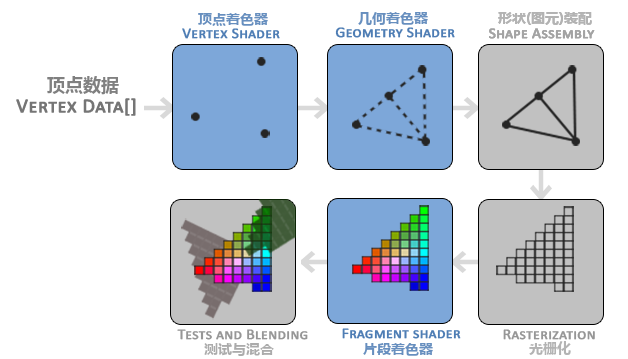
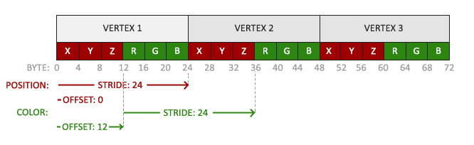
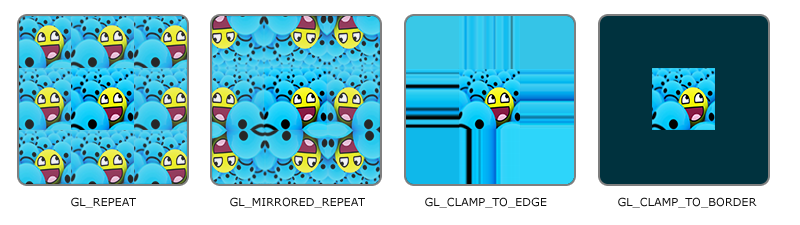
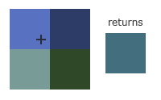
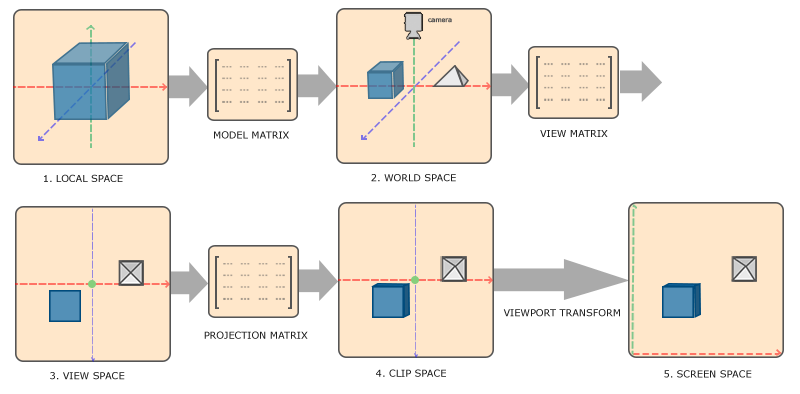
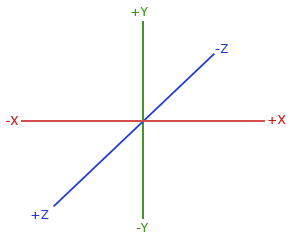
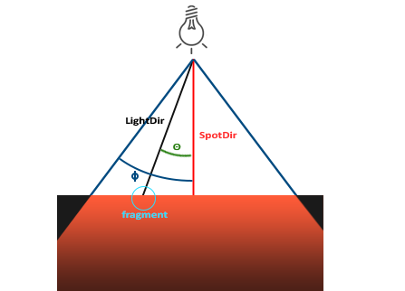

# 8-19
## 包含头文件
```cpp
#include <glad/glad.h>
#include <GLFW/glfw3.h>
```
请确认是在包含GLFW的头文件之前包含了GLAD的头文件。GLAD的头文件包含了正确的OpenGL头文件（例如GL/gl.h），所以需要在其它依赖于OpenGL的头文件之前包含GLAD。

## glfw的初始化和设置
```cpp
    glfwInit();
    glfwWindowHint(GLFW_CONTEXT_VERSION_MAJOR, 3);
    glfwWindowHint(GLFW_CONTEXT_VERSION_MINOR, 3);
    glfwWindowHint(GLFW_OPENGL_PROFILE, GLFW_OPENGL_CORE_PROFILE);
```

## 创建窗口
```cpp
    GLFWwindow* window = glfwCreateWindow(SCR_WIDTH, SCR_HEIGHT, "LearnOpenGL", NULL, NULL);
    if (window == NULL)
    {
        std::cout << "Failed to create GLFW window" << std::endl;
        glfwTerminate();
        return -1;
    }
```

## 将窗口的 OpenGL 上下文设置为当前线程的上下文
```cpp
    glfwMakeContextCurrent(window);
```
## 初始化 GLAD
确保 OpenGL 函数指针被正确加载。它需要传递一个函数指针获取 OpenGL 函数地址（通常是 glfwGetProcAddress）。
```cpp
    if (!gladLoadGLLoader((GLADloadproc)glfwGetProcAddress))
    {
        std::cout << "Failed to initialize GLAD" << std::endl;
        return -1;
    }
```

## 注册一个回调函数
当窗口大小改变时调用 framebuffer_size_callback。
```cpp
    //
    glfwSetFramebufferSizeCallback(window, framebuffer_size_callback);

    // 当窗口被第一次显示的时候framebuffer_size_callback也会被调用。
    void framebuffer_size_callback(GLFWwindow* window, int width, int height)
    {
    //视口变换
    //glViewport函数前两个参数控制窗口左下角的位置。第三个和第四个参数控制渲染窗口的宽度和高度（像素）。
    glViewport(0, 0, width, height);
    }
```

## 渲染循环
```cpp
    // glfwWindowShouldClose: 检查窗口是否应该关闭（如用户点击关闭按钮时返回 true）。
    while (!glfwWindowShouldClose(window))
    {
        // processInput: 每帧调用一次，用于处理用户输入。
        processInput(window);

        // glClearColor: 设置每帧清屏的颜色（这里是灰蓝色）。
        glClearColor(0.2f, 0.3f, 0.3f, 1.0f);
        // glClear: 清除颜色缓冲区，使屏幕填充为 glClearColor 设置的颜色。
        glClear(GL_COLOR_BUFFER_BIT);

        // glfwSwapBuffers: 交换前后缓冲区，显示渲染结果。详见tips
        glfwSwapBuffers(window);
        // glfwPollEvents: 处理所有未决的事件（如键盘输入、鼠标移动等）。
        glfwPollEvents();
    }
```
tips：
    双缓冲(Double Buffer)
    应用程序使用单缓冲绘图时可能会存在图像闪烁的问题。 这是因为生成的图像不是一下子被绘制出来的，而是按照从左到右，由上而下逐像素地绘制而成的。最终图像不是在瞬间显示给用户，而是通过一步一步生成的，这会导致渲染的结果很不真实。为了规避这些问题，我们应用双缓冲渲染窗口应用程序。前缓冲保存着最终输出的图像，它会在屏幕上显示；而所有的的渲染指令都会在后缓冲上绘制。当所有的渲染指令执行完毕后，我们交换(Swap)前缓冲和后缓冲，这样图像就立即呈显出来，之前提到的不真实感就消除了。

## 释放资源
```cpp
    glfwTerminate();
    return 0;
```

## 处理输入
```cpp
// 函数定义
void processInput(GLFWwindow *window)
{
    // 检查用户是否按下了返回键(Esc)
    //（如果没有按下，glfwGetKey将会返回GLFW_RELEASE。
    //如果用户的确按下了返回键，我们将通过使用glfwSetwindowShouldClose把WindowShouldClose属性设置为 true来关闭GLFW。
    if(glfwGetKey(window, GLFW_KEY_ESCAPE) == GLFW_PRESS)
        glfwSetWindowShouldClose(window, true);
}
// 函数调用
    processInput(window);
```

## 渲染
要把所有渲染操作放到渲染循环里，因为这些指令在每次循环迭代的时候都能被执行
```cpp
// glClearColor设置清屏所用的颜色。调用glClear函数时，清除颜色韩村后，整个颜色缓存会被填充为该函数所设置的颜色
glClearColor(0.2f, 0.3f, 0.3f, 1.0f);
// glClear接收一个缓冲位来指定要清除的缓冲，可能的缓冲包括
// GL_COLOR_BUFFER_BIT，GL_DEPTH_BUFFER_BIT和GL_STENCIL_BUFFER_BIT
// 由于现在我们只关心颜色值，所以我们只清空颜色缓冲。
glClear(GL_COLOR_BUFFER_BIT);
```

## 渲染管线

图形渲染管线的第一个部分是顶点着色器(Vertex Shader)，它把一个单独的顶点作为输入。顶点着色器主要的目的是把3D坐标转为另一种3D坐标（后面会解释），同时顶点着色器允许我们对顶点属性进行一些基本处理。

顶点着色器阶段的输出可以选择性地传递给几何着色器(Geometry Shader)。几何着色器将一组顶点作为输入，这些顶点形成图元，并且能够通过发出新的顶点来形成新的(或其他)图元来生成其他形状。在这个例子中，它从给定的形状中生成第二个三角形。

图元装配(Primitive Assembly)阶段将顶点着色器（或几何着色器）输出的所有顶点作为输入（如果是GL_POINTS，那么就是一个顶点），并将所有的点装配成指定图元的形状；本节例子中是两个三角形。

图元装配阶段的输出会被传入光栅化阶段(Rasterization Stage)，这里它会把图元映射为最终屏幕上相应的像素，生成供片段着色器(Fragment Shader)使用的片段(Fragment)。在片段着色器运行之前会执行裁切(Clipping)。裁切会丢弃超出你的视图以外的所有像素，用来提升执行效率。

    OpenGL中的一个片段是OpenGL渲染一个像素所需的所有数据。

片段着色器的主要目的是计算一个像素的最终颜色，这也是所有OpenGL高级效果产生的地方。通常，片段着色器包含3D场景的数据（比如光照、阴影、光的颜色等等），这些数据可以被用来计算最终像素的颜色。

在所有对应颜色值确定以后，最终的对象将会被传到最后一个阶段，我们叫做Alpha测试和混合(Blending)阶段。这个阶段检测片段的对应的深度（和模板(Stencil)）值（后面会讲），用它们来判断这个像素是其它物体的前面还是后面，决定是否应该丢弃。这个阶段也会检查alpha值（alpha值定义了一个物体的透明度）并对物体进行混合(Blend)。所以，即使在片段着色器中计算出来了一个像素输出的颜色，在渲染多个三角形的时候最后的像素颜色也可能完全不同。

可以看到，图形渲染管线非常复杂，它包含很多可配置的部分。然而，对于大多数场合，我们只需要配置顶点和片段着色器就行了。几何着色器是可选的，通常使用它默认的着色器就行了。

在现代OpenGL中，我们必须定义至少一个顶点着色器和一个片段着色器（因为GPU中没有默认的顶点/片段着色器）。

## 顶点输入
OpenGL是一个3D图形库，所以在OpenGL中我们指定的所有坐标都是3D坐标（x、y和z）。OpenGL不是简单地把所有的3D坐标变换为屏幕上的2D像素；OpenGL**仅当**3D坐标在3个轴（x、y和z）上-1.0到1.0的范围内时才处理它。所有在这个范围内的坐标叫做**标准化设备坐标**(Normalized Device Coordinates)，此范围内的坐标最终显示在屏幕上（在这个范围以外的坐标则不会显示）。

**标准化设备坐标**: 一旦你的顶点坐标已经在顶点着色器中处理过，它们就应该是标准化设备坐标了，标准化设备坐标是一个x、y和z值在-1.0到1.0的一小段空间。任何落在范围外的坐标都会被丢弃/裁剪，不会显示在你的屏幕上。

与通常的屏幕坐标不同，y轴正方向为向上，(0, 0)坐标是这个图像的中心，而不是左上角。

通过使用由glViewport函数提供的数据，进行**视口变换**(Viewport Transform)，**标准化设备坐标**(Normalized Device Coordinates)会变换为**屏幕空间坐标**(Screen-space Coordinates)。所得的屏幕空间坐标又会被变换为片段输入到片段着色器中。 

定义这样的顶点数据以后，我们会把它作为输入发送给图形渲染管线的第一个处理阶段：顶点着色器。顶点着色器接着会处理我们在内存中指定数量的顶点。

通过顶点缓冲对象(Vertex Buffer Objects, VBO)管理这个内存，它会在GPU内存（通常被称为显存）中储存大量顶点。使用这些缓冲对象的好处是我们可以一次性的发送一大批数据到显卡上，而不是每个顶点发送一次。从CPU把数据发送到显卡相对较慢，所以只要可能我们都要尝试尽量一次性发送尽可能多的数据。当数据发送至显卡的内存中后，顶点着色器几乎能立即访问顶点，这是个非常快的过程。

// 顶点缓冲对象本质是储存顶点数据的内存
```cpp
// 定义一个 unsigned int 类型的变量 VBO，用于存储顶点缓冲对象的 ID。
unsigned int VBO;

// 生成"一个"新的缓冲对象，并将其 ID 存储在 VBO 变量中。
// 第一个参数 1 表示生成一个缓冲对象。
// 第二个参数 &VBO 是一个指针，用于接收生成的缓冲对象的 ID。
glGenBuffers(1, &VBO);

// 第一个参数 GL_ARRAY_BUFFER 指定了缓冲对象的类型，这里表示该缓冲对象用于存储顶点数据。
// 第二个参数 VBO 是要绑定的缓冲对象的 ID。
glBindBuffer(GL_ARRAY_BUFFER, VBO);  

// 第一个参数 GL_ARRAY_BUFFER 指定目标缓冲类型（必须与绑定时一致）。
// 第二个参数 sizeof(vertices) 指定了数据的大小（字节数），即顶点数组的大小。
// 第三个参数 vertices 是一个指向顶点数据的指针。
// 第四个参数 GL_STATIC_DRAW 指定了数据的使用模式，这里表示数据不会被频繁更新。
glBufferData(GL_ARRAY_BUFFER, sizeof(vertices), vertices, GL_STATIC_DRAW);
```

tips:
第四个参数指定了我们希望显卡如何管理给定的数据。它有三种形式：
GL_STATIC_DRAW ：数据不会或几乎不会改变。
GL_DYNAMIC_DRAW：数据会被改变很多。
GL_STREAM_DRAW ：数据每次绘制时都会改变。
粗略理解：
第一步是分配一个int变量，用来后续储存缓存ID
第二步时生成一个缓冲对象，并将生成的“ID赋值给上一步的int对象
第三步是为上一步的缓存对象设置属性为GL_ARRAY_BUFFER
第四步是将数组中的数据赋值到刚才分配的GL_ARRAY_BUFFER缓存之中

## 顶点着色器
```cpp
    const char *vertexShaderSource = "#version 330 core\n"
    "layout (location = 0) in vec3 aPos;\n"
    "void main()\n"
    "{\n"
    "   gl_Position = vec4(aPos.x, aPos.y, aPos.z, 1.0);\n"
    "}\0";

    // vertex shader
    unsigned int vertexShader;
    // 指定创建的着色器类型
    vertexShader = glCreateShader(GL_VERTEX_SHADER);
    // 第二参数指定了传递的源码字符串数量
    glShaderSource(vertexShader, 1, &vertexShaderSource, NULL);
    glCompileShader(vertexShader);
    // check for shader compile errors
    int success;
    char infoLog[512];
    glGetShaderiv(vertexShader, GL_COMPILE_STATUS, &success);
    if (!success)
    {
        glGetShaderInfoLog(vertexShader, 512, NULL, infoLog);
        std::cout << "ERROR::SHADER::VERTEX::COMPILATION_FAILED\n" << infoLog << std::endl;
    }
```

## 片段着色器
```cpp
    const char *fragmentShaderSource = "#version 330 core\n"
    "out vec4 FragColor;\n"
    "void main()\n"
    "{\n"
    "   FragColor = vec4(1.0f, 0.5f, 0.2f, 1.0f);\n"
    "}\n\0";
    // fragment shader
    unsigned int fragmentShader = glCreateShader(GL_FRAGMENT_SHADER);
    glShaderSource(fragmentShader, 1, &fragmentShaderSource, NULL);
    glCompileShader(fragmentShader);
    // check for shader compile errors
    glGetShaderiv(fragmentShader, GL_COMPILE_STATUS, &success);
    if (!success)
    {
        glGetShaderInfoLog(fragmentShader, 512, NULL, infoLog);
        std::cout << "ERROR::SHADER::FRAGMENT::COMPILATION_FAILED\n" << infoLog << std::endl;
    }
```

## 着色器程序
```cpp
    // link shaders
    unsigned int shaderProgram = glCreateProgram();
    glAttachShader(shaderProgram, vertexShader);
    glAttachShader(shaderProgram, fragmentShader);
    glLinkProgram(shaderProgram);

    // check for linking errors
    glGetProgramiv(shaderProgram, GL_LINK_STATUS, &success);
    if (!success) {
        glGetProgramInfoLog(shaderProgram, 512, NULL, infoLog);
        std::cout << "ERROR::SHADER::PROGRAM::LINKING_FAILED\n" << infoLog << std::endl;
    }

    glDeleteShader(vertexShader);
    glDeleteShader(fragmentShader);
```

## 链接顶点属性
```cpp
    glVertexAttribPointer(0, 3, GL_FLOAT, GL_FALSE, 3 * sizeof(float), (void*)0);
    // 以顶点属性位置值作为参数，启用顶点属性；顶点属性默认是禁用的。
    glEnableVertexAttribArray(0);
```
0 表示顶点属性的索引是 0，即在顶点着色器中对应 layout (location = 0) 的位置。
3 表示每个顶点属性有 3 个分量，这里是三维坐标 vec3。
GL_FLOAT 表示数据类型是浮点型。
GL_FALSE 表示不进行规范化处理。
3 * sizeof(float) 表示每个顶点占用 12 字节（3 个 float）。
(void*)0 表示数据从缓冲区的起始位置开始。

第一个参数指定我们要配置的顶点属性。还记得我们在顶点着色器中使用layout(location = 0)定义了position顶点属性的位置值(Location)吗？它可以把顶点属性的位置值设置为0。因为我们希望把数据传递到这一个顶点属性中，所以这里我们传入0。
第二个参数指定顶点属性的大小。顶点属性是一个vec3，它由3个值组成，所以大小是3。
第三个参数指定数据的类型，这里是GL_FLOAT(GLSL中vec*都是由浮点数值组成的)。
下个参数定义我们是否希望数据被标准化(Normalize)。如果我们设置为GL_TRUE，所有数据都会被映射到0（对于有符号型signed数据是-1）到1之间。我们把它设置为GL_FALSE。
第五个参数叫做步长(Stride)，它告诉我们在连续的顶点属性组之间的间隔。由于下个组位置数据在3个float之后，我们把步长设置为3 * sizeof(float)。要注意的是由于我们知道这个数组是紧密排列的（在两个顶点属性之间没有空隙）我们也可以设置为0来让OpenGL决定具体步长是多少（只有当数值是紧密排列时才可用）。一旦我们有更多的顶点属性，我们就必须更小心地定义每个顶点属性之间的间隔，我们在后面会看到更多的例子（译注: 这个参数的意思简单说就是从这个属性第二次出现的地方到整个数组0位置之间有多少字节）。
最后一个参数的类型是void*，所以需要我们进行这个奇怪的强制类型转换。它表示位置数据在缓冲中起始位置的偏移量(Offset)。由于位置数据在数组的开头，所以这里是0。我们会在后面详细解释这个参数。

## 顶点数组对象
一个顶点数组对象会储存以下这些内容：
glEnableVertexAttribArray和glDisableVertexAttribArray的调用。
通过glVertexAttribPointer设置的顶点属性配置。
通过glVertexAttribPointer调用与顶点属性关联的顶点缓冲对象。
**顶点数组对象储存了顶点属性配置和应使用的VBO**
**VAO 实质上是 OpenGL 用于存储和管理顶点数据解析方式的容器。**

创建一个VAO和创建一个VBO很类似：
```cpp
unsigned int VAO;
glGenVertexArrays(1, &VAO);
glBindVertexArray(VAO);
glBindBuffer(GL_ARRAY_BUFFER, VBO);
glBufferData(GL_ARRAY_BUFFER, sizeof(vertices), vertices, GL_STATIC_DRAW);
glVertexAttribPointer(0, 3, GL_FLOAT, GL_FALSE, 3 * sizeof(float), (void*)0);
glEnableVertexAttribArray(0);
```

## 绘制三角形
```cpp
// 激活着色器
glUseProgram(shaderProgram);
// 绑定对应VAO
glBindVertexArray(VAO);
// 图元类型， 起始索引， 多少个顶点
glDrawArrays(GL_TRIANGLES, 0, 3);
```

## 元素缓冲对象
```cpp
unsigned int indices[] = {
    // 注意索引从0开始! 
    // 此例的索引(0,1,2,3)就是顶点数组vertices的下标，
    // 这样可以由下标代表顶点组合成矩形

    0, 1, 3, // 第一个三角形
    1, 2, 3  // 第二个三角形
};

unsigned int EBO;
glGenBuffers(1, &EBO);
glBindBuffer(GL_ELEMENT_ARRAY_BUFFER, EBO);
glBufferData(GL_ELEMENT_ARRAY_BUFFER, sizeof(indices), indices, GL_STATIC_DRAW);
// 用glDrawElements来替换glDrawArrays函数
glDrawElements(GL_TRIANGLES, 6, GL_UNSIGNED_INT, 0);
```

# 8-20
VAO不仅可以保存VBO还可以保存EBO

VBO解决了我们要花哪些内容的问题（顶点缓冲对象）其中储存了我们要绘制的顶点
VBO需要通过glVertexAttribPointer和glEnableVertexAttribArray函数来告诉opengl如何解析顶点中的各项数据
而这些配置信息可以被存储在VAO中
tip：绑定当前VAO后，对当前VBO的配置信息将存储在VAO中，即使之后解绑（注意，非释放）该VBO，只要存储其数据的VAO仍处于被绑定状态也可以直接读取，解析出VBO顶点，每个线程只可绑定一个VAO，绑定新的之后，老的会自动解绑
为了解决构建多个EBO或者EBO中存储过多顶点的问题，引入EBO，EBO内存储的是VBO的顶点下标索引，VAO也可以存储VBO。在绑定VAO时，绑定的最后一个EBO存储为VAO的EBO。绑定到VAO也会自动绑定该EBO。

tips:
1. 将VBO配置记录在VAO后解绑VBO不会影响后续解析
   ```cpp
    // 生成变量存储Id
    unsigned int VBO, VAO;
    // 生成缓存并且绑定到Id
    glGenVertexArrays(1, &VAO);
    glGenBuffers(1, &VBO);
    // 绑定VAOVBO到当前线程（注意先后顺序）
    glBindVertexArray(VAO);
    glBindBuffer(GL_ARRAY_BUFFER, VBO);
    // 将数组数据存储到VBO
    glBufferData(GL_ARRAY_BUFFER, sizeof(vertices), vertices, GL_STATIC_DRAW);
    // 配置顶点属性指针，并将其记录到当前绑定的 VAO 中
    glVertexAttribPointer(0, 3, GL_FLOAT, GL_FALSE, 3 * sizeof(float), (void*)0);
    glEnableVertexAttribArray(0);
    //解绑VBOVAO（都是可选的，因为绑定新的之后会自动解绑旧的）
    glBindBuffer(GL_ARRAY_BUFFER, 0); 
    glBindVertexArray(0); 
   ```
2. 一次性生成多个VAOVBO
3. glVertexAttribPointer第五个参数设置为0，因为顶点数据是紧密排列的，所以我们也可以指定 0 作为顶点属性的步幅，以便让 OpenGL 弄清楚
   ```cpp
    // 一次生成多个VAOVBO
    unsigned int VBOs[2], VAOs[2];
    glGenVertexArrays(2, VAOs); 
    glGenBuffers(2, VBOs);

    // first triangle setup
    // --------------------
    glBindVertexArray(VAOs[0]);
    glBindBuffer(GL_ARRAY_BUFFER, VBOs[0]);
    glBufferData(GL_ARRAY_BUFFER, sizeof(firstTriangle), firstTriangle, GL_STATIC_DRAW);
    glVertexAttribPointer(0, 3, GL_FLOAT, GL_FALSE, 3 * sizeof(float), (void*)0);	
    glEnableVertexAttribArray(0);
    // 此处不需要解绑，因为下几行会绑定不同的 
    // glBindVertexArray(0); 
    
    // second triangle setup
    // ---------------------
    // 绑定新的VAOVBO
    glBindVertexArray(VAOs[1]);
    glBindBuffer(GL_ARRAY_BUFFER, VBOs[1]);	
    glBufferData(GL_ARRAY_BUFFER, sizeof(secondTriangle), secondTriangle, GL_STATIC_DRAW);
    // 因为顶点数据是紧密排列的，所以我们也可以指定 0 作为顶点属性的步幅，以便让 OpenGL 弄清楚glEnableVertexAttribArray(0);
    glVertexAttribPointer(0, 3, GL_FLOAT, GL_FALSE, 0, (void*)0); 
    // glBindVertexArray(0); 
    // not really necessary as well, but beware of calls that could affect VAOs while this one is bound (like binding element buffer objects, or enabling/disabling vertex attributes)

    //解绑时注意，第二个参数为地址值，所以数组名即可，不需要加取址符
    glDeleteVertexArrays(2, VAOs);
    glDeleteBuffers(2, VBOs);
    
   ```
4. 但是不要解绑EBO，如果解绑，VAO中的EBO记录会清空

## GLSL
```cpp
    // 声明版本
    #version version_number
    // 输入
    in type in_variable_name;
    in type in_variable_name;
    // 输出
    out type out_variable_name;

    uniform type uniform_name;

    int main()
    {
    // 处理输入并进行一些图形操作
    ...
    // 输出处理过的结果到输出变量
    out_variable_name = weird_stuff_we_processed;
    }
```
针对顶点着色器，每个输入变量也叫顶点属性，有上限（取决于硬件），至少是16个

## 数据类型
### 向量
GLSL中的向量是一个可以包含有2、3或者4个分量的容器，分量的类型可以是前面默认基础类型的任意一个。
一个向量的分量可以通过vec.x这种方式获取，这里x是指这个向量的第一个分量。你可以分别使用.x、.y、.z和.w来获取它们的第1、2、3、4个分量。
GLSL也允许你对颜色使用rgba，或是对纹理坐标使用stpq访问相同的分量。
|类型|含义|
|-|-|
|vecn|包含n个float分量的默认向量|
|bvecn|包含n个bool分量的向量|
|ivecn|包含n个int分量的向量|
|uvecn|包含n个unsigned int分量的向量|
|dvecn|包含n个double分量的向量|

可以重组，使用相当灵活
```cpp
vec2 someVec;
vec4 differentVec = someVec.xyxx;
vec3 anotherVec = differentVec.zyw;
vec4 otherVec = someVec.xxxx + anotherVec.yxzy;
vec2 vect = vec2(0.5, 0.7);
vec4 result = vec4(vect, 0.0, 0.0);
vec4 otherResult = vec4(result.xyz, 1.0);
```

不允许在一个vec2向量中去获取.z元素

## 输入与输出

### in 和 out
每个着色器使用这两个关键字设定输入和输出，只要一个输出变量与下一个着色器阶段的输入匹配，它就会传递下去。但在顶点和片段着色器中会有点不同。

顶点着色器需要为它的输入提供一个额外的layout标识，这样我们才能把它链接到顶点数据。

    也可以忽略layout (location = 0)标识符
    通过在OpenGL代码中使用glGetAttribLocation查询属性位置值(Location)
    但是我更喜欢在着色器中设置它们
    这样会更容易理解而且节省你（和OpenGL）的工作量。

另一个例外是片段着色器，它需要一个vec4颜色输出变量，因为片段着色器需要生成一个最终输出的颜色。如果你在片段着色器没有定义输出颜色，OpenGL会把你的物体渲染为黑色（或白色）。

如果我们打算从一个着色器向另一个着色器发送数据，我们必须在发送方着色器中声明一个输出，在接收方着色器中声明一个类似的输入。当类型和名字都一样的时候，OpenGL就会把两个变量链接到一起，它们之间就能发送数据了

传参belike：
```cpp
//顶点着色器
#version 330 core
layout (location = 0) in vec3 aPos; // 位置变量的属性位置值为0

out vec4 vertexColor; // 为片段着色器指定一个颜色输出

void main()
{
    gl_Position = vec4(aPos, 1.0); // 注意我们如何把一个vec3作为vec4的构造器的参数
    vertexColor = vec4(0.5, 0.0, 0.0, 1.0); // 把输出变量设置为暗红色
}

//片段着色器
#version 330 core
out vec4 FragColor;

in vec4 vertexColor; // 从顶点着色器传来的输入变量（名称相同、类型相同）

void main()
{
    FragColor = vertexColor;
}
```

## Uniform
Uniform是另一种从我们的应用程序在 CPU 上传递数据到 GPU 上的着色器的方式，但uniform和顶点属性有些不同。

uniform是全局的(Global)
全局意味着uniform变量必须在每个着色器程序对象中都是独一无二的，而且它可以被着色器程序的任意着色器在任意阶段访问。
第二，无论你把uniform值设置成什么，uniform会一直保存它们的数据，直到它们被重置或更新。

```cpp
#version 330 core
out vec4 FragColor;

uniform vec4 ourColor; // 在OpenGL程序代码中设定这个变量

void main()
{
    FragColor = ourColor;
}
```

```cpp
// 更新一个uniform之前你必须先使用程序
glUseProgram(shaderProgram);

// 获取运行的秒数
float timeValue = glfwGetTime();
// 使用sin函数让颜色在0.0到1.0之间改变，最后将结果储存到greenValue里
float greenValue = (sin(timeValue) / 2.0f) + 0.5f;
// 查询uniform ourColor的位置值
// 如果返回-1则说明未找到
int vertexColorLocation = glGetUniformLocation(shaderProgram, "ourColor");
// 设置uniform值
// 参数 位置值，值 0.0f, greenValue, 0.0f, 1.0f
glUniform4f(vertexColorLocation, 0.0f, greenValue, 0.0f, 1.0f);
// 绘制三角形
glBindVertexArray(VAO);
glDrawArrays(GL_TRIANGLES, 0, 3);
```

tip:
glUniform有一个特定的后缀，标识设定的uniform的类型
比如此处，希望分别设定uniform的4个float值，所以我们通过glUniform4f传递我们的数据，也可以使用fv版本

## 更多属性
若将颜色变量添加至vertices数组
```cpp
float vertices[] = {
    // 位置              // 颜色
     0.5f, -0.5f, 0.0f,  1.0f, 0.0f, 0.0f,   // 右下
    -0.5f, -0.5f, 0.0f,  0.0f, 1.0f, 0.0f,   // 左下
     0.0f,  0.5f, 0.0f,  0.0f, 0.0f, 1.0f    // 顶部
};
```
为此要更新着色器

1. 顶点着色器将颜色数值传递给片段着色器
```cpp
#version 330 core
layout (location = 0) in vec3 aPos;   // 位置变量的属性位置值为 0 
layout (location = 1) in vec3 aColor; // 颜色变量的属性位置值为 1

out vec3 ourColor; // 向片段着色器输出一个颜色

void main()
{
    gl_Position = vec4(aPos, 1.0);
    ourColor = aColor; // 将ourColor设置为我们从顶点数据那里得到的输入颜色
}

#version 330 core
out vec4 FragColor;  
in vec3 ourColor;

void main()
{
    FragColor = vec4(ourColor, 1.0);
}
```

2. 重新配置顶点属性指针

```cpp
// 位置属性
glVertexAttribPointer(0, 3, GL_FLOAT, GL_FALSE, 6 * sizeof(float), (void*)0);
glEnableVertexAttribArray(0);
// 颜色属性
glVertexAttribPointer(1, 3, GL_FLOAT, GL_FALSE, 6 * sizeof(float), (void*)(3* sizeof(float)));
glEnableVertexAttribArray(1);
```
再次回顾glVertexAttribPointer各参数意义
1. 顶点属性位置值
2. 该顶点属性的大小
3. 是否标准化
4. 步长
5. 偏移量

## 着色器类

```cpp
#ifndef SHADER_H
#define SHADER_H
[...]
#endif
```
这种用法跟
#pragma once
作用相同

关于include头文件

#include "shader_s.h"
使用双引号（"shader_s.h"）来包含头文件，编译器首先会在当前源文件所在目录中查找 shader_s.h 文件。如果在该目录中找不到，编译器才会继续在系统标准目录（例如 /usr/include 或 C:\Program Files\Include）中查找。

#include <shader_s.h>
使用尖括号（<shader_s.h>）来包含头文件，编译器会在标准系统头文件目录中查找 shader_s.h 文件。这种方法通常用于包含系统库或第三方库中的头文件。需要在项目配置中添加头文件路径，不会查找当前目录

**Attention!!!**
设置uniform的值要在shader被启用之后
它是在当前激活的着色器程序中设置uniform的。

## 纹理
纹理坐标eg:
```cpp
float texCoords[] = {
    0.0f, 0.0f, // 左下角
    1.0f, 0.0f, // 右下角
    0.5f, 1.0f // 上中
};
```

## 纹理环绕方式
|环绕方式	|描述|
|-|-|
|GL_REPEAT	|对纹理的默认行为。重复纹理图像。|
|GL_MIRRORED_REPEAT	|和GL_REPEAT一样，但每次重复图片是镜像放置的。|
|GL_CLAMP_TO_EDGE	|纹理坐标会被约束在0到1之间，超出的部分会重复纹理坐标的边缘，产生一种边缘被拉伸的效果。|
|GL_CLAMP_TO_BORDER	|超出的坐标为用户指定的边缘颜色。|


纹理坐标的范围通常是从(0, 0)到(1, 1)
纹理坐标的str与xyz是等价的

glTexParameteri(GL_TEXTURE_2D, GL_TEXTURE_WRAP_S, GL_MIRRORED_REPEAT);
glTexParameteri(GL_TEXTURE_2D, GL_TEXTURE_WRAP_T, GL_MIRRORED_REPEAT);

参数：
纹理目标：2D纹理
设置的选项与应用的纹理轴：WRAP（环绕方式） 指定S T轴
环绕方式：镜像 GL_MIRRORED_REPEAT

如果是GL_CLAMP_TO_BORDER需要额外设置边缘颜色
float borderColor[] = { 1.0f, 1.0f, 0.0f, 1.0f };
glTexParameterfv(GL_TEXTURE_2D, GL_TEXTURE_BORDER_COLOR, borderColor);

## 纹理过滤
主要两种
1. GL_NEAREST   邻近过滤
   默认过滤方法
   
2. GL_LINEAR    线性过滤
   


glTexParameteri(GL_TEXTURE_2D, GL_TEXTURE_MIN_FILTER, GL_NEAREST);
glTexParameteri(GL_TEXTURE_2D, GL_TEXTURE_MAG_FILTER, GL_LINEAR);
参数意义：目标图像的类型，放大/缩小，过滤方法

## 多级渐远纹理

|过滤方式|	描述|
|-|-|
|GL_NEAREST_MIPMAP_NEAREST|	使用最邻近的EXTURE_MAG_FILTER, GL_LINEAR);
放大不会使用多级渐远纹理，为放大过滤设多级渐远纹理来匹配像素大小，并使用邻近插值进行纹理采样
|GL_LINEAR_MIPMAP_NEAREST|	使用最邻近的多级渐远纹理级别，并使用线性插值进行采样
|GL_NEAREST_MIPMAP_LINEAR|	在两个最匹配像素大小的多级渐远纹理之间进行线性插值，使用邻近插值进行采样
|GL_LINEAR_MIPMAP_LINEAR|	在两个邻近的多级渐远纹理之间使用线性插值，并使用线性插值进行采样

glTexParameteri(GL_TEXTURE_2D, GL_TEXTURE_MIN_FILTER, GL_LINEAR_MIPMAP_LINEAR);
glTexParameteri(GL_TEXTURE_2D, GL_TEXTURE_MAG_FILTER, GL_LINEAR);

纹理放大不会使用多级渐远纹理，为放大过滤设置多级渐远纹理的选项会产生一个GL_INVALID_ENUM错误代码。

## 关于添加头文件
对于外部库stb_image.h
新建一个cpp文件并添加如下代码
```cpp
#define STB_IMAGE_IMPLEMENTATION
#include "stb_image.h"
```

通过stbi_load载入图片
```cpp
int width, height, nrChannels;
unsigned char *data = stbi_load("container.jpg", &width, &height, &nrChannels, 0);
```
文件位置 宽度 高度 颜色管道的个数

# 8-21

## 生成纹理
```cpp
    unsigned int texture;
    glGenTextures(1, &texture);
    glBindTexture(GL_TEXTURE_2D, texture);

    // 为当前绑定的纹理对象设置环绕、过滤方式
    glTexParameteri(GL_TEXTURE_2D, GL_TEXTURE_WRAP_S, GL_REPEAT);   
    glTexParameteri(GL_TEXTURE_2D, GL_TEXTURE_WRAP_T, GL_REPEAT);
    glTexParameteri(GL_TEXTURE_2D, GL_TEXTURE_MIN_FILTER, GL_LINEAR);
    glTexParameteri(GL_TEXTURE_2D, GL_TEXTURE_MAG_FILTER, GL_LINEAR);

    // 加载并生成纹理
    int width, height, nrChannels;
    unsigned char *data = stbi_load("container.jpg", &width, &height, &nrChannels, 0);
    if (data)
    {
        glTexImage2D(GL_TEXTURE_2D, 0, GL_RGB, width, height, 0, GL_RGB, GL_UNSIGNED_BYTE, data);
        glGenerateMipmap(GL_TEXTURE_2D);
    }
    else
    {
        std::cout << "Failed to load texture" << std::endl;
    }
    // 释放图像内存
    stbi_image_free(data);
```

    glTexImage2D(GL_TEXTURE_2D, 0, GL_RGB, width, height, 0, GL_RGB, GL_UNSIGNED_BYTE, data);
参数：
1. 纹理目标，生成于当前绑定纹理对象（2D纹理）在同一目标上的纹理
2. 多级渐远纹理级别，0为基础级别
3. 如何存储纹理中的像素数据，常见的值包括 GL_RGB、GL_RGBA
4. 宽
5. 高
6. 总设为0（历史遗留问题）
7. 指定数据的格式，传递的图像数据中的颜色通道的排列顺序。常用值包括 GL_RGB、GL_RGBA
8. 指定像素数据的类型，描述了数据数组中的每个像素的存储方式。
9. 指向图像数据的指针

## 应用纹理
```cpp
    glVertexAttribPointer(2, 2, GL_FLOAT, GL_FALSE, 8 * sizeof(float), (void*)(6 * sizeof(float)));
    glEnableVertexAttribArray(2);
```

## 采样器
GLSL有一个供纹理对象使用的内建数据类型，叫做采样器(Sampler)，它以纹理类型作为后缀，比如sampler1D、sampler3D，或在我们的例子中的sampler2D。
    
    uniform sampler2D ourTexture;
    FragColor = texture(ourTexture, TexCoord);

第一个参数是纹理采样器，第二个参数是对应的纹理坐标。texture函数会使用之前设置的纹理参数对相应的颜色值进行采样。这个片段着色器的输出就是纹理的（插值）纹理坐标上的(过滤后的)颜色。

## 纹理单元
一个片段着色器中可以设置多个纹理，一个纹理的位置值通常被成为纹理单元
只有一个纹理的时候默认是0
纹理单元的目的是可以在着色器中使用多个纹理

    glActiveTexture(GL_TEXTURE0); // 在绑定纹理之前先激活纹理单元
    glBindTexture(GL_TEXTURE_2D, texture);
注意看GL_TEXTURE0最后的0，是下标
激活纹理单元之后，接下来的glBindTexture函数调用会绑定这个纹理到当前激活的纹理单元，纹理单元GL_TEXTURE0默认总是被激活
至少有16个可以使用，而且是顺序定义的

    FragColor = mix(texture(texture1, TexCoord), texture(texture2, TexCoord), 0.2);
mix函数需要接受两个值作为参数，并对它们根据第三个参数进行线性插值。如果第三个值是0.0，它会返回第一个输入；如果是1.0，会返回第二个输入值。0.2会返回80%的第一个输入颜色和20%的第二个输入颜色，即返回两个纹理的混合色。

    stbi_set_flip_vertically_on_load(true);
水平翻转

## 向量
1. 向量加减乘除标量
2. 向量相乘：
   1. 点乘
   $v \cdot k = \|v\| \cdot \|k\| \cdot \cos \theta$
   2. 叉乘 生成一个正交于两个输入向量的第三个向量
   $\begin{pmatrix} A_x \\ A_y \\ A_z \end{pmatrix} \times \begin{pmatrix} B_x \\ B_y \\ B_z \end{pmatrix} = \begin{pmatrix} A_y \cdot B_z - A_z \cdot B_y \\ A_z \cdot B_x - A_x \cdot B_z \\ A_x \cdot B_y - A_y \cdot B_x \end{pmatrix}$

## 矩阵
1. 矩阵加减乘除标量
2. 矩阵相乘

## 矩阵和向量相乘
齐次坐标
缩放
$$
\begin{pmatrix}
S_1 & 0 & 0 & 0 \\
0 & S_2 & 0 & 0 \\
0 & 0 & S_3 & 0 \\
0 & 0 & 0 & 1
\end{pmatrix}
\cdot
\begin{pmatrix}
x \\
y \\
z \\
1
\end{pmatrix}
=\begin{pmatrix}
S_1 \cdot x \\
S_2 \cdot y \\
S_3 \cdot z \\
1
\end{pmatrix}
$$

位移
$$
\begin{pmatrix}
1 & 0 & 0 & T_x \\
0 & 1 & 0 & T_y \\
0 & 0 & 1 & T_z \\
0 & 0 & 0 & 1
\end{pmatrix}
\cdot
\begin{pmatrix}
x \\
y \\
z \\
1
\end{pmatrix}
=\begin{pmatrix}
x + T_x \\
y + T_y \\
z + T_z \\
1
\end{pmatrix}
$$


绕x旋转
$$
\begin{pmatrix}
1 & 0 & 0 & 0 \\
0 & \cos \theta & \sin \theta & 0 \\
0 & -\sin \theta & \cos \theta & 0 \\
0 & 0 & 0 & 1
\end{pmatrix}
\cdot
\begin{pmatrix}
x \\
y \\
z \\
1
\end{pmatrix}
=\begin{pmatrix}
x \\
\cos \theta \cdot y - \sin \theta \cdot z \\
\sin \theta \cdot y + \cos \theta \cdot z \\
1
\end{pmatrix}
$$

绕y旋转
$$
\begin{pmatrix}
\cos \theta & 0 & -\sin \theta & 0 \\
0 & 1 & 0 & 0 \\
\sin \theta & 0 & \cos \theta & 0 \\
0 & 0 & 0 & 1
\end{pmatrix}
\cdot
\begin{pmatrix}
x \\
y \\
z \\
1
\end{pmatrix}
=\begin{pmatrix}
\cos \theta \cdot x + \sin \theta \cdot z \\
y \\
-\sin \theta \cdot x + \cos \theta \cdot z \\
1
\end{pmatrix}
$$


绕z旋转
$$
\begin{pmatrix}
\cos \theta & \sin \theta & 0 & 0 \\
-\sin \theta & \cos \theta & 0 & 0 \\
0 & 0 & 1 & 0 \\
0 & 0 & 0 & 1
\end{pmatrix}ptr.hpp>
    glm::mat4 trans = g
\cdot
\begin{pmatrix}
x \\
y \\
z \\
1
\end{pmatrix}
=\begin{pmatrix}
\cos \theta \cdot x - \sin \theta \cdot y \\
\sin \theta \cdot x + \cos \theta \cdot y \\
z \\
1
\end{pmatrix}
$$

## GLM
```cpp
#include <glm/glm.hpp>
#include <glm/gtc/matrix_transform.hpp>
#include <glm/gtc/type_lm::mat4(1.0f);
    // 目标矩阵，位移向量
    trans = glm::translate(trans, glm::vec3(1.0f, 1.0f, 0.0f));
    // 目标矩阵，旋转角度，旋转轴
    trans = glm::rotate(trans, glm::radians(90.0f), glm::vec3(0.0, 0.0, 1.0));
    // 目标矩阵，缩放因子
    trans = glm::scale(trans, glm::vec3(0.5, 0.5, 0.5));
    // uniform位置值，发送矩阵的数量，是否转置矩阵，矩阵数据
    glUniformMatrix4fv(transformLoc, 1, GL_FALSE, glm::value_ptr(trans));
```

# 8-22

**Attention!!!**
矩阵变换的顺序与语句顺序相反
```cpp
    // 先位移，再旋转
    transform = glm::rotate(transform, (float)glfwGetTime(), glm::vec3(0.0f, 0.0f, 1.0f)); // Switched the order
    transform = glm::translate(transform, glm::vec3(0.5f, -0.5f, 0.0f)); // Switched the order
```

tip: 在渲染循环中多次调用glDrawElements可以绘制多个图形
在两次调用之间插入变更 矩阵的uniform 可以绘制多个不同的矩阵

## 坐标系

MVP变换

$$
V_{clip} = M_{projection} \cdot M_{view} \cdot M_{model} \cdot V_{local}
$$

opengl使用右手坐标系

正z轴穿过屏幕朝向自己

```cpp
    // 虽然循环外已经启动了，但养成每次设置uniform之前启动响应shader的习惯
    ourShader.use();
    // create transformations
    // 初始化矩阵
    glm::mat4 model         = glm::mat4(1.0f); 
    glm::mat4 view          = glm::mat4(1.0f);
    glm::mat4 projection    = glm::mat4(1.0f);
    model = glm::rotate(model, glm::radians(-55.0f), glm::vec3(1.0f, 0.0f, 0.0f));
    view  = glm::translate(view, glm::vec3(0.0f, 0.0f, -3.0f));
    projection = glm::perspective(glm::radians(45.0f), (float)SCR_WIDTH / (float)SCR_HEIGHT, 0.1f, 100.0f);

    // retrieve the matrix uniform locations
    unsigned int modelLoc = glGetUniformLocation(ourShader.ID, "model");
    unsigned int viewLoc  = glGetUniformLocation(ourShader.ID, "view");

    // 将它们传递给着色器（3 种不同的方式）
    glUniformMatrix4fv(modelLoc, 1, GL_FALSE, glm::value_ptr(model));
    glUniformMatrix4fv(viewLoc, 1, GL_FALSE, &view[0][0]);
    // 注意：目前我们每帧设置投影矩阵，但由于投影矩阵很少改变，因此最佳实践通常是仅将其设置在主循环之外一次。
    ourShader.setMat4("projection", projection);
```

## Z-buffer
深度测试默认是关闭的，需要通过

    glEnable(GL_DEPTH_TEST);
开启深度测试，一般在程序初始化时

因为进行了深度测试，所以要在每次渲染迭代之前清除深度缓冲，就像清除颜色缓冲一样（循环体内）

    glClear(GL_COLOR_BUFFER_BIT | GL_DEPTH_BUFFER_BIT);

## perspective函数
    glm::mat4 glm::perspective(float fovy, float aspect, float zNear, float zFar);
1. 视野的垂直视角：以度为单位，值越大视野越广，收缩越大
2. 视口的宽高比
   这里很反直觉的是，宽高比越大，宽度反而越小，因为宽高比越大，在宽度上的收缩就越大，因此宽度变小
   更容易理解的一种方法是：
   如果本身屏幕是1920 / 1080，设置成2 * 1920 / 1080，
   图像被渲染成3840 * 1080，但被渲染到1920 * 1080，
   因此宽度要收缩到原来1/2
3. 近平面距离，相机到最近的可视平面的距离。所有距离相机更近于这个距离的物体将不会被渲染。不可设为0。
4. 远平面距离，相机到最远的可视平面的距离。所有距离相机更远于这个距离的物体将不会被渲染。

# 8-23

## 摄像机/观察空间
不要忘记正z轴是从屏幕指向你的，如果我们希望摄像机向后移动，我们就沿着z轴的正方向移动。
## 摄像机位置
    glm::v ec3 cameraPos = glm::vec3(0.0f, 0.0f, 3.0f);

## 摄像机方向
    glm::vec3 cameraTarget = glm::vec3(0.0f, 0.0f, 0.0f);
    glm::vec3 cameraDirection = glm::normalize(cameraPos - cameraTarget);
**attention!!!**: 该方向与实际观察方向相反

## 右轴
    //上向量
    glm::vec3 up = glm::vec3(0.0f, 1.0f, 0.0f); 
    //
    glm::vec3 cameraRight = glm::normalize(glm::cross(up, cameraDirection));
右手定则：
    方向：结果向量垂直于向量A和B所在的平面。
    方向由右手定则确定：如果用右手的四指从A指向B（小于180度方向），则拇指指向叉乘结果向量的方向。

## 上轴
    glm::vec3 cameraUp = glm::cross(cameraDirection, cameraRight);

## Look At
\[
\text{LookAt} = \begin{pmatrix}
R_x & U_x & D_x & 0 \\
R_y & U_y & D_y & 0 \\
R_z & U_z & D_z & 0 \\
0 & 0 & 0 & 1
\end{pmatrix}
\ast
\begin{pmatrix}
1 & 0 & 0 & -P_x \\
0 & 1 & 0 & -P_y \\
0 & 0 & 1 & -P_z \\
0 & 0 & 0 & 1
\end{pmatrix}
\]

其中
R是右向量，
U是上向量，
D是方向向量
P是摄像机位置向量。
注意，位置向量是相反的，因为我们最终希望把世界平移到与我们自身移动的相反方向。
```cpp
    glm::mat4 view;
    view = glm::lookAt(glm::vec3(0.0f, 0.0f, 3.0f), //位置
                       glm::vec3(0.0f, 0.0f, 0.0f), //目标
                       glm::vec3(0.0f, 1.0f, 0.0f));//上向量
```
锁定视角

## 自由移动
这里目标可以改进成
```cpp
    // 摄像头位置       (0,0,3)
    // 摄像头面朝方向   (0,0,-1)
    // 摄像头头顶       (0,1,0)
    glm::vec3 cameraPos   = glm::vec3(0.0f, 0.0f,  3.0f);
    glm::vec3 cameraFront = glm::vec3(0.0f, 0.0f, -1.0f);
    glm::vec3 cameraUp    = glm::vec3(0.0f, 1.0f,  0.0f);
    view = glm::lookAt(cameraPos, cameraPos + cameraFront, cameraUp);
```
自由视角
```cpp
    void processInput(GLFWwindow *window)
    {
        ...
        float cameraSpeed = 0.05f; // adjust accordingly
        if (glfwGetKey(window, GLFW_KEY_W) == GLFW_PRESS)
            cameraPos += cameraSpeed * cameraFront;
        if (glfwGetKey(window, GLFW_KEY_S) == GLFW_PRESS)
            cameraPos -= cameraSpeed * cameraFront;
        if (glfwGetKey(window, GLFW_KEY_A) == GLFW_PRESS)
            cameraPos -= glm::normalize(glm::cross(cameraFront, cameraUp)) * cameraSpeed;
        if (glfwGetKey(window, GLFW_KEY_D) == GLFW_PRESS)
            cameraPos += glm::normalize(glm::cross(cameraFront, cameraUp)) * cameraSpeed;
    }
```
右向量进行了标准化。如果我们没对这个向量进行标准化，最后的叉乘结果会根据cameraFront变量返回大小不同的向量。如果我们不对向量进行标准化，我们就得根据摄像机的朝向不同加速或减速移动了，但如果进行了标准化移动就是匀速的。

## 移动速度
每次刷新都会触发processInput
也就是说帧率越高，前进速度越快，这是不合理的，所以要设置一个变量来确保在所有硬件上移动速度一样
时间差(Deltatime)变量，存储渲染上一帧所用的时间，速度乘以Deltatime，即为渲染时间越长，移速越快。以此来平衡硬件条件差异
```cpp
// 追踪两个全局变量
float deltaTime = 0.0f; // 当前帧与上一帧的时间差
float lastFrame = 0.0f; // 上一帧的时间
    ...
    {
        // 每次渲染循环中计算新的deltaTime
        // 获取当前时间
        float currentFrame = glfwGetTime();
        // 上一次渲染花费时间
        deltaTime = currentFrame - lastFrame;
        lastFrame = currentFrame;
    }

    ...
    {
        float cameraSpeed = 2.5f * deltaTime;
    }
```

## 视角移动
根据鼠标的输入改变cameraFront向量
欧拉角
Pitch
Yaw
Roll

```cpp
    direction.x = cos(glm::radians(pitch)) * cos(glm::radians(yaw)); 
    // 译注：direction代表摄像机的前轴(Front)
    direction.y = sin(glm::radians(pitch));
    direction.z = cos(glm::radians(pitch)) * sin(glm::radians(yaw));
```

## 鼠标输入
原理就是，储存上一帧鼠标的位置，在当前帧中我们当前计算鼠标位置与上一帧的位置相差多少。如果水平/竖直差别越大那么俯仰角或偏航角就改变越大，也就是摄像机需要移动更多的距离。

    glfwSetInputMode(window, GLFW_CURSOR, GLFW_CURSOR_DISABLED);
隐藏光标，并捕捉它
    
    void mouse_callback(GLFWwindow* window, double xpos, doubleypos);
与键盘输入相似，运用回调函数xpos 和 ypos代表当前鼠标的位置，每次移动鼠标都会调用

    glfwSetCursorPosCallback(window, mouse_callback);

在处理FPS风格摄像机的鼠标输入的时候，我们必须在最终获取方向向量之前做下面这几步：
1. 计算鼠标距上一帧的偏移量。
   1. 首先保存上一帧的位置，初始值设置为屏幕中心
   2. 然后回调函数中计算当前帧和上一帧的偏移量
    ```cpp
    float lastX = 400, lastY = 300;
    ...
    float xoffset = xpos - lastX;
    float yoffset = lastY - ypos; // 注意这里是相反的，因为y坐标是从底部往顶部依次增大的
    lastX = xpos;
    lastY = ypos;
    float sensitivity = 0.05f;
    xoffset *= sensitivity;
    yoffset *= sensitivity;
    ```
2. 把偏移量添加到摄像机的俯仰角和偏航角中。
    ```cpp
    yaw   += xoffset;
    pitch += yoffset;
    ```
3. 对偏航角和俯仰角进行最大和最小值的限制。
    ```cpp
    if(pitch > 89.0f)
    pitch =  89.0f;
    if(pitch < -89.0f)
    pitch = -89.0f;
    ```
4. 计算方向向量。
    ```cpp
    glm::vec3 front;
    front.x = cos(glm::radians(pitch)) * cos(glm::radians(yaw));
    front.y = sin(glm::radians(pitch));
    front.z = cos(glm::radians(pitch)) * sin(glm::radians(yaw));
    cameraFront = glm::normalize(front);
    ```

初次进入窗口时就会调用回调函数，鼠标从中心点跳到进入位置，为了防止这种情况需要在对调函数头添加一次性判断体
```cpp
    if(firstMouse)
    {
        lastX = xpos;
        lastY = ypos;
        firstMouse = false;
    }
```
**tip**
yaw要初始化为 -90°
因为0度为x轴，为屏幕“右侧”，设为-90正对-z轴，

## 缩放
```cpp
    // yoffset代表数值滚动的大小
    void scroll_callback(GLFWwindow* window, double xoffset, double yoffset)
    {
    if(fov >= 1.0f && fov <= 45.0f)
        fov -= yoffset;
    if(fov <= 1.0f)
        fov = 1.0f;
    if(fov >= 45.0f)
        fov = 45.0f;
    }
```
此处要调整fov，所以要将设置透视投影的函数写进渲染循环

以上操作都要在程序开始时设置事件回调函数
以及设置鼠标捕获

## 变换总结

变换最终体现在MVP变换
经过M变换，局部坐标转换成世界坐标
这一步确定物体在“世界”中的，大小，位移，方向
一般在渲染循环中设置

从摄像机类中可以获取V和P变化
经过V变换，世界坐标转换成观察坐标
这一步有摄像机决定，摄像机 位置，焦点以及“上方向”

经过P变换，观察坐标转换成裁剪坐标
这一步由视角大小，宽高比，观察距离/渲染距离决定

## 光照
```cpp
glm::vec3 lightColor(1.0f, 1.0f, 1.0f);
glm::vec3 toyColor(1.0f, 0.5f, 0.31f);
glm::vec3 result = lightColor * toyColor; // = (1.0f, 0.5f, 0.31f);
```
物体从一个光源反射各个颜色分量的大小

# 8-26
## Phong模型
环境光照
漫反射光照
镜面光照

### 环境光照
```cpp
    void main()
    {
        float ambientStrength = 0.1;
        vec3 ambient = ambientStrength * lightColor;

        vec3 result = ambient * objectColor;
        FragColor = vec4(result, 1.0);
    }
```

### 漫反射光照
计算漫反射光照需要
**法向量**：一个垂直于顶点表面的向量。
定向的光线：作为**光源的位置**与**片段的位置**之间向量差的方向向量。为了计算这个光线，我们需要光的位置向量和片段的位置向量。

为了实现漫反射，我们需要
1. 通过uniform向片段着色器中传入变量**光源位置**
   uniform vec3 lightPos;
2. 通过顶点着色器向片段着色器中传入变量**法向量**，通过
    // vert
    layout (location = 1) in vec3 aNormal;
    out vec3 Normal;
    Normal = mat3(transpose(inverse(model))) * aNormal;
    获取法向量的世界坐标
    **warning：**矩阵求逆是一项对于着色器开销很大的运算，因为它必须在场景中的每一个顶点上进行，所以应该尽可能地避免在着色器中进行求逆运算。
3. 通过顶点着色器向片段着色器中传入变量顶点**片段位置**，即各顶点坐标乘以mmodel矩阵，通过线性插值，获取每个像素对应各个片段的世界坐标
    // vert
    layout (location = 0) in vec3 aPos;
    out vec3 FragPos;  
    FragPos = vec3(model * vec4(aPos, 1.0));
    // frag
    in vec3 FragPos;
    vec3 norm = normalize(Normal);
    vec3 lightDir = normalize(lightPos - FragPos);
    float diff = max(dot(norm, lightDir), 0.0);
    vec3 diffuse = diff * lightColor;
4. 混合在一起！ 
    vec3 result = (ambient + diffuse) * objectColor;
    FragColor = vec4(result, 1.0);

### 镜面光照
根据法向量翻折入射光的方向来计算反射向量。然后我们反射向量与观察方向的角度差，它们之间夹角越小，镜面光的作用就越大。由此产生的效果就是，看向在入射光在表面的反射方向时，会看到一点高光。
因此需要额外引入的变量是**观察向量**
```shader
    // frag
    // 观察者位置
    uniform vec3 viewPos;
    // 镜面强度
    float specularStrength = 0.5;
    // 观察向量
    vec3 viewDir = normalize(viewPos - FragPos);
    // 反射光向量
    // 参数1：入射向量，即光线或其他向量的方向。在大多数情况下，它是指从光源到片段的方向向量。在计算镜面反射时，通常需要将这个向量反转（即 -lightDir），因为光线是从片段向外反射的。
    // 参数2：法向量
    vec3 reflectDir = reflect(-lightDir, norm);
    // 计算镜面分量
    // 先计算点乘，并确认不是负数，然后取32次幂（反光度）
    float spec = pow(max(dot(viewDir, reflectDir), 0.0), 32);
    vec3 specular = specularStrength * spec * lightColor;

    // 混合
    vec3 result = (ambient + diffuse + specular) * objectColor;
    FragColor = vec4(result, 1.0);
```

tips
1. Gouraud着色
   在顶点着色器中实现phong光照模型，相比在片段中，顶点少得多，效率更高，但顶点着色器中的最终颜色值是仅仅只是那个顶点的颜色值，片段的颜色值是由插值光照颜色所得来的。这种光照看起来不会非常真实，除非使用了大量顶点。

2. 在观察空间中实现phong光照
```shader
    // vert
    uniform vec3 lightPos; // we now define the uniform in the vertex shader and pass the 'view space' lightpos to the fragment shader. lightPos is currently in world space.

    // 将世界坐标都转成视空间坐标
    gl_Position = projection * view * model * vec4(aPos, 1.0);
    FragPos = vec3(view * model * vec4(aPos, 1.0));
    Normal = mat3(transpose(inverse(view * model))) * aNormal;
    LightPos = vec3(view * vec4(lightPos, 1.0));

    //frag
    in vec3 LightPos;   // extra in variable, since we need the light position in view space we calculate this in the vertex shader
    
    vec3 viewDir = normalize(-FragPos); // the viewer is always at (0,0,0) in view-space, so viewDir is (0,0,0) - Position => -Position
```

## 材质
```shader
struct Material {
    vec3 ambient;
    vec3 diffuse;
    vec3 specular;
    float shininess;
}; 

uniform Material material;
```

# 8-27
一般将环境光和漫反射分量设置成物体本身的颜色，将镜面反射设置成一个中等亮度的颜色

同时应该设置光照属性
```shader
struct Light {
    vec3 position;

    vec3 ambient;
    vec3 diffuse;
    vec3 specular;
};

uniform Light light;

vec3 ambient  = light.ambient * material.ambient;
vec3 diffuse  = light.diffuse * (diff * material.diffuse);
vec3 specular = light.specular * (spec * material.specular);
```
## 光照贴图
分为漫反射贴图和镜面光贴图
使用镜面光贴图的方法和之前的“纹理”类似
在片段着色器中设置采样器
    sampler2D diffuse;
    sampler2D specular;
(环境光颜色在几乎所有情况下都等于漫反射颜色，所以不需要将它们分开储存)
    texture(material.diffuse, TexCoords)
lightingShader.setInt("material.diffuse", 0);
lightingShader.setInt("material.specular", 1);
    即为，对漫反射贴图采样器运用0号纹理
    即为，对镜面反射贴图采样器运用1号纹理

...
glActiveTexture(GL_TEXTURE0);
glBindTexture(GL_TEXTURE_2D, diffuseMap);
glActiveTexture(GL_TEXTURE1);
glBindTexture(GL_TEXTURE_2D, specularMap);
绑定纹理单元，纹理单元下标对应采样器的编号

    unsigned int emissionMap = loadTexture("matrix.jpg");
    lightingShader.setInt("material.emission", 2);
    glActiveTexture(GL_TEXTURE2);
    glBindTexture(GL_TEXTURE_2D, emissionMap);

    sampler2D emission;
    vec3 emission = vec3(texture(material.emission, TexCoords));
    vec3 result = ambient + diffuse + specular + emission;
    emission直接加就完事了

# 8-28
## 投光体

### 平行光
给light结构体设定direction属性
（此处direction是从光源出发的全局方向0）
计算光照时，需要一个从片段到光源的位置，因此要对direction取反，并归一化

```c
    // shader
    struct Light
    {
        vec3 direction
        ...
    };
    ...
    void main()
    {
        vec3 lightDir = normalize(-light.direction);
        ...
    }

    // cpp
    lightingShader.setVec3("light.direction", -0.2f, -1.0f, -0.3f);
```

### 点光源
衰减强度公式
$$
F_{att} = \frac{1.0}{K_c + K_l \cdot d + K_q \cdot d^2}
$$
```c
    //shader
    struct Light {
        // “点”光源
        vec3 position; 

        vec3 ambient;
        vec3 diffuse;
        vec3 specular;
        // 常数，一次项，二次项
        float constant;
        float linear;
        float quadratic;
    };

    float distance    = length(light.position - FragPos);
    float attenuation = 1.0 / (light.constant + light.linear * distance + 
                    light.quadratic * (distance * distance));
    ambient  *= attenuation; 
    diffuse  *= attenuation;
    specular *= attenuation;

    //c
    lightingShader.setFloat("light.constant",  1.0f);
    lightingShader.setFloat("light.linear",    0.09f);
    lightingShader.setFloat("light.quadratic", 0.032f);
```

### 聚光

LightDir：从片段指向光源的向量。
SpotDir：聚光所指向的方向。
Phiϕ：指定了聚光半径的切光角。落在这个角度之外的物体都不会被这个聚光所照亮。
Thetaθ：LightDir向量和SpotDir向量之间的夹角。在聚光内部的话θ
值应该比ϕ值小。
计算LightDir和SpotDir向量的点积，与切光角θ对比。

#### 以手电筒为例
```c
// shader
struct Light {
    vec3  position;
    vec3  direction;
    float cutOff;
    ...
};
    // 计算夹角余弦值并对比
    vec3 lightDir = normalize(light.position - FragPos);
    float theta = dot(lightDir, normalize(-light.direction));
    if(theta > light.cutOff) 
    {       
    // 执行光照计算
    }
    else  // 否则，使用环境光，让场景在聚光之外时不至于完全黑暗
    color = vec4(light.ambient * vec3(texture(material.diffuse, TexCoords)), 1.0);

// cpp
lightingShader.setVec3("light.position",  camera.Position);
lightingShader.setVec3("light.direction", camera.Front);
lightingShader.setFloat("light.cutOff",   glm::cos(glm::radians(12.5f)));
```

### 软光照
模拟聚光有一个内圆锥和一个外圆锥
$$
I = \frac{(\theta - \gamma)}{\epsilon}
$$
这里ϵ(Epsilon)是内（ϕ）和外圆锥（γ）之间的余弦值差（ϵ=ϕ−γ）。最终的I值就是在当前片段聚光的强度。
运用线性插值的方法
```c
float theta     = dot(lightDir, normalize(-light.direction));
float epsilon   = light.cutOff - light.outerCutOff;
// 公式会推出结果大于1或者小于0的结果，所以需要将值限制在0-1之间
// 在聚光外是负的，在内圆锥内大于1.0的
float intensity = clamp((theta - light.outerCutOff) / epsilon, 0.0, 1.0);    
...
// 将不对环境光做出影响，让它总是能有一点光
diffuse  *= intensity;
specular *= intensity;
...
```
## 多光源
