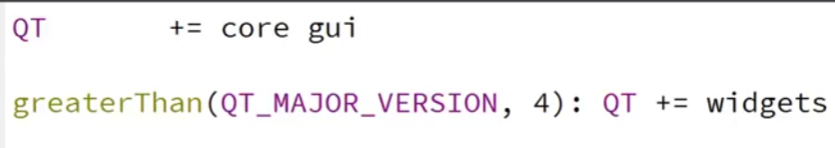
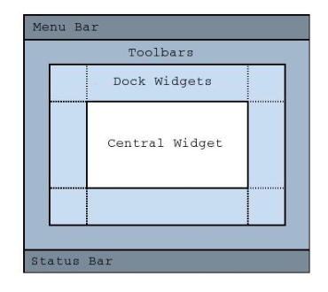

# Day1
## QLabel类
构造函数：
```cpp
QLabel(QWidget *parent = nullptr, Qt::WindowFlags f = Qt::WindowFlags())
```
**or**
```cpp
QLabel(const QString &text, QWidget *parent = nullptr, Qt::WindowFlags f = Qt::WindowFlags())
```
QString 是 Qt 中用于表示字符串的类。是一个常量引用，表示构造 QLabel 对象时要显示的文本内容。
QWidget 是 Qt 中所有可视化组件的基类。是一个指向父控件的指针，默认值是 nullptr，即没有父控件。
Qt::WindowFlags 是一个枚举类型，用于指定窗口的标志和属性。f 参数的默认值是一个默认构造的 Qt::WindowFlags 对象，即没有特殊的窗口标志。
Qt::WindowFlags 可以组合多个标志，用于定义窗口的外观和行为。

```cpp
QLabel *label1 = new QLabel();  // 创建一个空的 QLabel
QLabel *label2 = new QLabel("Text only");  // 创建一个带文本的 QLabel
QLabel *label3 = new QLabel(nullptr);  // 创建一个没有父控件的 QLabel
QLabel *label4 = new QLabel("Text with parent", this);  // 创建一个带文本和父控件的 QLabel
QLabel *label5 = new QLabel("Text with parent and flags", this, Qt::Window | Qt::FramelessWindowHint);  // 带有文本、父控件和窗口标志的 QLabel
```

## QPushButton类
类似QLabel类

```cpp
QPushButton(QWidget *parent = nullptr)
QPushButton(const QString &text, QWidget *parent = nullptr)
```
参数依次是显示字符串， 父窗口指针

## 构造窗口对象，show()，循环执行
```cpp
#include <QApplication>  // Qt应用类
#include  <QLabel> // 标签
#include <QPushButton> // 按钮类
#include <QWidget>   // 基类父窗口类
#include <QMainWindow> // 主窗口类
#include <QDialog> // 对话框类 
    // 构建Qt应用程序
    QApplication app(argc, argv);

    // 构造QLbel对象
    QLabel label("Hello , Stm32");
    // 构造按钮对象
    QPushButton button("我是一个按钮");

    // 将标签, 按钮组件显示
    label.show();
    button.show();

    //循环执行
    return app.exec();
```

## 父窗口
可做父窗口的类包括
QWidget
QMainWindow(主窗口)//QWidget的直接子类
QDialog(对话框)//QWidget的直接子类

```cpp
#include <QApplication>  // Qt应用类
#include  <QLabel> // 标签
#include <QPushButton> // 按钮类
#include <QWidget>   // 基类父窗口类
#include <QMainWindow> // 主窗口类
#include <QDialog> // 对话框类 
int main(int argc, char* argv[]){
​	QApplication app(argc, argv);
​	// 构建父窗口 
​	QWidget  parent; 
​	parent.move(500, 300); // 设置父窗口位置
​	parent.resize(300, 300); // 父窗口大小 
	// 构建子控件,  停靠在父窗口上，以父窗口为锚点
​	QLabel label("我是快乐的子窗口", &parent);
​	label.move(80, 30); //  子窗口位置
​	label.resize(140, 30); // 设置label大小

​	QPushButton  btnOK("保存", &parent);
​	btnOK.move(40, 90);
​	btnOK.resize(100, 30);

​	QPushButton* btnCancel = new QPushButton("不保存", &parent);
​	btnCancel->move(165, 90);
​	btnCancel->resize(100, 30);
​	// 将父窗口显示出来
​	parent.show();
​	return app.exec();
}
```

## 信号和槽
信号和槽机制是 Qt 框架中的核心功能之一，用于实现对象之间的通信和事件处理。这种机制非常强大且灵活，使得开发者能够以松耦合的方式响应和处理事件。
**信号（Signals）**
信号是一种由对象发射的通知，通常用于表示某个事件的发生。例如，一个按钮被点击时，可以发射一个信号来通知其他对象。**信号的定义类似于函数声明，但不需要实现。**信号可以有参数，这些参数会在信号发射时传递给槽函数。
**槽（Slots）**
槽是一个可以连接到信号的普通成员函数，当相应的信号被发射时，槽函数会被自动调用。槽函数可以有参数，参数类型和数量应与信号的参数匹配。槽可以是类的成员函数，也可以是全局函数，甚至可以是 Lambda 表达式（在 C++11 及更高版本中）。

定义信号：
在类定义中使用 signals: 关键字来**声明**信号。
```cpp
#include <QObject>

class MyClass : public QObject {
    Q_OBJECT

signals:
    void signal_func(); // 没有参数的信号
    void signal_with_param(int value); // 带一个整数参数的信号
};
```

定义槽：
槽函数可以是类的成员函数，也可以是全局函数。
```cpp
class MyReceiver : public QObject {
    Q_OBJECT

public slots:
    void mySlot() {
        // 处理信号
    }

    void mySlotWithParam(int value) {
        // 处理带参数的信号
        qDebug() << "Received value:" << value;
    }
};
```

为什么需要Q_OBJECT？
当定义一个继承自 QObject 的类，并且希望在这个类中使用信号和槽机制时，您需要在类声明中包含 Q_OBJECT 宏。这是因为 Q_OBJECT 宏会使 MOC（Meta-Object Compiler）为类生成必要的代码，以支持这些功能。
1. 信号和槽机制：让类能够发射信号和接收槽。
2. 元对象系统：提供运行时类型信息、动态属性和信号槽连接。
3. 动态属性系统：允许在运行时添加和修改对象的属性。

连接信号和槽
使用 QObject::connect 函数来连接信号和槽：
```cpp
QObject::connect(sender, signal, receiver, method);
QObject::connect(sender, SIGNAL(signal()), receiver, SLOT(slot()));
//宏 SIGNAL() 会将 clicked() 转换为编译器识别的字符串格式，在运行时使用该字符串来连接信号。
//宏 SLOT() 会将 close() 转换为编译器识别的字符串格式，在运行时使用该字符串来连接槽。
```


```cpp
MyClass obj;
MyReceiver receiver;

QObject::connect(&obj, &MyClass::signal_func, &receiver, &MyReceiver::mySlot);//无参
QObject::connect(&obj, &MyClass::signal_with_param, &receiver, &MyReceiver::mySlotWithParam);//有参
```

发射信号
在类的成员函数中使用 emit 关键字来发射信号：
```cpp
void MyClass::someFunction() {
    emit signal_func(); // 发射没有参数的信号
    emit signal_with_param(42); // 发射带参数的信号
}
```

```cpp
    // 建立信号和槽的链接关系 
    // btnOK ----- clicked() ---- label ------ close()
   QObject::connect(&btnOK,   SIGNAL(clicked()),  &label,   SLOT(close()));
    
    QObject::connect(&btnOK, &QPushButton::clicked, &label, &QWidget::close);//新版指针写法
    
    // 点击btnOK按钮, 关闭父窗口
   QObject::connect(&btnOK,   SIGNAL(clicked()),  &parent,   SLOT(close()));

    // 点击btnCancel按钮, 关闭父窗口
    QObject::connect(btnCancel,   SIGNAL(clicked()),  &parent,   SLOT(close()));
```

信号和槽的参数要求
1. 参数要一致
   eg：SIGNAL(sigfun(int)) - SLOT(slotfun(int)) √
       SIGNAL(sigfun(int)) - SLOT(slotfun(int, int)) ×
2. 可以有默认参数
   eg：SIGNAL(sigfun(int)) - SLOT(slotfun(int, int = 0)) √
3. 信号函数参数可以多于槽函数，多余参数将被忽略，只会接收能够处理的部分参数
   eg：SIGNAL(sigfun(int, int)) - SLOT(slotfun(int)) √
       SIGNAL(sigfun(char, int)) - SLOT(slotfun(int)) √

信号和槽的连接规则
1. 一个信号可以被连接到多个槽(一对多)
   A发射信号可调用B同时也可调用C
2. 多个信号也可以连接到同一个槽(多对一)
   A可以发射信号调用B，a也可以发射信号调用B
3. 两个信号可以直接连接(信号级联) 类似链式反应 A发射信号给B，B再发射信号
```cpp
#include <QApplication>
#include <QDialog>
#include <QSpinBox> // 选值框
#include <QSlider>  // 滑块

int main(int argc, char* argv[]){
    QApplication app(argc, argv);

    QDialog  parent;
    parent.move(500, 500);
    parent.resize(600, 400);

    //构建滑块
    QSlider slider(Qt::Horizontal,  &parent); // 构造parent中的水平滑块
    slider.move(20, 40);
    slider.resize(150, 25);
    slider.setRange(0, 100);

    //构建选值框
    QSpinBox spin(&parent);
    spin.move(190, 40);
    spin.resize(90, 25);
    spin.setRange(0, 100);

    // 选值框改变 - 滑块改变
    QObject::connect(&spin, SIGNAL(valueChanged(int)), &slider, SLOT(setValue(int)));

    // 滑块改变 - 选值框改变
    QObject::connect(&slider, SIGNAL(valueChanged(int)), &spin, SLOT(setValue(int)));
    
    //setValue(int)是spin类和slider类的槽函数
    //valueChanged(int)是spin类和slider类的信号函数

    parent.show();
    return app.exec();
}
```

# Day02
## Qt Creator

QT += widgets的作用是什么
    如果在项目中使用了任何 Qt Widgets 模块中的类（如 QWidget、QPushButton 等），就需要在 .pro 文件中包含 widgets 模块。这是因为 Qt 是模块化的，每个模块包含不同的功能集。如果不显式声明使用的模块，qmake 将不会为这些模块生成相应的编译和链接命令，从而导致编译错误。
    此外，core 和 gui 模块也是常见的 Qt 模块：
    core 模块：包含核心的非 GUI 功能，如事件循环、信号和槽机制等。
    gui 模块：包含图形用户界面功能，如窗口系统集成、事件处理等。

```cpp
#include "dialog01.h"
#include "ui_dialog01.h"

#include <QDoubleValidator>

Dialog01::Dialog01(QWidget *parent)
    : QDialog(parent)
    , ui(new Ui::Dialog01)
{
    ui->setupUi(this);

    //this 作为父对象参数，确保 QDoubleValidator 的生命周期由 Dialog01 对象管理，自动处理内存释放。
    ui->m_EditX->setValidator(new QDoubleValidator(this));
    ui->m_EditY->setValidator(new QDoubleValidator(this));
    connect(ui->m_EditX,SIGNAL(textChanged(QString)), this, SLOT(enableButton()));
    connect(ui->m_EditY,SIGNAL(textChanged(QString)), this, SLOT(enableButton()));
    //此处是自定义的链接，clicked()属于系统内设链接，不需要程序员定义
}

Dialog01::~Dialog01()
{
    delete ui;
}


void Dialog01::on_m_Button_clicked()
{
    //text()获取字符串
    //setText(QString)设定字符串
    ui->m_EditZ->setText(QString::number(ui->m_EditX->text().toDouble() + ui->m_EditY->text().toDouble()));
}

void Dialog01::enableButton()
{
    bool xOk, yOk;

    // text()-获取控件文本
    //如果不向toDouble()传递参数，则返回值为无限（溢出）or0.0（下溢）
    //如果向toDouble()传递bool参数如下，则成功改参数为T，失败改为F
    ui->m_EditX->text().toDouble(&xOk);
    ui->m_EditY->text().toDouble(&yOk);
    //setEnabled(bool)-让某个控件使能
    ui->m_Button->setEnabled(xOk && yOk);
}
```

```cpp
#include "logindialog.h"
#include "ui_logindialog.h"

#include <QMessageBox>
#include <QDebug>

LoginDialog::LoginDialog(QWidget *parent)
    : QDialog(parent)
    , ui(new Ui::LoginDialog)
{
    ui->setupUi(this);
}

LoginDialog::~LoginDialog()
{
    delete ui;
}

void LoginDialog::on_buttonBox_accepted()
{
    if(ui->username->text() == "ABC" && ui->password->text() == "abc")
    {
        qDebug() << "登录成功";
        close();
    }else{
        QMessageBox::critical(this, windowTitle(), "用户名或密码错误", QMessageBox::Ok);
    }
}

void LoginDialog::on_buttonBox_rejected()
{
    if(QMessageBox::question(this, windowTitle(), "确定要退出？", QMessageBox::Yes | QMessageBox::No) 
                == QMessageBox::Yes)
    {
        qDebug() << "取消登录";
        close();
    }
}
```
## Qt事件
QT将系统产生的消息转化为QT事件QT事件被封装为对象所有的QT事件均继承抽象类QEvent，用于描述程序内部或外部发生的动作，任意的QObject对象都具备处理QT事件的能力。
.asset/image-17.png)
### 事件的产生
.asset/image-18.png)
.asset/image-19.png)

### 事件的处理
* 事件的调度
* 事件通知，派发
* 事件的转发
* 事件的处理和过滤
  - 重写特定事件处理函数
  - 继承QApplication类，并重写notify()函数
  - 给QApplication对象安装过滤器
  - 重写event()函数
  - 在Qt对象上安装事件过滤器

### 覆盖事件处理函数
* 在Qt中，事件被封装成对象，所有的事件对象类型都继承自抽象类QEvent
* 当事件发生时，首先被调用的是Q0bject类中的虚函数event()，其参数(QEvent)标识了具体的事件类型
* 在Qt桌面应用(Qt Widgets Appliction)开发中，QWidget类覆盖了其基类中的event()虚函数，并根据具体事件调用具体事件理函数:
- void QWidget::mousePressEvent (QMouseEvent* e);//鼠标按下事件
- void QWidget::mouseReleaseEvent (QMouseEvent* e);//鼠标抬起事件
- void QWidget::mouseMoveEvent (QMouseEvent* e);//鼠标移动事件
- void QWidget::paintEvent (QPaintEvent* e);//绘图事件

### 如何处理事件
* 所有的事件处理函数都是虚函数，可以被QWidget的子类覆盖，以提供针对不同窗口控件类型的事件处理，控件的使用者所关心的往往是定义什么样的槽处理什么样的信号，而控件的实现者则更关心覆盖哪些事件处理函数
* 如果程序员希望在窗口中自定义的处理事件。以继承QWidget或者其子类，比如QDialog、QMainWindow，在自定义的窗口子类中重写事件处理函数，当相应事件被触发时，会利用多态的语法机制，所执行到的事件处理函数将是子类中重写的版本，从而实现程序员想要的事件处理效果

### 定时器事件
* Qt通过两套机制为应用程序提供定时功能
    定时器事件，由Q0bject提供
    定时器信号，由QTimer提供
* 通过定时器事件实现定时器
    int QObject:startTimer (int interval);启动定时器，以后每隔interval毫秒触发一次定时器事件，返回定时器ID
    void QObject::timerEvent (QTimerEvent*)[virtual];//定时器事件处理函数
    void QObject::killTimer(int id);//关闭参数id所标识的定时器

#### time和timer区别总结
    用途不同：
    QTime 用于表示和操作具体的时间点。
    QTimer 用于定时操作，可以设置单次或周期性触发。
    功能不同：
    QTime 处理时间的表示、计算、比较和格式化。
    QTimer 管理定时任务的启动、停止和间隔设置。
    实现方式不同：
    QTime 是一个轻量级的时间表示类，不涉及事件处理。
    QTimer 是一个基于事件循环的定时器类，依赖于 Qt 的事件机制。

```cpp
#include "timerdialog.h"
#include "ui_timerdialog.h"

TimerDialog::TimerDialog(QWidget *parent)
    : QDialog(parent)
    , ui(new Ui::TimerDialog)
{
    ui->setupUi(this);

    on_m_clock_timeout();

    //链接时钟 和 时间显示函数
    connect(&m_clock, SIGNAL(timeout()),
            this, SLOT(on_m_clock_timeout()));

    m_clock.start(1000);

    on_Reset_clicked();
}

TimerDialog::~TimerDialog()
{ 
    delete ui;
}

void TimerDialog::on_Start_clicked()
{
    if (ui->Start->text() == "开始")
    {
        m_elapsedTimer = startTimer(1);
        ui->Start->setText("停止");
        ui->Reset->setEnabled(false);
    }else if(ui->Start->text() == "停止")
    {
        ui->Start->setText("开始");
        killTimer(m_elapsedTimer);
        ui->Reset->setEnabled(true);
    }
}

void TimerDialog::on_Reset_clicked()
{
    m_elapsed.setHMS(0,0,0);
    ui->m_lcdElapsed->display(m_elapsed.toString("HH:mm:ss.zzz"));
}

void TimerDialog::on_m_clock_timeout()
{
    QTime now = QTime::currentTime();

    ui->m_lcdHour->display(QString::number(now.hour()));

    ui->m_lcdMin->display(QString::number(now.minute()));

    ui->m_lcdSec->display(QString::number(now.second()));
}

void TimerDialog::timerEvent(QTimerEvent*)
{

    m_elapsed = m_elapsed.addMSecs(1);
    ui->m_lcdElapsed->display(m_elapsed.toString("HH:mm:ss.zzz"));
}
```

# Day03
### 鼠标事件
* QWidget类定义了以下虚函数提供对鼠标事件的处理，其参数QMouseEvent描述了鼠标事件的细节，如引发事件的鼠标按键、鼠标所在位置等
    virtual void mousePressEvent (QMouseEvent* e);//鼠标按下
    virtual void mouseReleaseEvent (QMouseEvent* e);//鼠标抬起
    virtual void mouseDoubleClickEvent (QMouseEvent* e);//鼠标双击
    virtual void mouseMoveEvent (QMouseEvent* e);//鼠标移动

```cpp
#include "mousedialog.h"
#include "ui_mousedialog.h"
#include <algorithm>

using namespace std;

MouseDialog::MouseDialog(QWidget *parent)
    : QDialog(parent)
    , ui(new Ui::MouseDialog)
{
    ui->setupUi(this);
}

MouseDialog::~MouseDialog()
{
    delete ui;
}


//1.button -获取按键
//2.frameRect-获取组件的区域
//3.contains -包含
//4.QPoint - 坐标
//5.pos()- 鼠标的坐标
void MouseDialog::mousePressEvent (QMouseEvent* e)
{
    if (e->button() == Qt::LeftButton)
    {
        QRect blockRect = ui->label->frameRect();
        blockRect.translate(ui->label->pos());//坐标变换函数

        if (blockRect.contains(e->pos()))
        {
            m_dragging= true;
            m_offset = (ui->label->pos()) - (e->pos());
        }
    }
}
void MouseDialog::mouseMoveEvent (QMouseEvent* e)
{
    if(m_dragging)
    {
        QPoint labelPos = (e->pos()) + m_offset;

        QSize windowSize = this->size();
        QSize blockSize = ui->label->size();

        int minX = 0, maxX = windowSize.width() - blockSize.width();
        int minY = 0, maxY = windowSize.height() - blockSize.height();
        labelPos.setX(max(min(labelPos.x(), maxX),minX));
        labelPos.setY(max(min(labelPos.y(), maxY),minY));

        ui->label->move(labelPos);
    }
}
void MouseDialog::mouseReleaseEvent (QMouseEvent* e)
{
    if(e->button() == Qt::LeftButton)
    {
        m_dragging = false;
    }
}
```

### 键盘事件
```cpp
virtual void keyPressEvent(QKeyEvent* e); // 键盘键按下事件处理函数
virtual void keyReleaseEvent(QKeyEvent* e); // 键盘键弹起事件处理函数
```

```cpp
#include <algorithm>
using namespace std;

#include <QKeyEvent>

#include "keyboarddialog.h"
#include "ui_keyboarddialog.h"

KeyboardDialog::KeyboardDialog(QWidget *parent)
: QDialog(parent)
, ui(new Ui::KeyboardDialog)
{
ui->setupUi(this);
}

KeyboardDialog::~KeyboardDialog()
{
delete ui;
}

void KeyboardDialog::keyPressEvent(QKeyEvent* e)
{
    QPoint blockPos = ui->m_block->pos();
    switch (e->key())
    {
        case Qt::Key_Left:
            blockPos.setX(blockPos.x() - 10);
            break;

        case Qt::Key_Right:
            blockPos.setX(blockPos.x() + 10);
            break;

        case Qt::Key_Up:
            blockPos.setY(blockPos.y() - 10);
            break;

        case Qt::Key_Down:
            blockPos.setY(blockPos.y() + 10);
            break;
    }

    QSize windowSize = size();
    QSize blockSize = ui->m_block->size();

    int xMin = 0, xMax = windowSize.width() - blockSize.width();
    int yMin = 0, yMax = windowSize.height() - blockSize.height();

    blockPos.setX(min(max(blockPos.x(), xMin), xMax));
    blockPos.setY(min(max(blockPos.y(), yMin), yMax));

    ui->m_block->move(blockPos);
}
```

### 绘图事件
通过绘图事件，可以实现自定义的图像绘制，当有下列情况之一发生时，将触发窗口的绘制事件，即QWidget类的paintEvent()虚函数会被调用:
* 窗口创建后首次显示
* 窗口由隐藏变为可见
* 窗口由最小化变为正常或最大化
* 窗口因大小改变需要呈现更多内容
* 人为调用窗口的update或repaint方法
如果希望在自己的窗口中显示某个图像，在QWidqet的窗口子类中可以重写绘图事件函数paintEvent，在其中可用QPainter(Qt二维图形引擎)实现指定的图像绘制、渲染等操作

向Qt中添加资源
1. 项目右键"add new..."
2. Qt Resource File
3. Add Prefix
4. 删去前缀中除了"/"
5. Add Files

```cpp
 #include "picturedialog.h"
#include "ui_picturedialog.h"

#include <QPainter>
#include <QDebug>


PictureDialog::PictureDialog(QWidget *parent)
    : QDialog(parent)
    , ui(new Ui::PictureDialog)
    , m_imageIndex(0)
{
    ui->setupUi(this);
}

PictureDialog::~PictureDialog()
{
    delete ui;

}

void PictureDialog::on_m_btnPrev_clicked()
{
    m_imageIndex--;
    m_imageIndex = (m_imageIndex%8 + 8)%8;
    update();
}

void PictureDialog::on_m_btnNext_clicked()
{
    m_imageIndex++;
    //int result = (value % range + range) % range 上下循环逻辑
    m_imageIndex = (m_imageIndex%8 + 8)%8;

    //人为调用窗口的update或repaint会触发绘制事件
    update();
}

void PictureDialog::paintEvent(QPaintEvent*)
{
    QPainter painter(this);

    //获取画框区域
    QRect frameRect = ui->m_frameImage->frameRect();
    frameRect.translate(ui->m_frameImage->pos());

    //构建一张图片
//    QImage image(":/images/0.jpg");
    QImage image(":/images/" + QString::number(m_imageIndex) + ".jpg");


    //将图片贴入画框中
    painter.drawImage(frameRect, image);
}
```
### 画笔
画笔用于绘制线条。Qt中表示画笔的类是QPen，包括颜色、线宽、线型、线端样式、连接样式等属性。
```cpp
    void QPen::setColor(QColor& color); // 设置颜色
    void QPen::setWidth(int width); // 设置线宽
    void QPen::setStyle(Qt::PenStyle style); // 设置线型
    void QPen::setCapStyle(Qt::PenCapStyle style); // 设置线端样式
    void QPen::setJoinStyle(Qt::PenJoinStyle style); // 设置连接样式
```

### 画刷
画刷用于填充区域。Qt中表示画刷的类是QBrush，包括颜色、填充样式、纹理图片等属性。
```cpp
    void QBrush::setColor(QColor& color); // 设置颜色
    void QBrush::setStyle(Qt::BrushStyle style); // 设置填充样式
    void QBrush::setTexture(QPixmap& pixmap); // 设置QPixmap类型的纹理图片
    void QBrush::setTextureImage(QImage& image); // 设置QImage类型的纹理图片
    //setTexture和setTextureImage会自动将画刷央视设置为TexturePattern
```

### 字体
字体用于绘制文本。Qt中表示字体的类是QFont，包括字体名、大小、粗细、加粗、斜体、下划线等属
性。
```cpp
    void QFont::setFamily(const QString& family); // 设置字体名
    void QFont::setPointSize(int pointSize); // 设置大小
    void QFont::setWeight(int weight); // 设置粗细
    void QFont::setBold(bool enable); // 设置加粗
    void QFont::setItalic(bool enable); // 设置斜体
    void QFont::setUnderline(bool enable); // 设置下划线
```

### QPainter基本绘图
QPainter是用来进行绘图操作的类
QPaintDevice是一个可以使用QPainter进行绘图的抽象的二维界面
Qt的绘图系统由QPainter、QPaintDevice和QPaintEngine三个类组成。
QPainter类提供表示具体绘制动作的接口。
PainterDevice类表示可在其上绘制图形的二维表面。
QPaintEngine类提供在不同设备上完成图形渲染的接口，仅在QPainter类和QPaintDevice类内部使用。
应用程序一般无需与QPaintEngine打交道，除非要自己创建某种特殊的设备类型。
Qt支持的绘制设备包括QWidget、QPixmap、QImage等，这些绘制设备在QPainter看来，就是一张张“画布”。
.asset/image-20.png)
- QWidget
- QPixmap
- QImage

QWidget类及其子类是最常用的绘制设备。
QWidget类的所有子类都可以通过覆盖其基类的paintEvent虚函数，响应绘制事件，执行绘制动作。
在该虚函数的实现中，只需实例化一个QPainter类的对象，并将作为“画布”的绘制设备交给该对象即可。之后通过该对象完成的所有绘制动作，都会呈现在指定的绘制设备上。

```cpp
#include "paintdialog.h"
#include "ui_paintdialog.h"

PaintDialog::PaintDialog(QWidget *parent)
    : QDialog(parent)
    , ui(new Ui::PaintDialog)
{
    ui->setupUi(this);
}

PaintDialog::~PaintDialog()
{
    delete ui;
}

void PaintDialog::paintEvent(QPaintEvent *e)
{
    QPainter painter(this);

    QPen pen;
    pen.setColor(Qt::red);
    pen.setWidth(3);
    pen.setStyle(Qt::SolidLine);
    pen.setJoinStyle(Qt::RoundJoin);
    painter.setPen(pen);

    QBrush brush;
//    brush.setColor(Qt::yellow);
//    brush.setStyle(Qt::SolidPattern);

    brush.setTextureImage(QImage(":/images/1.png"));
    
    brush.setStyle(Qt::TexturePattern);

    painter.setBrush(brush);

    int w = width(), h = height();

    painter.drawRect(QRect(QPoint(w/4, h/4), QPoint(w * 3/4, h * 3/4)));
}
```

#### 复杂图形
##### QPainterPath
QPainter类除了提供上述绘制基本图形的方法外，还提供了一个名为drawPath的方法，用于绘制一些相
对复杂的图形：
    void QPainter::drawPath(const QPainterPath& path); // 绘制复杂图形
该方法的参数是一个对QPainterPath类型对象的引用。QPainterPath的妙处在于，它可以记录一系列参
与复杂图形绘制的绘制动作。

### 坐标系统和坐标变换
```cpp
    void QPainter::translate(qreal dx, qreal dy); // 坐标系平移
    void QPainter::rotate(qreal angle); // 坐标系旋转
    void QPainter::scale(qreal sx, qreal sy); // 坐标系缩放
    void QPainter::shear(qreal sh, qreal sv); // 坐标系扭曲
    void QPainter::save(); // 将当前坐标系压入到堆栈中
    void QPainter::restore(); // 从堆栈中弹出并恢复坐标系
    void QPainter::resetTransform(); // 恢复到默认坐标系
```

```cpp
#include "reboundedballdialog.h"
#include "ui_reboundedballdialog.h"

#include<QPainter>

ReboundedBallDialog::ReboundedBallDialog(QWidget *parent)
    : QDialog(parent)
    , ui(new Ui::ReboundedBallDialog)
    , m_dia(40)
    , m_off(5, 5)
{
    ui->setupUi(this);

    m_pos.setX((width() - m_dia)/2);
    m_pos.setY((height() - m_dia)/2);

    m_timer = startTimer(10);
}

ReboundedBallDialog::~ReboundedBallDialog()
{
    delete ui;
}


void ReboundedBallDialog::paintEvent(QPaintEvent *)
{
    QPainter painter(this);
    painter.setRenderHint(QPainter::Antialiasing);

    QPen pen(Qt::red);
    painter.setPen(pen);

    QRadialGradient brush(m_pos + QPoint(m_dia/3, m_dia/3), (m_dia * 2/3));
    //后者顺序不能颠倒，整形运算，2/3=0

    brush.setColorAt(0, Qt::white);//渐变开始颜色
    brush.setColorAt(1, Qt::red);//渐变结束颜色

    //The area is filled with the closest stop color. This is the default.
    brush.setSpread(QGradient::PadSpread);

    painter.setBrush(brush);

    painter.drawEllipse(QRect(m_pos, m_pos + QPoint(m_dia, m_dia)));
}


void ReboundedBallDialog::timerEvent(QTimerEvent *)
{
    m_pos += m_off;

    int X = width() - m_dia;
    int Y = height() - m_dia;

    if (m_pos.x() < 0 || m_pos.x() > X)
    {
        m_off.setX(-m_off.x());
    }
    if (m_pos.y() < 0 || m_pos.y() > Y)
    {
        m_off.setY(-m_off.y());
    }
    
    // // 循环处理水平边界
    // while (m_pos.x() < 0 || m_pos.x() > X)
    // {
    //     if (m_pos.x() < 0)
    //     {
    //         m_pos.setX(-m_pos.x());
    //         m_off.setX(-m_off.x());
    //     }
    //     else if (m_pos.x() > X)
    //     {
    //         m_pos.setX(2 * X - m_pos.x());
    //         m_off.setX(-m_off.x());
    //     }
    // }

    // // 循环处理垂直边界
    // while (m_pos.y() < 0 || m_pos.y() > Y)
    // {
    //     if (m_pos.y() < 0)
    //     {
    //         m_pos.setY(-m_pos.y());
    //         m_off.setY(-m_off.y());
    //     }
    //     else if (m_pos.y() > Y)
    //     {
    //         m_pos.setY(2 * Y - m_pos.y());
    //         m_off.setY(-m_off.y());
    //     }
    // }

    //可能出现bug，正偏移量后还在边界外，导致左右横跳


    update();
}
```

# Day04
## 主窗口
QMainWindow是一个为用户提供主窗口程序的类，包含一个菜单栏、多个工具栏、多个停靠控件、一个状态栏以及一个中心控件，是许多应用程序(比如文本编辑器、图片编辑器等)的基础。


## 菜单栏、工具栏和状态栏
* 菜单栏
    – 菜单是一些列命令的列表
    – 为了实现菜单、工具栏按钮、键盘快捷方式等命令的一致性，Qt使用动作(QAction)来表示这些命令
    – Qt的菜单就是由一系列的QAction动作对象构成的列表
    – 菜单栏是包含菜单的面板，位于主窗口标题栏的下面
    – 一个主窗口只能有一个菜单栏
* 工具栏
    – 工具栏是由一系列的类似于按钮的动作排列而成的面板，它通常由一些经常使用的命令(动作)组成
    – 工具栏位于菜单栏的下面、状态栏的上面，可以停靠在主窗口的上下左右四个方向
    – 一个主窗口可以包含多个工具栏
* 状态栏
    – 提供一个用于展示状态信息的水平栏

## QAction
* QAction类提供了抽象的用户界面action，这些action可以被放置在窗口控件中
* QAction可以被添加到菜单和工具栏中，并且可以自动保持在菜单和工具栏中的同步。
* QAction是可以作为独立的对象被创建，也可以在构建菜单时创建。
* QAction可以包含一个图标、菜单文本、快捷键、状态文本等。 
* 只有将QAction添加到窗口控件上，才可以使用这些QAction。
  
tip:
    内置槽函数可以通过signal & slot editor来添加
    eg:复制粘贴等操作

## QDockWidget
* 停靠控件是放置在QMainWindow中心控件周围的停靠控件区域中的次要窗口。
    QDockWidget::DockWidgetClosable 
    窗口可关闭
    QDockWidget::DockWidgetMovable 
    窗口可移动
    QDockWidget::DockWidgetFloatable 
    停靠窗口可以与主窗口分离，作为独立窗口浮动
    QDockWidget::DockWidgetVerticalTitleBar 
    停靠窗口在左侧显示垂直标题栏。用于增加QMainWindow中的垂直空间。
    QDockWidget::AllDockWidgetFeatures 
    前三个的集合
    QDockWidget::NoDockWidgetFeatures 
    停靠窗口不可关闭、移动、浮动

    停靠区域
    allowedAreas : 
    Qt::DockWidgetAreas 
    Qt::LeftDockWidgetArea 
    Qt::RightDockWidgetArea 
    Qt::TopDockWidgetArea 
    Qt::BottomDockWidgetArea 
    Qt::AllDockWidgetAreas 
    Qt::NoDockWidgetArea

## 日期时间相关类
QTime类
– 时间数据类型，仅表示时间，如：15:23:20
QDate类
– 日期数据类型，仅表示日期，如：2021-07-01
QDateTime
– 日期时间数据类型，表示日期和时间，如：2021-07-01 15:23:20
### 日期时间和字符串的转换
日期时间类型转换成字符串
QString toString(const QString &format) const 

字符串转换成日期时间 [static]
- QTime QTime::fromString(const QString &string, const QString&format) 
- QDate QDate::fromString(const QString &string, const QString&format)
- QDateTime QDateTime::fromString(const QString &string, constQString &format)


| 格式符号 | 含义 |
| ------:| -----------:|
|d|没有前导零的日期(1~31)|
|dd |有前导零的日期(01~31)|
|ddd|本地日期名缩写(如：Mon~Sun)|
|dddd|本地日期名(如：Monday~Sunday)|
|M|没有前导零的月份(1~12)|
|MM|有前导零的月份(01~12)|
|MMM|本地月份名称缩写(如：Jan~Dec)|
|MMMM|本地月份名称(如：January~December)|
|yy|两位数字的年份(00~99)|
|yyyy|四位数字的年份|

时间类型 -> 字符串类型
QTime curTime = QTime::currentTime();
QString time = curTime.toString(" HH:mm:ss");
字符串类型 -> 日期时间类型
QDateTime dateTime= QDateTime::fromString("2022-10-01 09:10:10" , " yyyy-MM-dd HH:mm:ss");

# Day05
## QComboBox
* 下拉列表框控件类
* 提供一个下拉列表共用户选择，也可以直接当作一个QLineEdit用作输入
* 每个项(item,或称列表项)可以关联一个QVariant类型的变量，用于存储一些不可见数据。
### 常用函数
    添加项
    void addItem(const QString &text,const QVariant &userData = QVariant())
    void addItem(const QIcon &icon,const QString &text,const QVariant &userData = QVariant())
    访问项
    int currentIndex()：返回当前项的序号，从0开始
    QString currentText()：返回当前项的文字
    QVariant currentData(int role=Qt::UserRole)：返回当前项的关联数据
    QString itemText(int index)：返回指定索引号的项的文字
    QVariant itemData(int index,int role=Qt::UserRole)：返回指定索引号的项的关联数据
    int count()：返回项的个数
### 常用信号
    void currentIndexChanged(int index)
    void currentIndexChanged(const)
## QPlainTextEdit
* 用于编辑多行文本的编辑器，可以编辑普通文本
* QPlainTextEdit提供cut()、copy()、paste()、undo()、redo()、clear()、selectAll()等标准功能的槽函数，QPlainTextEdit还提供一个标准的右键快捷菜单
### 常用函数
    添加项字符串
    QPlainTextEdit::appendPlainText(const QString &text)
    读取所有文字
    QString QPlainTextEdit::toPlainText() const
### 常用函数
    逐行读取需要使用QTextDocument
    QTextDocument *QPlainTextEdit::document() const
    int QTextDocument ::blockCount()
    QTextBlock QTextDocument::findBlockByNumber(int blockNumber)
## 自定义操作系统
contextMenuPolicy属性
枚举类型：Qt::ContextMenuPolicy
常用取值：Qt::DefaultContextMenu
         Qt::CustomContextMenu
信号
* void customContextMenuRequested(const QPoint &pos)
添加自定义右键菜单的步骤
1. contextMenuPolicy ：Qt::CustomContextMenu
2. 处理信号 customContextMenuRequested(const QPoint &pos)
3. 在槽函数中：
   1. 创建菜单 QMenu* menu = new QMenu;
   2. 添加菜单项 void addAction(QAction *action)
   3. 显示菜单 QAction *exec(const QPoint &p)

tips:Q_UNUSED(pos);
     未使用参数的宏

## QListWidget
QListWidget提供一个基于项的列表控件
QListWidgetItem – QListWidget中的一个项
### 常用函数
#### 添加项
    void addItem(const QString &label)
    void addItem(QListWidgetItem *item)
    void addItems(const QStringList &labels)
#### 插入项
    void insertItem(int row, const QString &label)
    void insertItem(int row, QListWidgetItem*item)
    Void insertItems(int row, const QStringList &labels)
#### 删除项
    QListWidgetItem * takeItem(int row)
#### 插入项
    QListWidgetItem * item(int row) const
    QListWidgetItem * itemAt(const QPoint &p) const
    QListWidgetItem * itemAt(int x, int y) const
#### 常用信号
    void currentItemChanged(QListWidgetItem*current,QListWidgetItem *previous)
    void currentRowChanged(int currentRow)

## 其他控件
1. QToolButton
为命令或选项提供一个快速访问按钮，通常用于工具栏
void setDefaultAction(QAction *action) [slot]
popupMode : ToolButtonPopupMode
    QToolButton::DelayedPopup
    QToolButton::MenuButtonPopup
    QToolButton::InstantPopup
2. QToolBox – 容器控件，提供一列自上而下的标签控件项
3. QTabWidget – 容器控件，提供一个堆叠式标签控件
4. QSplitter – 分裂器