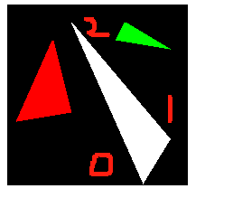
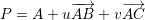
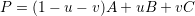
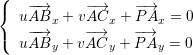
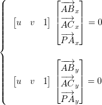
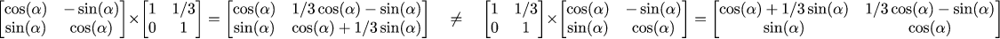
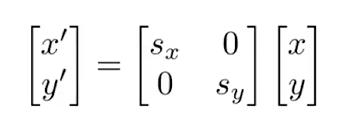
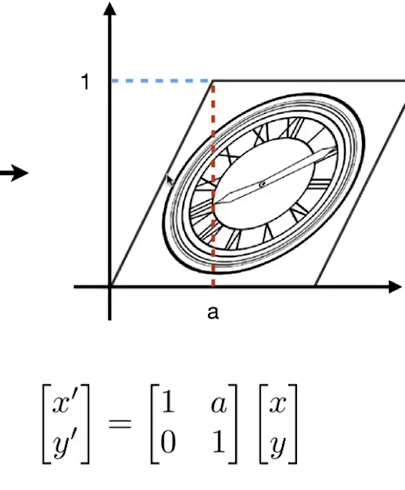
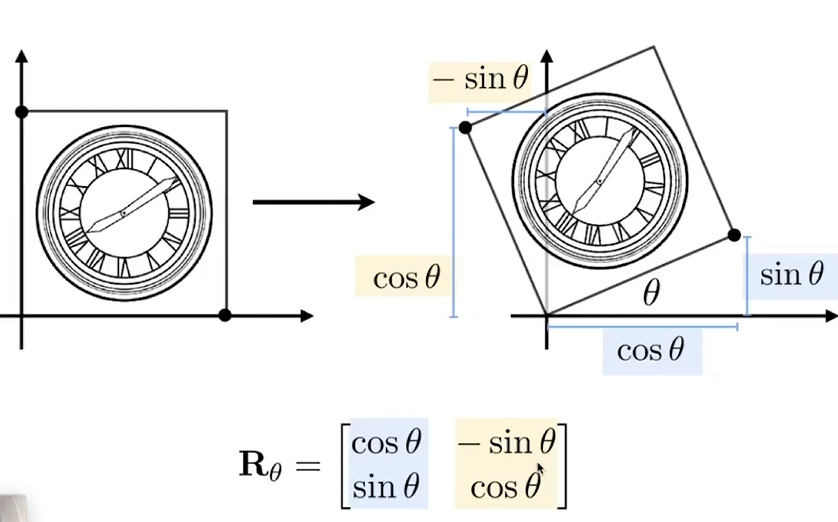
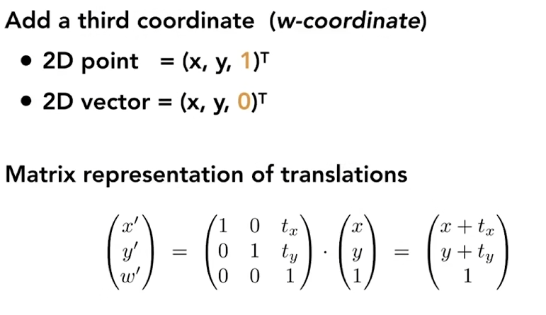

# 第 1 课：Bresenham 画线算法
## 画线第1版：在起点和终点之间打点
```cpp
void line(int x0, int y0, int x1, int y1, TGAImage& image, TGAColor color) {
	for (float t = 0.; t < 1.; t += .1) {
		int x = x0 * (1. - t) + x1 * t;
		int y = y0 * (1. - t) + y1 * t;
		image.set(x, y, color);
	}
}
```


## 画线第2版：按照比例计算y的位置，缺点是斜率越大画的点越少，越不精细
```cpp
void line(int x0, int y0, int x1, int y1, TGAImage& image, TGAColor color) {
	for (int x = x0; x <= x1; x++) {
		float t = (x - x0) / (float)(x1 - x0);
		int y = y0 * (1. - t) + y1 * t;
		image.set(x, y, color);
	}
}
```

## 画线第3版：按照比例计算y的位置，缺点是1.无法从右往左画 2.斜率越大画的点越少，越不精细, 增加斜率对比，若斜率大于1则xy互换
```cpp
void line(int x0, int y0, int x1, int y1, TGAImage& image, TGAColor color) {
    bool steep = false;

    if (std::abs(x0 - x1) < std::abs(y0 - y1)) {  //if the line is steep, we transpose the image 
        std::swap(x0, y0);
        std::swap(x1, y1);
        steep = true;
    }

    if (x0 > x1) {  //make it left−to−right 
        std::swap(x0, x1);
        std::swap(y0, y1);
    }

    for (int x = x0; x <= x1; x++) {
        float t = (x - x0) / (float)(x1 - x0);
        int y = y0 * (1. - t) + y1 * t;
        if (steep) {
            image.set(y, x, color);  //if transposed, de−transpose 
        }
        else {
            image.set(x, y, color);
        }
    }
}
```

## 第4版：提取出斜率，减少循环中的计算量

```cpp
void line(int x0, int y0, int x1, int y1, TGAImage& image, TGAColor color) {
    bool steep = false;
    if (std::abs(x0 - x1) < std::abs(y0 - y1)) {
        std::swap(x0, y0);
        std::swap(x1, y1);
        steep = true;
    }
    if (x0 > x1) {
        std::swap(x0, x1);
        std::swap(y0, y1);
    }
    int dx = x1 - x0;
    int dy = y1 - y0;
    float derror = std::abs(dy / float(dx));
    float error = 0;
    int y = y0;
    for (int x = x0; x <= x1; x++) {
        if (steep) {
            image.set(y, x, color);
        }
        else {
            image.set(x, y, color);
        }
        error += derror;
        if (error > .5) {
            y += (y1 > y0 ? 1 : -1);
            error -= 1.;
        }
    }
}
```

## 第5版：该浮点型为整形，提高速度
``` cpp
void line(int x0, int y0, int x1, int y1, TGAImage& image, TGAColor color) {
    bool steep = false;
    if (std::abs(x0 - x1) < std::abs(y0 - y1)) {
        std::swap(x0, y0);
        std::swap(x1, y1);
        steep = true;
    }
    if (x0 > x1) {
        std::swap(x0, x1);
        std::swap(y0, y1);
    }
    int dx = x1 - x0;
    int dy = y1 - y0;
    int derror2 = std::abs(dy) * 2;
    int error2 = 0;
    int y = y0;
    for (int x = x0; x <= x1; x++) 
    {
        if (steep) {
            image.set(y, x, color);
        }
        else {
            image.set(x, y, color);
        }
        error2 += derror2;
        if (error2 > dx) {
            y += (y1 > y0 ? 1 : -1);
            error2 -= dx * 2;
        }
    }
}
```

```cpp
for (int i=0; i<model->nfaces(); i++) { //遍历模型的每个面
    std::vector<int> face = model->face(i); //为每个面的三个顶点ABC创建容器
    for (int j=0; j<3; j++) { //遍历每个顶点，并使其连线
        //以j=0为例，A的三维坐标 (vert() 获取顶点的三维坐标
        Vec3f v0 = model->vert(face[j]); 
        Vec3f v1 = model->vert(face[(j+1)%3]); //B的三维坐标  (j+1)%3
        int x0 = (v0.x+1.)*width/2.; 
        int y0 = (v0.y+1.)*height/2.;
        int x1 = (v1.x+1.)*width/2.; 
        int y1 = (v1.y+1.)*height/2.;  //坐标由（-1，1）转化为（0，width or height）
        line(x0, y0, x1, y1, image, white); //连线
    } 
}
```
总结：
    坐标插值法计算每个x坐标对应的y值，若斜率大于1则会出现可采样像素点过少，此时需要调转xy位置，以y位置来采样，则可以保证采样数
    可以通过提取斜率提高运行速度，进一步将Δy int化提高运行速度
    对于模型渲染，遍历每个面，获取ABC顶点的三维坐标，并以此获得AB BC CA各个顶点的二维坐标，分别画线

# 第 2 课：三角形光栅化和背面剔除

## 线扫法构建三角形
根据y坐标排序，y2 > y1 > y0


计算01 02斜率，并且根据过1的水平线为分界线，分别绘制上半部分和下半部分，根据比例计算每行像素与01 02的交点

```cpp
void triangle(Vec2i t0, Vec2i t1, Vec2i t2, TGAImage& image, TGAColor color) {
    if (t0.y == t1.y && t0.y == t2.y) return; // i dont care about degenerate triangles
    if (t0.y > t1.y) std::swap(t0, t1);
    if (t0.y > t2.y) std::swap(t0, t2);
    if (t1.y > t2.y) std::swap(t1, t2);
    int total_height = t2.y - t0.y;
    for (int i = 0; i < total_height; i++) {
        bool second_half = i > t1.y - t0.y || t1.y == t0.y;
        int segment_height = second_half ? t2.y - t1.y : t1.y - t0.y;
        float alpha = (float)i / total_height;
        float beta = (float)(i - (second_half ? t1.y - t0.y : 0)) / segment_height; // be careful: with above conditions no division by zero here
        Vec2i A = t0 + (t2 - t0) * alpha;
        Vec2i B = second_half ? t1 + (t2 - t1) * beta : t0 + (t1 - t0) * beta;
        if (A.x > B.x) std::swap(A, B);
        for (int j = A.x; j <= B.x; j++) {
            image.set(j, t0.y + i, color); // attention, due to int casts t0.y+i != A.y
        }
    }
}
```

## 重心法构建三角形

任何一个在ABC平面上的点P都可以表示成



即为



根据向量变形得，



再次变形



用叉乘法得uv1的解（ux, uy, uz）,得u = ux/uz v= uy/uz
则P相对于ABC的重心坐标为1 - (u.x + u.y) / u.z, u.y / u.z, u.x / u.z

```cpp
Vec3f barycentric(Vec2i* pts, Vec2i P) {
    //(ACx, ABx, PAx) 和(ACy, ABy, PAy)的叉乘，u即是垂直于这两个向量的向量(设pts[0]pts[1]pts[2]分别为ABC)
    Vec3f u = Vec3f(pts[2].raw[0] - pts[0].raw[0], pts[1].raw[0] - pts[0].raw[0], pts[0].raw[0] - P.raw[0]) ^ Vec3f(pts[2].raw[1] - pts[0].raw[1], pts[1].raw[1] - pts[0].raw[1], pts[0].raw[1] - P.raw[1]);
    /* `pts` and `P` has integer value as coordinates
       so `abs(u[2])` < 1 means `u[2]` is 0, that means
       triangle is degenerate, in this case return something with negative coordinates */
    if (std::abs(u.z) < 1) return Vec3f(-1, 1, 1);
    return Vec3f(1.f - ((u.x + u.y) / u.z), u.y / u.z, u.x / u.z);
}

            Vec3f bc_screen = barycentric(pts, P);
            if (bc_screen.x < 0 || bc_screen.y < 0 || bc_screen.z < 0) continue; //如果当前像素点 P 的重心坐标中有一个小于 0，说明该点不在三角形内部，跳过绘制该像素的步骤。
            image.set(P.x, P.y, color);
```

```cpp
Vec3f light_dir(0,0,-1); // 设置默认光照方向

for (int i=0; i<model->nfaces(); i++) { //遍历模型的每一个面
    std::vector<int> face = model->face(i); //储存每个面的顶点
    Vec2i screen_coords[3]; //平面投影坐标容器
    Vec3f world_coords[3]; //三维坐标容器
    for (int j=0; j<3; j++) { 
        Vec3f v = model->vert(face[j]); 
        screen_coords[j] = Vec2i((v.x+1.)*width/2., (v.y+1.)*height/2.); //坐标转换
        world_coords[j]  = v; 
    } 
    Vec3f n = (world_coords[2]-world_coords[0])^(world_coords[1]-world_coords[0]); //计算平面法向量
    n.normalize(); //归一化法向量，确保长度为1
    float intensity = n*light_dir; 
    //计算光照强度。这里使用了向量点乘来计算法向量和光源方向向量之间的夹角余弦值，以表示光照的强度。
    if (intensity>0) { 
        triangle(screen_coords[0], screen_coords[1], screen_coords[2], image, TGAColor(intensity*255, intensity*255, intensity*255, 255)); 
    } 
}
```

总结：
    三角形渲染方法：
    第一种 线扫法，现根据y坐标从上到小排列CBA顶点，再以过点B点的水平线为分界
    计算出AB AC BC的斜率，再遍历y值，再对应的在两点之间画线，依次完成上下部分绘制

    第二种 重心坐标法
    首先通过ABC三点xy大小，确定出框体
    然后遍历框体里的每个像素，计算其相对于ABC点的重心坐标（u，v，w）,判断uvw是否都大于0，是则渲染该像素，否则continue跳过

    光照计算方法：
    设置初始光照方向
    遍历各个平面
    计算每个平面的法向量，点乘法计算光照强度在该平面上的投影系数，根据投影系数确定具体色彩


# 第 3 课：隐藏面去除（z buffer）

```cpp
void triangle(Vec3f* pts, float* zbuffer, TGAImage& image, TGAColor color) {
    Vec2f bboxmin(std::numeric_limits<float>::max(), std::numeric_limits<float>::max());
    Vec2f bboxmax(-std::numeric_limits<float>::max(), -std::numeric_limits<float>::max());
    Vec2f clamp(image.get_width() - 1, image.get_height() - 1);

    for (int i = 0; i < 3; i++) {
        for (int j = 0; j < 2; j++) {
            bboxmin[j] = std::max(0.f, std::min(bboxmin[j], pts[i][j]));
            bboxmax[j] = std::min(clamp[j], std::max(bboxmax[j], pts[i][j]));
        }
    }

    Vec3f P;

    for (P.x = bboxmin.x; P.x <= bboxmax.x; P.x++) {
        for (P.y = bboxmin.y; P.y <= bboxmax.y; P.y++) {
            Vec3f bc_screen = barycentric(pts[0], pts[1], pts[2], P);//计算每个点的重心坐标
            if (bc_screen.x < 0 || bc_screen.y < 0 || bc_screen.z < 0) continue;

            P.z = 0;//初始化P点的深度值
            for (int i = 0; i < 3; i++) P.z += pts[i][2] * bc_screen[i];//是Az * u + Bz * v +Cz * w（uvw是P相对于ABC的重心坐标值）
            //这就是所谓的深度插值（Depth Interpolation）。

            if (zbuffer[int(P.x + P.y * width)] < P.z) {
                zbuffer[int(P.x + P.y * width)] = P.z;
                image.set(P.x, P.y, color);
            }
        }
    }
}

Vec3f world2screen(Vec3f v) {
    return Vec3f(int((v.x + 1.) * width / 2. + .5), int((v.y + 1.) * height / 2. + .5), v.z);//加上 0.5 的目的是为了实现四舍五入效果
}

float* zbuffer = new float[width * height];//创建zbuffer
for (int i = width * height; i--; zbuffer[i] = -std::numeric_limits<float>::max());//初始化zbuffer

TGAImage image(width, height, TGAImage::RGB);

for (int i = 0; i < model->nfaces(); i++) {
    std::vector<int> face = model->face(i);
    Vec3f pts[3];
    for (int i = 0; i < 3; i++) pts[i] = world2screen(model->vert(face[i]));
    triangle(pts, zbuffer, image, TGAColor(rand() % 255, rand() % 255, rand() % 255, 255));
}
```

总结：
    遍历每个点相对于ABC点的z坐标值（重心坐标深度插值），渲染z值最高点

# 第 4 课：透视投影



这是有道理的：剪切一个对象然后旋转它与旋转它然后剪切它不同！
图形变化矩阵向左乘

缩放公式，x方向变为sx * x
         y方向变为sy * y



切变公式


旋转公式


仿射变换


```cpp
const int width  = 800;
const int height = 800;
const int depth  = 255;

Model *model = NULL;
int *zbuffer = NULL;
Vec3f light_dir(0,0,-1);
Vec3f camera(0,0,3);

Vec3f m2v(Matrix m) {
    return Vec3f(m[0][0]/m[3][0], m[1][0]/m[3][0], m[2][0]/m[3][0]);
}

Matrix v2m(Vec3f v) {
    Matrix m(4, 1);
    m[0][0] = v.x;
    m[1][0] = v.y;
    m[2][0] = v.z;
    m[3][0] = 1.f;
    return m;
}

Matrix viewport(int x, int y, int w, int h) {
    Matrix m = Matrix::identity(4);
    m[0][3] = x+w/2.f;
    m[1][3] = y+h/2.f;
    m[2][3] = depth/2.f;

    m[0][0] = w/2.f;
    m[1][1] = h/2.f;
    m[2][2] = depth/2.f;
    return m;
}

void triangle(Vec3i t0, Vec3i t1, Vec3i t2, Vec2i uv0, Vec2i uv1, Vec2i uv2, TGAImage &image, float intensity, int *zbuffer) {
    if (t0.y==t1.y && t0.y==t2.y) return; // i dont care about degenerate triangles
    if (t0.y>t1.y) { std::swap(t0, t1); std::swap(uv0, uv1); }
    if (t0.y>t2.y) { std::swap(t0, t2); std::swap(uv0, uv2); }
    if (t1.y>t2.y) { std::swap(t1, t2); std::swap(uv1, uv2); }

    int total_height = t2.y-t0.y;
    for (int i=0; i<total_height; i++) {
        bool second_half = i>t1.y-t0.y || t1.y==t0.y;
        int segment_height = second_half ? t2.y-t1.y : t1.y-t0.y;
        float alpha = (float)i/total_height;
        float beta  = (float)(i-(second_half ? t1.y-t0.y : 0))/segment_height; // be careful: with above conditions no division by zero here
        Vec3i A   =               t0  + Vec3f(t2-t0  )*alpha;
        Vec3i B   = second_half ? t1  + Vec3f(t2-t1  )*beta : t0  + Vec3f(t1-t0  )*beta;
        Vec2i uvA =               uv0 +      (uv2-uv0)*alpha;
        Vec2i uvB = second_half ? uv1 +      (uv2-uv1)*beta : uv0 +      (uv1-uv0)*beta;
        if (A.x>B.x) { std::swap(A, B); std::swap(uvA, uvB); }
        for (int j=A.x; j<=B.x; j++) {
            float phi = B.x==A.x ? 1. : (float)(j-A.x)/(float)(B.x-A.x);
            Vec3i   P = Vec3f(A) + Vec3f(B-A)*phi;
            Vec2i uvP =     uvA +   (uvB-uvA)*phi;
            int idx = P.x+P.y*width;
            if (zbuffer[idx]<P.z) {
                zbuffer[idx] = P.z;
                TGAColor color = model->diffuse(uvP);
                image.set(P.x, P.y, TGAColor(color.r*intensity, color.g*intensity, color.b*intensity));
            }
        }
    }
}

int main(int argc, char** argv) {
    if (2==argc) {
        model = new Model(argv[1]);
    } else {
        model = new Model("obj/african_head.obj");
    }

    zbuffer = new int[width*height];
    for (int i=0; i<width*height; i++) {
        zbuffer[i] = std::numeric_limits<int>::min();
    }

    { // draw the model
    
        Matrix Projection = Matrix::identity(4);
        Matrix ViewPort   = viewport(width/8, height/8, width*3/4, height*3/4);
        Projection[3][2] = -1.f/camera.z;

        TGAImage image(width, height, TGAImage::RGB);

        for (int i=0; i<model->nfaces(); i++) {
            std::vector<int> face = model->face(i);
            Vec3i screen_coords[3];
            Vec3f world_coords[3];
            for (int j=0; j<3; j++) {
                Vec3f v = model->vert(face[j]);
                screen_coords[j] =  m2vion*v2m(v));
                world_coords[j]  = v;(ViewPort*Project
            }
            Vec3f n = (world_coords[2]-world_coords[0])^(world_coords[1]-world_coords[0]);
            n.normalize();
            float intensity = n*light_dir;
            if (intensity>0) {
                Vec2i uv[3];
                for (int k=0; k<3; k++) {
                    uv[k] = model->uv(i, k);
                }
                triangle(screen_coords[0], screen_coords[1], screen_coords[2], uv[0], uv[1], uv[2], image, intensity, zbuffer);
            }
        }

        image.flip_vertically(); // i want to have the origin at the left bottom corner of the image
        image.write_tga_file("output.tga");
    }

    { // dump z-buffer (debugging purposes only)
        TGAImage zbimage(width, height, TGAImage::GRAYSCALE);
        for (int i=0; i<width; i++) {
            for (int j=0; j<height; j++) {
                zbimage.set(i, j, TGAColor(zbuffer[i+j*width], 1));
            }
        }
        zbimage.flip_vertically(); // i want to have the origin at the left bottom corner of the image
        zbimage.write_tga_file("zbuffer.tga");
    }
    delete model;
    delete [] zbuffer;
    return 0;
}
```